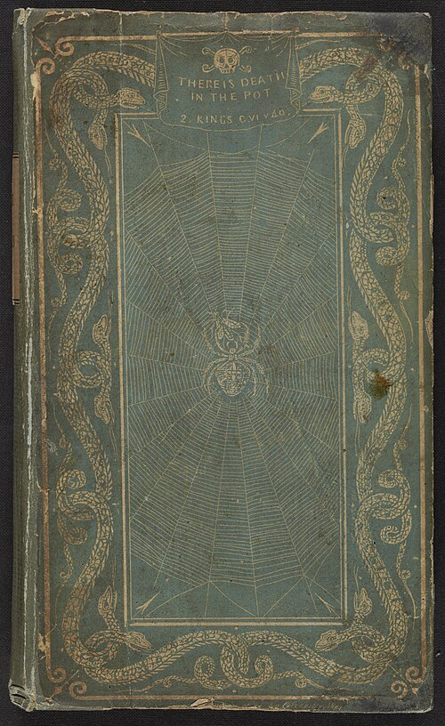
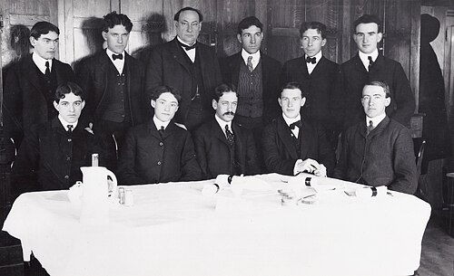

In 1820 a German chemist in London, **[Friedrich Accum](kloom:e/friedrich-accum)**, published a book that sold a thousand copies in a month. _A Treatise on Adulterations of Food, and Culinary Poisons_ named what London's grocers, brewers and bakers put into what they sold: hedge leaves colored to pass as tea, roasted peas and beans in coffee, red lead in cheese and narcotic berries in porter. "The man who robs a fellow subject of a few shillings on the high-way, is sentenced to death," he wrote, "while he who distributes a slow poison to a whole community, escapes unpunished." He printed the names of tradesmen convicted of each fraud, and within two years, after a charge of tearing pages from the Royal Institution's books, he had left England.

Accum gave each fraud a test that readers with no chemistry could run. London bakers whitened bread from poor flour with **[alum](kloom:e/alum)**, three or four ounces to a 240-pound sack. To find it:

1. Pour half a pint of boiling distilled water on two ounces of the bread, boil a few minutes, and filter through unsized paper.
2. Boil the liquid down to a quarter.
3. Drip in a solution of "muriate of barytes" (barium chloride).
4. A _copious_ white precipitate that pure nitric acid will not dissolve means sulfate, and so probably alum; common salt gives a little.

## The microscope

From 1851 to 1854 the physician **[Arthur Hill Hassall](kloom:e/arthur-hill-hassall)** was chief analyst of an "Analytical Sanitary Commission" that the reformer Thomas Wakley ran in **[_The Lancet_](kloom:e/the-lancet)**. Hassall examined food bought in shops under the microscope, and the journal printed each shop's name and address. At 140 diameters, as the plate draws them, roasted coffee is a mass of hard, angular cells "which adhere so firmly together that they break up into pieces", holding drops of oil; **chicory** root falls apart into loose, oil-free cells, threaded with "dotted or interrupted spiral" vessels that coffee never has. Of the first 34 coffees, 31 contained chicory, and 12 roasted corn.

After arsenic, sold in error for the gypsum a Bradford sweet-maker used to stretch his sugar, killed about twenty people in 1858, Parliament passed an Adulteration of Food or Drink Act in 1860, but it was vague and its fine was at most £5. The Sale of Food and Drugs Act of 1875 made it an offense to sell any food "not of the nature, substance, and quality of the article demanded by such purchaser", and provided public analysts in the counties and boroughs to test it.

## The Poison Squad

In the United States the fight was led by **[Harvey Washington Wiley](kloom:e/harvey-washington-wiley)**, chief chemist of the **[United States Department of Agriculture](kloom:e/united-states-department-of-agriculture)**. Food was now canned and shipped far, and new preservatives such as **[borax](kloom:e/borax)** and **[formaldehyde](kloom:e/formaldehyde)** had almost no taste. In 1902 Congress authorized the department "to investigate the character of proposed food preservatives and coloring matters, to determine their relation to digestion and to health." Wiley tested them on people.

Twelve young men, most of them employees of the department, signed a pledge from December 1, 1902 to eat and drink nothing but what the "hygienic table" in the laboratory's basement gave them. They became known as the Poison Squad. The first report, on borax, sets out the trial:

| Step            | What was done                                                                                                     |
| --------------- | ----------------------------------------------------------------------------------------------------------------- |
| Meals           | Breakfast at 8, luncheon at 12, dinner at 5:30; every portion weighed                                             |
| Fore period     | Several days on the diet alone, to set each man's baseline                                                        |
| Preservative    | Borax or boric acid added, from half a gram a day, often raised in steps                                          |
| After period    | The preservative withdrawn, the men still measured                                                                |
| Measured        | Body weight, temperature, pulse, blood counts, and all urine and feces, analyzed for nitrogen, phosphorus and fat |
| Hiding the dose | In butter, then milk, then coffee; each time the men found it and ate less, so it went into gelatin capsules      |

At four or five grams a day most men lost their appetite and could not work. Three grams brought the same in many, with a "feeling of fullness and uneasiness in the stomach", nausea and a dull headache. Even half a gram for fifty days was "too much for the normal man to receive regularly". Wiley concluded that borax should be used only where nothing else would keep the food, and labeled, because "the law does not excuse the use of injurious substances because they may be present in small quantities." A later report, in 1908, judged formaldehyde in food "never justifiable".

## Two laws in one day

**[Upton Sinclair](kloom:e/upton-sinclair)** spent seven weeks in Chicago's packing district and wrote **[_The Jungle_](kloom:e/the-jungle)** (1906) about its immigrant workers. Readers fixed on the meat: spoiled sausage sent back from Europe that "would be dosed with borax and glycerine, and dumped into the hoppers, and made over again for home consumption." "I aimed at the public's heart," Sinclair said, "and by accident I hit it in the stomach." President **[Theodore Roosevelt](kloom:e/theodore-roosevelt)**'s own investigators confirmed much of it, and on June 30, 1906 he signed both the **[Federal Meat Inspection Act](kloom:e/federal-meat-inspection-act)**, which put USDA inspectors in the packing houses, and the **[Pure Food and Drug Act](kloom:e/pure-food-and-drug-act)**. The second banned false labels and food "adulterated" in six ways, from a substitute for the article to a "filthy, decomposed, or putrid" substance. Wiley's Bureau of Chemistry enforced it, and in 1930 its regulators took the name **[Food and Drug Administration](kloom:e/food-and-drug-administration)**.

Historians disagree about whom it served. The economists Marc Law and Gary Libecap find three forces: producers who wanted rules to hurt rivals (straight-whiskey distillers against blenders, whom Wiley opposed), reformers who wanted to know what they bought, and a muckraking press and Wiley's bureau, which set the timing. Clayton Coppin and Jack High call Wiley a quiet ally of firms that stood to gain. The law policed labels after sale and approved nothing before it; it was replaced by the **[Federal Food, Drug, and Cosmetic Act](kloom:e/federal-food-drug-and-cosmetic-act)** of 1938, after a poisoned "elixir" killed more than a hundred people. The next frame keeps food cold, with Clarence Birdseye.
