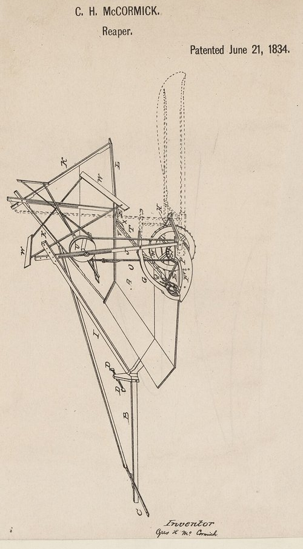

When wheat ripens, the farmer has a week or ten days to cut it before the heads shatter and drop their grain. Before machines, every hand was needed at once. A man with a **[sickle](kloom:e/sickle)** gathered a fistful of stalks and cut them close to the ground; binders followed, tying the cut grain into sheaves with straw, and others stood the sheaves in shocks. A good man with a **[grain cradle](kloom:e/grain-cradle)**, a scythe fitted with wooden fingers that laid the stalks in an even row, kept two or three binders busy, but harvested "not much over three acres a day". In the account of McCormick's biographer William T. Hutchinson, in 1830 a crew of six might harvest two acres of wheat in a day, at 75 cents or a dollar a man. A farmer could sow far more than he could reap.

In the harvest of 1831, on a farm next to his father's in Rockbridge County, Virginia, **[Cyrus McCormick](kloom:e/cyrus-mccormick)**, 22, tried a horse-drawn **[mechanical reaper](kloom:e/reaper)** on a field of late oats. Shown near Lexington soon after, it cut ten or twelve acres a day. His father, **[Robert McCormick](kloom:e/robert-mccormick-virginia-inventor)**, had worked on a reaping machine of his own for years and given it up that summer. In a neighbor's recollection of 1885, two men the McCormicks held in slavery, **Jo Anderson** and Anthony, held the horses, which shied at the rattle. Cyrus took out a patent on 21 June 1834. **[Obed Hussey](kloom:e/obed-hussey)**, a former whaler working in Baltimore and Cincinnati, had shown a machine of his own in Ohio in July 1833 and patented it that December.

## How the reaper cut

Hutchinson named seven parts that had to work together, and showed how a machine with six of them could fail:

| Part       | What it does                                                                             |
| ---------- | ---------------------------------------------------------------------------------------- |
| Side draft | The horses walk beside the cut, on the stubble, pulling rather than pushing              |
| Knife      | A blade on a bar close to the ground, driven rapidly right and left across the path      |
| Fingers    | Guards along the bar, four or five inches apart, that hold the straws while they are cut |
| Divider    | A wedge at the outer end that parts the swath from the standing grain                    |
| Reel       | Slats turning above the knife that bend the heads toward it and lay the cut stalks back  |
| Platform   | Boards behind the knife where the grain falls, to be raked off in sheaf-sized heaps      |
| Main wheel | Carries the weight, and drives the reel and the knife through gears and a crank          |

As the horses walk, the **main wheel**, or bull wheel, turns gearing that spins a crank many times a turn, and the crank throws the knife back and forth. In McCormick's own description of 1851, it was "a straight saw, vibrating rapidly right and left", its teeth inclined alternately so that half cut on each stroke. Hussey's knife was a row of triangular steel sections riveted to a bar sliding through slotted guards, which shear each straw like scissors. Hussey's became the standard cutter bar of mowers and harvesters, and is the one the plate draws.

## Who invented it

McCormick's machine sold none until 1840, and he claimed sole credit for the rest of his life. Hussey's patent came first and his machines sold first, and the two fought in the press, in trials in the field and in the Patent Office for a quarter of a century. Cyrus's own family divided too: his brother Leander published a _Memorial_ in 1885 crediting their father. Each side collected the old neighbors' recollections. In 1881 Jo Anderson put his mark to a statement that Robert was the inventor; in 1885 he told Cyrus's side that Cyrus was. Hutchinson in 1930 judged both collections "virtually worthless as historical evidence", then dismissed the first statement as absurd, since "Old Joe" had "loved Cyrus since the latter's babyhood": a judgment that takes an enslaved man's feelings on his owners' word. What Jo Anderson thought, or built, his enslavement kept out of the record. Modern accounts credit him with helping to build the machine.

## Chicago, credit and London

In 1847 McCormick moved to **[Chicago](kloom:e/chicago)**, close to the prairie wheat and the lake shipping, and built his own works. In 1848 he printed a warranty: $120, $30 down and the rest in six months, if the reaper cut an acre and a half an hour and wasted less grain than a cradle, or the money came back. Casson's admiring life of 1909 calls such a warranty new; Hutchinson found it commonplace. The parts were made by hand and fitted one by one. The historian **[David Hounshell](kloom:e/david-a-hounshell)** showed that armory practice, interchangeable parts gauged to limits, came to the works only in the early 1880s, with a mechanic from the Colt armory, Lewis Wilkinson.

At the **[Great Exhibition](kloom:e/great-exhibition)** of 1851 in London, McCormick's reaper won a Council Medal. The jury's reporter, the agriculturist **[Philip Pusey](kloom:e/philip-pusey)**, reported that it would cut fifteen acres in ten hours, and costed the work:

| Fifteen acres of wheat, 1851        | Cost      |
| ----------------------------------- | --------- |
| Cut by hand, at 9 shillings an acre | £6 15s 0d |
| Reaper: horses and men              | £0 10s 0d |
| Binding, at 2s 6d an acre           | £1 17s 6d |
| Saving, 5s 10d an acre              | £4 7s 6d  |

Hussey's machine failed in both trials at Tiptree Hall in Essex; Pusey recorded his "regret" that it was disqualified, since it had since worked well elsewhere.

## What it changed

Reapers spread slowly: twenty years passed before farmers bought them in numbers in the mid-1850s. Economists long explained the wait by farm size, a threshold of acres below which a reaper did not pay. Alan Olmstead and Paul Rhode found in 1995 that many small farmers bought reapers early, and that neighbors shared machines or hired them out. Admirers claimed that in the Civil War the reaper brought in the North's harvest while its farmhands fought. "The reaper is to the North what the slave is to the South" is printed as the words of **[Edwin Stanton](kloom:e/edwin-stanton)** in 1861 by Herbert Casson's history of 1908, which gives no source. The firm became part of **[International Harvester](kloom:e/international-harvester)** in 1902.

The reaper saved labor at the harvest; it was no help where the harvest itself failed. The next frame turns to the Great Famine in Ireland.
