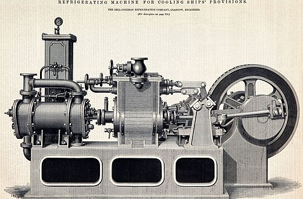

On 15 February 1882 the sailing ship **[Dunedin](kloom:e/dunedin-1874-ship)** left Port Chalmers in New Zealand for London with a hold full of frozen sheep. Between her masts stood a funnel, for the coal-fired engine of a refrigerating machine. In the tropics the cold air stopped circulating among the carcasses, and her captain, John Whitson, crawled into the air trunk to cut new vents and had to be hauled out by a rope tied to his legs, numb with frost. She reached London after 98 days. The meat was sold at Smithfield within a fortnight, and the salesmen pronounced the sheep as clean and bright as newly killed mutton.

## Cold by the shipload

Before machines, cold was cut from lakes. In 1806 the Boston merchant **[Frederic Tudor](kloom:e/frederic-tudor)** sent a cargo of ice to Martinique; most of it melted for want of anywhere to store it. He learned to build insulated ice houses, and by 1816 was selling households in Charleston "Little Ice Houses", wooden boxes lined with iron that held three pounds of ice. His cargoes were packed in sawdust, and from 1825 he bought ice cut into even blocks by Nathaniel Wyeth's horse-drawn cutter on Fresh Pond, near Cambridge. In 1833 about a hundred tons reached Calcutta, and the **[ice trade](kloom:e/ice-trade)** grew until, in 1914, American plants made more ice than was harvested from nature.

## Making cold

The machines of **[refrigeration](kloom:e/refrigeration)** rest on one fact: a liquid that boils takes up heat. In 1834 **[Jacob Perkins](kloom:e/jacob-perkins)**, an American in London, patented a closed machine; it used, his patent said, "volatile fluids for the purpose of producing the cooling or freezing of fluids, and yet at the same time constantly condensing such volatile fluids, and bringing them again into operation without waste." The plate draws its cycle, the one most refrigerators still use:

| Part            | What happens to the working fluid                                     |
| --------------- | --------------------------------------------------------------------- |
| Compressor      | Vapor is squeezed to high pressure, and heats up                      |
| Condenser       | It gives its heat to the air or water outside and turns liquid        |
| Expansion valve | Its pressure drops suddenly, and part of it flashes to cold mist      |
| Evaporator      | It boils inside the cold space, taking heat from what is stored there |

In Geelong, Australia, the newspaper owner **[James Harrison](kloom:e/james-harrison-engineer)** built ether machines from the 1850s that made ice and cooled a brewery. In Munich **[Carl von Linde](kloom:e/carl-von-linde)** built one for the Spaten brewery in 1873 and then turned to ammonia; by 1890 his company had sold 747, mostly to brewers. Ships used another kind, the cold-air machine, in which, as a meat-trade history of 1912 put it, air is compressed, its heat "removed by water circulation", and it is let expand in a second cylinder, where it "becomes further cooled in virtue of the work it does." The Dunedin carried one, built by the Bell-Coleman company of Glasgow.

Every such machine pays in work. Heat does not flow from cold to hot by itself, and a machine moves it uphill only by spending energy. By our arithmetic from Carnot's limit, a perfect machine keeping a freezer at −18 °C in a room at 30 °C could move at most about 5.3 units of heat for each unit of work (255 ÷ 48, in kelvins); real ones manage less.

## Meat across the equator

The first long voyages came from France. **[Charles Tellier](kloom:e/charles-tellier)**'s _Frigorifique_ brought chilled meat from the River Plate to Rouen in August 1877 after 104 days, some of it spoiled. The _Paraguay_, cooled by **[Ferdinand Carré](kloom:e/ferdinand-carre)**'s ammonia machine, froze mutton hard at San Nicolás in Argentina and, after a collision and four months' repairs, landed 5,500 carcasses at Le Havre in May 1878 in good condition. From Australia the _Strathleven_ reached London in 1880. Then came the Dunedin, sent by **[William Soltau Davidson](kloom:e/william-davidson-agribusinessman)** of the New Zealand and Australian Land Company. Accounts of her cargo differ: the meat-trade history of 1912 gives 4,909 sheep and lambs in one place and 3,970 in another, and Wikipedia 4,331 mutton and 598 lamb carcasses, besides pigs.

| Year | Carcasses imported (round totals) |
| ---- | --------------------------------: |
| 1885 |                         1,000,000 |
| 1890 |                         3,000,000 |
| 1895 |                         5,000,000 |
| 1900 |                         7,000,000 |
| 1910 |                        13,000,000 |

Within five years 172 shipments had sailed from New Zealand, and by 1893 the Melbourne _Age_ wrote of an industry that had "pulled New Zealand out of the shoals into calm water." Freezing works opened in Argentina in 1883. The economic historians Pablo Delgado, Vicente Pinilla and Gema Aparicio describe Britain as an almost monopsonist buyer, and mechanical refrigeration as what let the River Plate, Australia and New Zealand lead the world's meat exports. Emiliano Travieso, comparing how New Zealand and Uruguay chose to preserve their meat, argues that access to coal shaped the choice.

## The cold chain

In the home, the **[refrigerator](kloom:e/refrigerator)** replaced the icebox between the wars. General Electric's Monitor-Top of 1927, its compressor in a drum on top, sold for $525, and more than a million were made. Its refrigerants, sulfur dioxide or methyl formate, were poisonous or flammable, and their safe replacements, from about 1930, were the **[chlorofluorocarbons](kloom:e/chlorofluorocarbon)**, whose later cost chemistry tells. By 1940, 44 percent of American households had a mechanical refrigerator.

Much of the world still lacks the **[cold chain](kloom:e/cold-chain)**, the unbroken run of refrigerated storage and transport from farm to plate. The UN Environment Programme and the FAO estimated that in 2017 less than half the food that needed refrigeration was refrigerated, and that the lack cost 526 million tonnes, 12 percent of all food produced; developing countries refrigerated about 20 percent of their perishable food, rich ones about 60. Cold could keep food from spoiling, but not from being cheated: the next frame turns to adulteration and the pure food laws.
