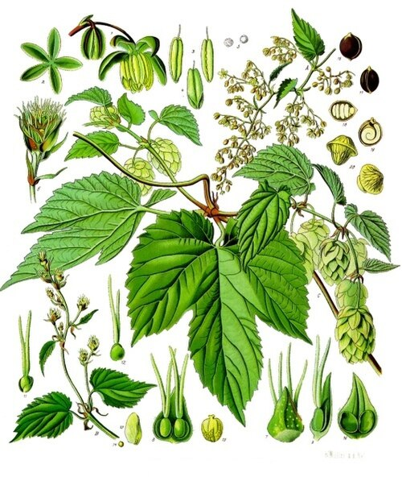

In April 1516 the estates of Bavaria met at **[Ingolstadt](kloom:e/ingolstadt)** and agreed with their dukes, **[William IV](kloom:e/william-iv-of-bavaria)** and his brother Louis X, on a single code of law for a duchy reunited after a war of succession. Among its police regulations, under the heading "how beer shall be poured and brewed in summer and winter in the country", it fixed what beer could cost and what it could be made of. The ordinance is dated 24 April (23 April in many accounts), was settled in July and then printed in Munich, and is known today as the **[Reinheitsgebot](kloom:e/reinheitsgebot)**, the "purity order". Its central sentence, in our translation of the Early New High German: "We wish also in particular that henceforth everywhere in our towns, markets and in the country, no more ingredients than barley, hops and water alone shall be taken and used for any beer."

## Price first

Most of the passage is about price. Bavaria reckoned beer by the _Maß_, about 1.07 liters, or the _Kopf_, a bowl a little smaller:

| What the ordinance sets                                     | Most it may cost                       |
| ----------------------------------------------------------- | -------------------------------------- |
| A Maß or Kopf, Michaelmas (29 September) to St George's Day | 1 pfennig, Munich currency             |
| A Maß, St George's Day (23 April) to Michaelmas             | 2 pfennigs                             |
| A Kopf, the same summer months                              | 3 heller (a heller was half a pfennig) |
| Any beer but March beer, at any season                      | 1 pfennig the Maß                      |
| A country innkeeper reselling one to three _Eimer_          | 1 heller more than these               |
| Beer brewed with anything else                              | the barrel confiscated, every time     |

The dukes kept the right to restrict brewing if grain grew scarce and dear. The historian Klaus Rupprecht, in the _Historisches Lexikon Bayerns_, sets the ordinance among town rules a century and more older: Nuremberg allowed only barley in beer between 1302 and 1305, and Duke Albrecht IV ordered Munich in 1487 to brew from nothing "but hops, barley and water". The reasons were several. Drinkers complained of bad beer; barley was thought the best malting grain and was cheap; wheat and rye were to be kept for bakers' bread; and towns wanted their brewers protected from new country breweries. Others have seen more: the sociologist Eva Barlösius a protection against northern beers flavored with herbs Bavaria did not grow, and the ethnobotanist Christian Rätsch a ban on intoxicating plants such as henbane. The purity did not last: a decree of 1551 allowed coriander and bay leaf, and wheat beer was brewed by privilege, from 1548 by a noble family and from 1602 by the duke himself.

## Why hops

**[Hops](kloom:e/hops)** are the cones of the female hop plant, _Humulus lupulus_, and their value lies in tiny yellow lupulin glands at the base of the bracts, which make resins and oils. Boiled in the wort, the alpha acids of the resin, the humulones, change into iso-alpha acids, which are bitter and hold back bacteria, so hopped beer keeps. The plate draws a cone in section and one gland enlarged. The first certain record of hops in beer is in the statutes that Abbot **[Adalard of Corbie](kloom:e/adalard-of-corbie)** wrote for his monastery in northern France in January 822, which let the porter use tithed hops to make his own beer. In the twelfth century the abbess **[Hildegard of Bingen](kloom:e/hildegard-of-bingen)** thought the hop made people melancholy, and allowed it one virtue: "in its bitterness it prevents spoilage in those drinks to which it is added, so that they can last much longer", in Max Nelson's translation. Before hops, brewers in the Low Countries and the Rhineland bittered beer with **[gruit](kloom:e/gruit)**, a mixture of herbs such as bog myrtle, whose sale lords and bishops licensed and taxed.

## What it left out

The ordinance does not name **[yeast](kloom:e/yeast)**. Brewers used it, passing the foam of one brew to the next, but nobody knew what it was. Nor did it use the word Reinheitsgebot, which was coined in the Reichstag in Berlin in 1909 or 1910 and taken up in Bavaria's parliament in 1918; before that, Bavarians spoke of a ban on substitutes. A German tax law of 1906 required beer of the bottom-fermenting kind to be made of malt, hops, yeast and water, and in 1987 the **[European Court of Justice](kloom:e/european-court-of-justice)** ruled that Germany could not use the rule to keep out other countries' beer.

## Cold beer, pure yeast

By 1516 Bavaria's brewers were making **[lager](kloom:e/lager)**, fermented and stored ("lagered") cold in cellars. Its yeast, **[_Saccharomyces pastorianus_](kloom:e/saccharomyces-pastorianus)**, sinks to the bottom of the vat; in 2011 Diego Libkind and his colleagues showed it to be a hybrid of the ale yeast **[_Saccharomyces cerevisiae_](kloom:e/saccharomyces-cerevisiae)** and a cold-tolerant wild yeast they found in the beech forests of Patagonia, for a beer first brewed, they write, in the fifteenth century.

**[Louis Pasteur](kloom:e/louis-pasteur)** turned to beer after France's defeat in 1870, in an industry "wherein we are undoubtedly surpassed by Germany". His _Études sur la bière_ of 1876 argued that "every unhealthy change in the quality of beer coincides with a development of microscopic germs which are alien to the pure ferment of beer", in the 1879 translation of Frank Faulkner and D. Constable Robb. In 1883, at the Carlsberg brewery in Copenhagen, **[Emil Christian Hansen](kloom:e/emil-christian-hansen)** grew a brewing yeast from a single cell, a lager yeast traced to the Spaten brewery of Munich. Before, he wrote, the brewer "did not know in the least what he was introducing into the wort." **[Carl von Linde](kloom:e/carl-von-linde)**'s refrigerating machines, first built for Spaten in the 1870s, soon let lager be brewed in summer.

This is the trail's last frame. It began at Göbekli Tepe, where some archaeologists think the first beer was brewed for a feast.
