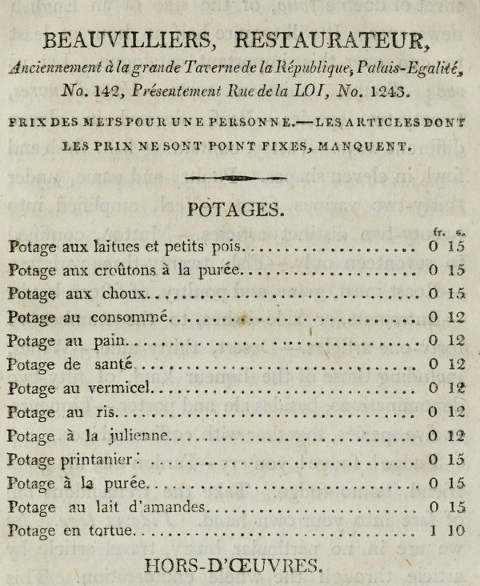

In September 1767 **[Denis Diderot](kloom:e/denis-diderot)** wrote to his friend Sophie Volland about a new habit. "Have I taken a liking to the restaurateur? Truly, yes: an infinite liking. One is served well there, a little dearly, but at whatever hour one wants" (our translation). Two years before, the fourteenth volume of his own **[_Encyclopédie_](kloom:e/encyclopedie)** had defined a _restaurant_ as "a term of medicine": "a remedy fit to give strength and vigor". By the time he wrote, the word also named what a few shops in **[Paris](kloom:e/paris)** sold, restorative broths made by sweating veal, game or fowl in a bain-marie, and those shops were turning into something new: the **[restaurant](kloom:e/restaurant)**.

## Broth for the delicate

The story usually told gives the first restaurant to a man called Boulanger, in the rue des Poulies, in 1765. An English traveler in Paris in 1801–2, **[Francis William Blagdon](kloom:e/francis-william-blagdon)**, told it already: Boulanger, "not being a traiteur", was "not authorized to serve ragouts", so he set before his customers "new-laid eggs and boiled fowl with strong gravy sauce", served "without a cloth, on little marble tables", under a Latin motto over his door: "Come to me, all whose stomachs labor, and I will restore you." Later tellings add a lawsuit by the traiteurs' guild, which Boulanger won.

The historian Rebecca Spang went to the records. She found no trace of the lawsuit, and gives the invention to Mathurin Roze de Chantoiseau, who was selling restorative broths in the rue des Poulies by 1766; the two names may belong to one man, and the sources still disagree. She also found what the first restaurants were for. An advertisement of 1767 offered them to "those who have a weak and delicate chest, or who by regimen are not in the habit of making two meals, nor of taking supper" (our translation of the French she quotes). They sold health, and the look of a refined sensibility, to people who barely ate.

## What made it a restaurant

The broths faded from the menus. The way of serving them stayed. **[Jean Anthelme Brillat-Savarin](kloom:e/jean-anthelme-brillat-savarin)**, writing in 1825, defined the restaurateur as one "whose trade consists in offering to the public a feast always ready, whose dishes are sold in portions at a fixed price, at the request of the consumers", and named its two papers: the _carte_, the list of dishes with their prices, and the _carte à payer_, the bill (our translations). Set beside the places Parisians had eaten in before, the restaurant differed in how it served, not in what:

|              | Inn or tavern          | Traiteur                 | Restaurant                            |
| ------------ | ---------------------- | ------------------------ | ------------------------------------- |
| When         | at the host's one hour | ordered in advance       | at any hour                           |
| Where        | one common table       | delivered to the house   | a small table of one's own            |
| What         | the dish of the day    | whole joints and ragouts | a choice from the printed carte       |
| What it cost | set per head           | by the piece             | per portion, printed beside each dish |

"One eats alone," Diderot wrote. "Each has his own little cabinet." The plate draws the two kinds of room in plan.

## Beauvilliers and the Revolution

**[Antoine Beauvilliers](kloom:e/antoine-beauvilliers)**, a cook from the household of the king's brother, the Count of Provence, opened La Grande Taverne de Londres in the **[Palais-Royal](kloom:e/palais-royal)** about 1782; that is Brillat-Savarin's date, and others give 1786. He was, Brillat-Savarin wrote, "the first to have an elegant room, well-dressed waiters, a choice cellar and a superior kitchen" (our translation). Blagdon copied his carte into a book in 1803:

The heading tells the story. The house was "formerly at the Grande Taverne de la République, Palais-Égalité": the **[French Revolution](kloom:e/french-revolution)** had renamed both the restaurant and the palace. "Prices of dishes for one person." Blagdon counted thirteen soups, twenty-two hors d'oeuvres, eleven ways with beef and thirty-two with poultry and game, on "a printed sheet of double folio, of the size of an English newspaper".

How much did the Revolution make the restaurant? In 1798 the writer **[Louis-Sébastien Mercier](kloom:e/louis-sebastien-mercier)** said that the cooks "of princes, of parlement councillors, of cardinals, of canons and of farmers-general" had not stayed idle "after the emigration" of their masters: "they made themselves restaurateurs" (our translation). Brillat-Savarin agreed that restaurants had made the best eating "popular". Spang argues that such accounts, repeated through the nineteenth century, gave the Revolution a credit that belonged to the 1760s: restaurants had multiplied through the 1770s and 1780s, and there were about a hundred before 1789. What the Revolution added was custom. The Allarde Decree of March 1791 abolished the guilds that had divided cooking among trades, and people from the provinces poured into a city where they had no family to feed them.

## The guides and the word

From 1803 **[Grimod de La Reynière](kloom:e/grimod-de-la-reyniere)** reviewed the restaurants in his yearly _Almanach des gourmands_, the first restaurant guide. In 1825 Brillat-Savarin, in his _Physiology of Taste_, counted on the cartes of the best houses at least twelve soups, twenty-four hors d'oeuvres, fifty entremets and fifty desserts among eleven classes of dish: by our arithmetic, at least 268 dishes, with thirty wines. The word traveled more slowly than the thing. The Académie française accepted _restaurant_ for the place only in 1835; Blagdon still wrote of the restaurateur as a French title "of no very ancient date"; and American cities ate first in "eating houses" and "restorators".

The next frame crosses to a Boston cooking school, where a cupful had to be measured level.
