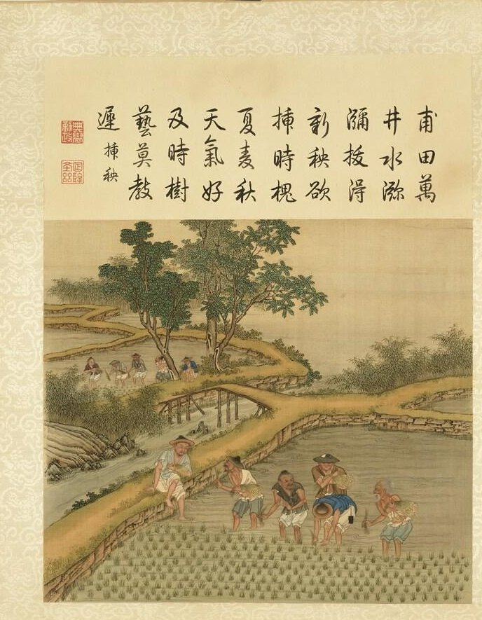

In the lower valley of the **[Yangtze](kloom:e/yangtze)**, in what is now Zhejiang, the first farmers of **[rice](kloom:e/rice)** lived among marshes. Their crop began as **[wild rice](kloom:e/oryza-rufipogon)**, _Oryza rufipogon_, a perennial grass of wet ground whose grains drop the moment they ripen. A plant that keeps its seed can be harvested; a plant that sheds it cannot. Rice became a crop, as wheat and barley did in the Fertile Crescent, when people began, without meaning to, to keep the plants that held on.

## Reading a spikelet base

The evidence is in the stub where each grain, in its husk, the spikelet, joined the plant. A wild spikelet breaks off cleanly at a layer of weak cells and leaves a smooth, round scar. A domesticated one has no such layer, and when it is threshed it tears, leaving a ragged base with a scrap of stalk. In 2006 Changbao Li, Ailing Zhou and Tao Sang traced much of the change to a single amino-acid substitution in a gene called _sh4_, which undermined that layer of cells. The plate draws both bases.

Counting them is how archaeologists measure domestication, and they disagree about the counts. A grain cut while still green tears too, so some "domesticated" bases may be wild rice harvested early. **[Dorian Fuller](kloom:e/dorian-fuller)**'s team sets those apart as unripe; Zheng Yunfei's team counts more of the torn bases as domesticated.

| Site, date                      | Wild, shattering | Torn, non-shattering    | Count by     |
| ------------------------------- | ---------------- | ----------------------- | ------------ |
| Huxi, about 7000–6400 BC        | 61%              | 9%, with 30% in between | Zheng, 2016  |
| Kuahuqiao, about 6000–5750 BC   | about 58%        |                         | Zheng, 2016  |
| Tianluoshan, about 5000–4600 BC | 49%              |                         | Zheng, 2016  |
| Tianluoshan, 4950 to 4650 BC    |                  | 27%, rising to 39%      | Fuller, 2009 |

Read either way, the change was slow. At Tianluoshan, a village of the **[Hemudu culture](kloom:e/hemudu-culture)** whose waterlogged mud keeps wood and seeds, Fuller found the share of domesticated bases rising by twelve points in three centuries, while rice grew from 8 to 24 percent of all the plant remains. The people still ate acorns, water chestnuts and fox nuts, fished and hunted deer, and tilled with hoes made from animals' shoulder blades.

## Fields of water

The first rice is older still. At Shangshan, about 10,000 years ago, potters mixed rice husks into their clay, and in 2017 Zuo Xinxin and colleagues dated rice silica from the site to about 9,400 years ago. At **[Kuahuqiao](kloom:e/kuahuqiao-site)**, near Hangzhou, Yongqiang Zong and colleagues read the pollen, charcoal and algae in the sediments: about 7,700 years ago people burned the alder scrub of a coastal swamp to clear it, kept it as wet grassland where rice grew, and probably held the water in with low banks. The sea drowned the site 150 years later.

Those banks, or bunds, are the **[paddy field](kloom:e/paddy-field)**. The oldest fields found, at Chaodun in Kunshan, date to about 4330 BC. A paddy is a flat plot walled with earth so that water can be let in, held a few centimeters deep, and drained before harvest. Most rice in Asia is still sown in a nursery and set out by hand, which takes about 40 kilograms of seed a hectare, against 60 to 80 sown direct, at a great cost in labor. A prime paddy on Java yields some 6 tonnes of unhusked rice a hectare: about 150 grains for every one planted, by our arithmetic, though with modern seed.

Two thousand years ago the historian **[Sima Qian](kloom:e/sima-qian)** wrote in the **[_Shiji_](kloom:e/shiji)** that in the south, the lands of Chu and Yue, "they eat rice and fish soup; some till with fire and weed with water" (in our translation), a phrase usually read as burning off the growth, then flooding the field to drown the weeds.

## One rice or several?

Asian rice has two great kinds, the sticky, short-grained **[japonica](kloom:e/japonica-rice)** and the long-grained indica. Archaeology puts its domestication in the Yangtze valley. Genetics has argued otherwise. In 2012 Xuehui Huang and colleagues sequenced 446 wild and 1,083 cultivated rices and placed the first domestication, of japonica, in the middle **[Pearl River](kloom:e/pearl-river)** valley farther south, with indica made later by crossing japonica with local wild rice as it spread into South and Southeast Asia. In 2017 Jae Young Choi and colleagues found that each kind arose from its own wild population, but that the genes of domestication came from japonica alone, carried into the others by crossing. Both put japonica first; they differ on where, and on how many beginnings to count.

## Millet in the north

Rice was not China's only grain. In the dry north, at **[Cishan](kloom:e/cishan-culture)** in Hebei, storage pits held the husks of **[broomcorn millet](kloom:e/proso-millet)**, which Lu Houyuan's team dated in 2009 to between about 10,300 and 8,700 years ago, with **[foxtail millet](kloom:e/foxtail-millet)** appearing after it; some archaeologists question how the samples were taken. Millet in the dry north and rice in the wet south became China's two ways of farming. The next part of this subject follows grain into those states, beginning with the granaries of Egypt.
