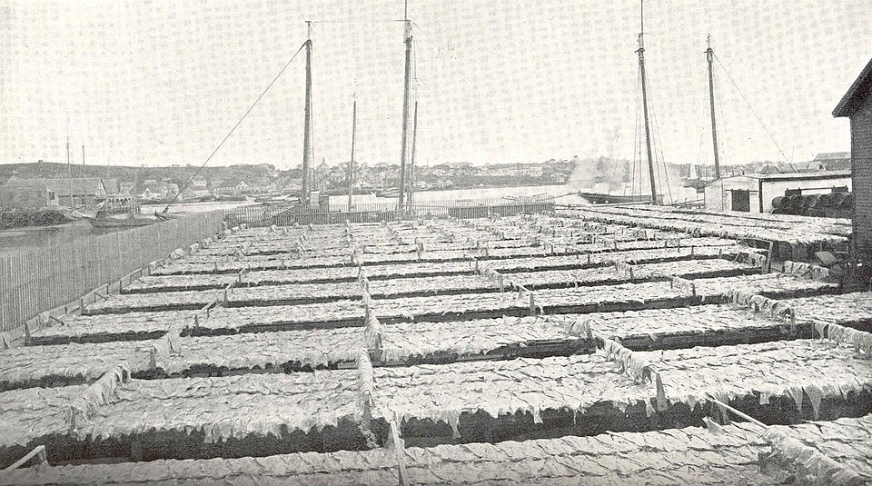

High in the Salzberg valley above **[Hallstatt](kloom:e/hallstatt)**, in the Austrian Alps, miners of the Bronze Age sank shafts into a mountain of rock salt. They cut parallel grooves in the salt with bronze picks, hammered out the lumps between, carried them off in rucksacks of cowhide and wooden trugs, and hauled them to the surface on ropes of lime bast. Tree rings in the timbers date the Bronze Age workings to between about 1458 and 1243 BC, and a wooden staircase to 1344–43 BC. For the archaeologist Anthony Harding it is the only certain deep salt mine of its age.

People and their herds need some salt to live, but salt was also, for most of history, how food was kept from one season to the next.

## Why salt keeps food

Bacteria and molds need water they can use. Food scientists measure it as **[water activity](kloom:e/water-activity)**: the vapor pressure of water over a food divided by that over pure water, so pure water has 1.0. Dissolved salt, **[sodium chloride](kloom:e/sodium-chloride)**, holds water and lowers it, and in a salted fish or ham water is drawn by osmosis out of the flesh and out of any microbe in it. Below a certain water activity each microbe stops growing:

| Food or organism                | Water activity |
| ------------------------------- | -------------: |
| Raw meat                        |           0.99 |
| _Clostridium botulinum_ A and B |  stops at 0.94 |
| _Staphylococcus aureus_         |  stops at 0.86 |
| Most molds                      |  stops at 0.80 |
| Saturated brine                 |           0.75 |

Drying lowers water activity by taking the water away outright. Smoke adds phenols, which slow bacteria and rancidity, but only at the surface, so smoked meat and fish were salted or dried too.

## Salt and the state

Something everyone needs, and only some places produce, is easy to tax. **[Pliny the Elder](kloom:e/pliny-the-elder)**, in his _Natural History_ of about AD 77, wrote that "even in the very honours, too, that are bestowed upon successful warfare, salt plays its part, and from it, our word 'salarium' is derived" (Bostock and Riley's translation of 1855). _Salarium_ does come from _sal_, salt, but no ancient source says Roman soldiers were paid in salt, and the classicist Peter Gainsford calls that modern claim "pure fantasy"; how the word got its meaning is unknown.

In China, **[Emperor Wu of Han](kloom:e/emperor-wu-of-han)** made salt and iron state monopolies in 119 BC to pay for his wars, and after his death a court debate of 81 BC, the **[Discourses on Salt and Iron](kloom:e/discourses-on-salt-and-iron)**, set Confucian scholars, who called state trading theft from the people, against officials who kept the revenue. The officials largely won, and for much of China's imperial history salt brought the state more than anything but the land tax.

France's **[gabelle](kloom:e/gabelle)**, a permanent royal salt tax from 1341, forced everyone over eight in its heartland to buy a set quantity of salt each year at the king's price. Finance minister **[Jacques Necker](kloom:e/jacques-necker)** gathered the figures in 1784; these are from the English translation of 1785:

| Provinces                 | Price, livres a hundredweight | Salt a head a year |
| ------------------------- | ----------------------------: | -----------------: |
| Of the great gabelle      |                      about 62 |          9⅙ pounds |
| Of the little gabelle     |                           33½ |         11¾ pounds |
| Of the salt pits          |                           21½ |    about 14 pounds |
| Redeemed from the gabelle |                       6 to 12 |    about 18 pounds |

Where salt was dear, people ate less of it, and smuggled the rest. The **[French Revolution](kloom:e/french-revolution)** abolished the gabelle in 1790; **[Napoleon](kloom:e/napoleon)** restored it in 1806, and it lasted until 1945.

## The salt cod

In 1497 the Milanese ambassador in London reported what the crew of **[John Cabot](kloom:e/john-cabot)** said of the sea off the new land: it "is swarming with fish, which can be taken not only with the net, but in baskets let down with a stone." Within the century Basque, Portuguese, French and English fleets were fishing the **[Grand Banks of Newfoundland](kloom:e/grand-banks-of-newfoundland)** every summer, and since the catch was far from any market, it had to be salted.

A Gloucester captain's journal, printed by the US Fish Commission in 1887, describes the work. On deck a header took off the head, a gutter the liver and guts, and a splitter cut out the backbone and laid the fish open flat. In the hold salters built the fish into piles called kenches, scattering salt over each: "No part of the work on a 'salt trip' requires so much care and judgment as the salting." Ashore they were washed, salted again, pressed, and dried on racks called flakes. Charles Stevenson of the Fish Commission set out in 1899 what the cure did to a fish:

| Stage                        |  Weight |   Water |   Salt |
| ---------------------------- | ------: | ------: | -----: |
| Cod as it comes from the sea |  100 lb |         |        |
| Dressed for salting          | 66.9 lb |   53 lb |   1 lb |
| Dry-salted for market        | 38.8 lb | 18.9 lb | 7.2 lb |

The best of this **[salt cod](kloom:e/dried-and-salted-cod)** went to Catholic Europe. The fish the European markets refused, the historian Olaf Janzen writes, went to the Caribbean, where the sugar plantations "welcomed cheap food imports, even refuse fish" to feed the people they held in slavery. Salt was made by enslaved people too. **[Mary Prince](kloom:e/mary-prince)**, sold to a salt-pond owner on Turks Island, told it in the account she dictated, published in 1831: "I was given a half barrel and a shovel, and had to stand up to my knees in the water, from four o'clock in the morning till nine". The sun raised "salt blisters", and "our feet and legs, from standing in the salt water for so many hours, soon became full of dreadful boils, which eat down in some cases to the very bone".

## What salt did to the diet

Salted food fed armies, navies and cities until refrigeration, and the taste for it stayed. The **[World Health Organization](kloom:e/world-health-organization)** puts the world's average intake at about 11 grams of salt a day in 2021, more than twice the 5 grams it advises, and links the excess chiefly to raised blood pressure. In 2015 its cancer agency classed meat "transformed through salting, curing, fermentation, smoking" as a cause of colorectal cancer: 50 grams a day raises the risk by 18 percent.

Salt meat kept a ship at sea for months, but lacked something its crew needed: the next frame is James Lind's scurvy trial.
