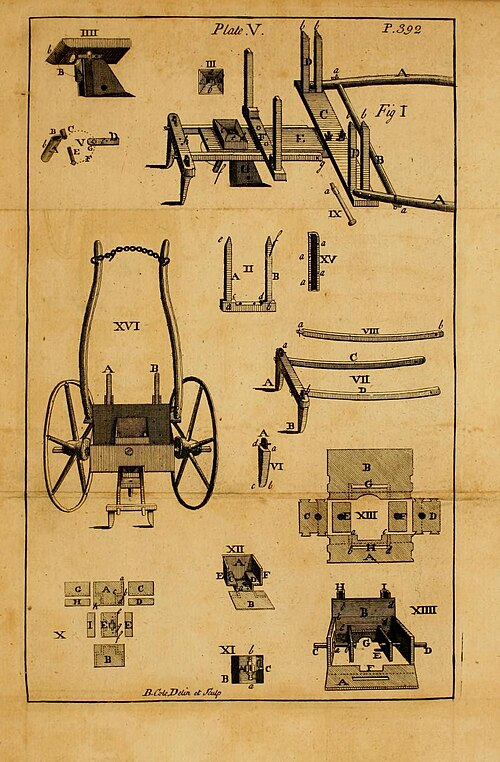

For most of history a farmer sowed grain by hand, walking the plowed field and throwing seed out in handfuls, while a harrow dragged after him buried what it could. Some seed lay too deep to come up and some lay on the surface for the birds, and to be sure of a stand he threw far more than the crop needed. Around 1700 **[Jethro Tull](kloom:e/jethro-tull-agriculturist)**, a young Berkshire gentleman trained in the law who had taken to farming his father's land, wanted to lay down his fields to **[sainfoin](kloom:e/onobrychis-viciifolia)**, a fodder legume. Its seed was scarce and dear, and the custom was to sow seven bushels an acre. He counted. Seven bushels came to 140 seeds for every square foot of ground; where the crop was best, he found about one plant per square foot.

Tull told the rest himself in _The Horse-Hoing Husbandry_ (1733). He paid laborers to cut channels and drop a little seed in each, "and cover it exactly", which cost "but a fourth Part of the Expence of the common Way". The next season, he wrote, "these People had conspired to disappoint me", perhaps fearing for their place if land were taken from the plow, so he dismissed them, "resolving to quit my Scheme, unless I could contrive an Engine to plant St. Foin more faithfully than such Hands would do." He had played the organ when young and knew how it worked: "at last pitched upon a Groove, Tongue, and Spring in the Sound-Board of the Organ". The machine he built from it "was named a Drill: because when Farmers us'd to sow their Beans and Peas into Channels or Furrows, by Hand, they call'd that Action, Drilling."

## How the drill worked

Tull's **[seed drill](kloom:e/seed-drill)** had four parts. "The principal Parts of the Drill are, the Seed-Box, the Hopper, and the Plow, with its Harrow," Tull wrote, and the seed-box was "as an artificial Hand, which performs the Task of delivering out the Seed, more equally than can be done by a natural Hand." His plates draw every part:

| Part               | What it did                                                                                                                     |
| ------------------ | ------------------------------------------------------------------------------------------------------------------------------- |
| Hopper             | Held the seed above the box and fed it down                                                                                     |
| Notched spindle    | A wooden cylinder through the box, the axle of the two wheels; cuts along it each carried out a "notchful" of seed as it turned |
| Tongue             | A brass plate inside the box, pressed against the notches so that only the seed in a notch got past                             |
| Spring and screw   | A steel spring behind the tongue let it give way rather than crush a seed; a screw set how near it stood                        |
| Shares and funnels | For wheat, three shares cut channels seven inches apart, and a funnel behind each led the seed down into its channel            |
| Harrow             | Dragged behind on its own beams, it closed the channels over the seed                                                           |

Because the spindle was the axle, an equal number of notchfuls fell "at each Revolution of the Wheels", whether the horse walked fast or slow. The rate was set by the number and size of the notches; to drill thin, Tull used four or five instead of six. The plate draws the drill from the side and the seed-box in section.

## Earth for food

Tull's farming had a second half, which gave his book its name. He sowed **[wheat](kloom:e/wheat)** in double or treble rows with intervals of "near Five Foot" between them, and through the summer a horse-drawn hoe stirred the soil in those intervals. He had seen the plowed vineyards of Languedoc, and meant to bring "a Sort of Vineyard-Culture into the Corn-Fields". His reason was a theory: "Every Plant is Earth, and the growth and true increase of a Plant is the Addition of more Earth." The finer the soil was broken, the more food the roots had, and manure was needless. That was wrong. A plant builds most of its body from the air and water, and what it takes from the soil is dissolved nutrients. Hoeing did help, by killing weeds. Tull's French followers, among them Henri-Louis Duhamel du Monceau, found that tillage alone did not keep land fertile.

## Older drills, and few users

The drill was not new to the world. A Sumerian text, _The Farmer's Instructions_, in which an old farmer advises his son, tells him to "keep your eye on the man who drops the seed. The grain should fall two fingers deep," from a seeder-plow, which dropped the grain down a tube behind its share. In China a multi-tube iron drill was in use under the **[Han dynasty](kloom:e/han-dynasty)** by the second century BC. The **[_Qimin Yaoshu_](kloom:e/qimin-yaoshu)**, a farming manual of about AD 540, says that when the official Huangfu Long taught the people of Dunhuang to make the drill-plow, "the labor saved was more than half, and the grain gained by half again" (our translation). Drills were common in Mughal India by the sixteenth century, and Venice granted one a patent in 1566.

English farmers were slow to follow. Tull's drills, and those built after them, were costly, unreliable and fragile, and on the open-field farmers who sowed broadcast, as Rowland Prothero (later Lord Ernle) put it in 1912, "Tull's experiments were lost". An encyclopedia of 1844 judged that the practice "did not come into any thing like general adoption" until the beginning of the nineteenth century, and drills became common in Europe only later in that century, when machine tools could make their parts cheaply and well.

## A revolution, and when

The drill and the turnip are on every list of what made the **[British Agricultural Revolution](kloom:e/british-agricultural-revolution)**, but historians disagree about when that was, or whether it happened at all. Eric Kerridge put it between 1560 and 1767, with "all its main achievements" before 1720; Robert Allen found a "yeoman's revolution" in the seventeenth century; Gregory Clark concluded that there was none between the early eighteenth and mid-nineteenth centuries. **[Mark Overton](kloom:e/mark-overton)** answered in 1996 that average wheat yields, stuck below about 18 bushels an acre for centuries, rose above that by 1800 and toward 30 by the mid-nineteenth century. On any of these accounts the drill came late. What raised yields first was a rotation, which the next frame takes up: turnips and clover.
