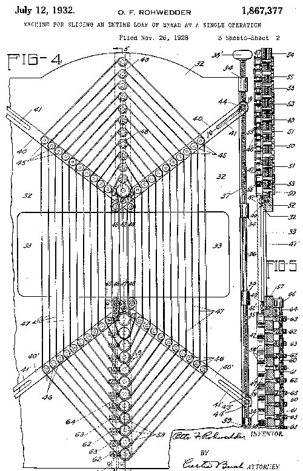

On 7 July 1928 the Chillicothe Baking Company of **[Chillicothe, Missouri](kloom:e/chillicothe-missouri)**, began selling loaves that a machine had cut into slices. It called them Kleen Maid Sliced Bread, and advertised them as "the greatest forward step in the baking industry since bread was wrapped". The machine was the work of **[Otto Frederick Rohwedder](kloom:e/otto-frederick-rohwedder)**, a jeweler from Iowa who had sold his shops to build it; the baker, Frank Bench, was a friend. His own story has gaps: one account has his first prototype burned in 1912, another in 1917, and accounts disagree even on whether he was born in Davenport or Des Moines.

**[Sliced bread](kloom:e/sliced-bread)** came into a trade that was already industrial, as the advertisement's boast about wrapping shows. Bakers sold wrapped loaves under brand names: Holsum, which a Chicago firm marketed for a cooperative of bakeries, and **[Wonder Bread](kloom:e/wonder-bread)**, launched in Indianapolis in 1921 and made a national brand by the Continental Baking Company, which bought it in 1925. Slicing was the next step down the line.

## How the slicer worked

Rohwedder filed his patent on 26 November 1928, and it was granted in 1932 as US 1,867,377, "Machine for slicing an entire loaf of bread at a single operation". Its description sets out what made it work:

| Part                    | What the patent says it does                                                                                   |
| ----------------------- | -------------------------------------------------------------------------------------------------------------- |
| Endless cutting bands   | Many thin blades run as loops over pulleys, "with their cutting edges in the same vertical plane"              |
| Opposed motion          | "Adjacent bands move in opposite directions to prevent crushing and displacement" of the loaf                  |
| Feed conveyor           | Fingers push each whole loaf through the rectangular opening the bands cross                                   |
| Spacing lever and screw | Changes "the spacing between the bands" all at once, for thicker or thinner slices                             |
| Delivery conveyor       | Carries the cut loaf off, "particularly adapted to cooperate with a bread wrapping machine"                    |
| Common drive            | One drive runs bands and conveyors, timed so the conveyors move "relatively slower than the slicing mechanism" |

The plate draws the cutting head in elevation, as the patent's fourth figure does: the bands fanning down from pulleys above, crossing the opening, and returning to pulleys below, neighbors running opposite ways so that the soft loaf is neither dragged nor crushed.

A slicer alone was not enough: a sliced loaf falls apart before it can be wrapped. Gustav Papendick, a St. Louis baker who bought the second machine, tried rubber bands and pins and settled on a cardboard tray that held the slices together until the wrapping machine closed them in. Wonder Bread went on sale sliced in 1930. By 1933, American bakeries made more sliced than unsliced loaves. Slices of one thickness suited the electric toaster: **[Charles Strite](kloom:e/charles-strite)** had patented one that popped up the toast in 1921, and the Toastmaster brought it into kitchens in the mid-1920s.

## The ban of 1943

On 29 December 1942 the Secretary of Agriculture, **[Claude R. Wickard](kloom:e/claude-r-wickard)**, signed Food Distribution Order No. 1, to take effect on 18 January 1943. Among a list of savings it said:

> No baker shall make or sell any sliced bread except that bread weighing two pounds or more per loaf may be sliced for a period of sixty days from the effective date of the order.

Officials told _The New York Times_ that a sliced loaf needed heavier wrapping to keep, and the order was also meant to hold down the price of bread after flour had been allowed to rise ten percent. It was hated. "I should like to let you know how important sliced bread is to the morale and saneness of a household," a mother of four wrote to the paper. On 8 March 1943 the order was rescinded. Wickard said the savings were "not as much as we expected", and that the War Production Board reported wax paper enough for four months.

## Enriched

The same order said something that outlasted the war: "All white bread shall be enriched." In May 1941 the **[Food and Drug Administration](kloom:e/food-and-drug-administration)** had set what **[enriched flour](kloom:e/enriched-flour)** meant. Its findings were blunt: many diets lacked vitamins and iron, the shortfalls were worst among "persons with low incomes", and those people got more of their energy from flour "because of their cheapness". White flour is mostly endosperm; milling takes away the bran and germ, and with them much of a grain's B vitamins and iron. Enrichment puts some back.

| Per pound of enriched flour | FDA, May 1941 | FDA, 2026 |
| --------------------------- | ------------- | --------- |
| Thiamine (vitamin B1)       | 1.66–2.5 mg   | 2.9 mg    |
| Riboflavin                  | 1.2–1.8 mg    | 1.8 mg    |
| Niacin                      | 6–24 mg       | 24 mg     |
| Iron                        | 6–24 mg       | 20 mg     |
| Folic acid                  | none          | 0.7 mg    |

Each answered a disease: thiamine **[beriberi](kloom:e/thiamine-deficiency)**, niacin **[pellagra](kloom:e/pellagra)** and iron **[anemia](kloom:e/anemia)**. Pellagra had struck the American South hardest, by one estimate 3 million cases and 100,000 deaths between 1906 and 1940. Whether enrichment ended it is harder to prove than it sounds. A study of 2000 found its effect hard to separate from the other changes of those years, but concluded that fortification "played a significant role". The frame on vitamins tells how they were found. The trail goes on to England in 1961, where a laboratory took the time out of the loaf.
