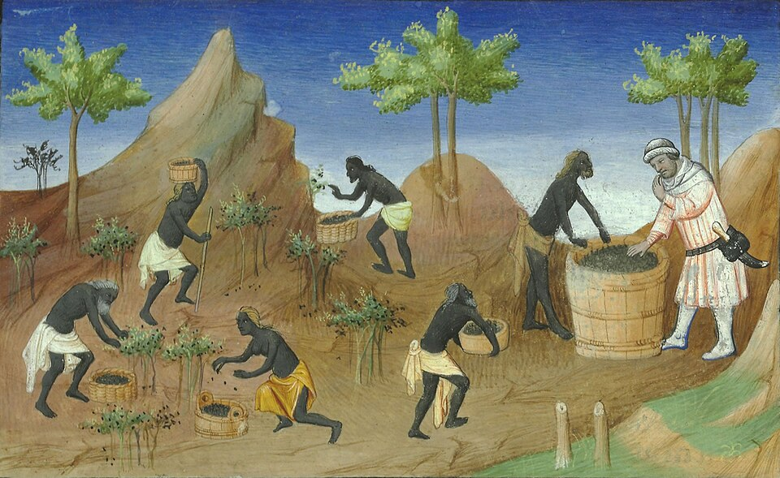

On 20 May 1498 three Portuguese ships under **[Vasco da Gama](kloom:e/vasco-da-gama)** anchored off **[Calicut](kloom:e/kozhikode)**, on the south-west coast of India. Next day da Gama sent one of the convicts he carried ashore, and the man was taken to two merchants from Tunis who spoke Castilian and Genoese. Their first words, in the journal kept by one of the crew, were "May the Devil take thee! What brought you hither?" He told them "we came in search of Christians and of spices." The journal, known as the _Roteiro_, is anonymous; the words here are from E. G. Ravenstein's translation of 1898. The answer was a good one. Europe's ships had reached the **[spice trade](kloom:e/spice-trade)**, which was already very old, and very international.

## Pepper from Malabar

The spice they meant above all was **[black pepper](kloom:e/black-pepper)**, the dried berry of a vine that grows wild in the hills of the **[Malabar Coast](kloom:e/malabar-coast)**. Picked green and dried in the sun, the berry shrinks and blackens into a peppercorn that keeps for years: a food made for long journeys. Roman ships came for it to **[Muziris](kloom:e/muziris)**, near the mouth of the Periyar River. A Greek merchant's handbook of the first century AD, the **[_Periplus of the Erythraean Sea_](kloom:e/periplus-of-the-erythraean-sea)**, says that ships were sent there "on account of the great quantity and bulk of pepper", bringing "a great quantity of coin", and that the pepper came from one district inland, called Cottonara (in W. H. Schoff's translation of 1912).

At Rome, **[Pliny the Elder](kloom:e/pliny-the-elder)** put long pepper at 15 denarii a pound, white at 7 and black at 4, and wondered at it: "its only desirable quality being a certain pungency; and yet it is for this that we import it all the way from India!" In no year, he complained, did India drain the empire of less than fifty million sesterces, for goods "sold among us at fully one hundred times their prime cost." (Bostock and Riley's translation of 1855 prints "five hundred and fifty millions"; the Latin, HS |D|, is fifty million.) A papyrus of the second century AD, the Muziris papyrus in Vienna, values one returning cargo, on the ship _Hermapollon_, at 1,151 talents and 5,852 drachmas after the state's quarter-share tax, nearly seven million sesterces. Federico De Romanis reads the faint first column as pepper making up about two-thirds of that value. Matthew Cobb, setting Pliny's price beside Roman wages, argues that pepper reached well beyond the rich in the **[Roman Empire](kloom:e/roman-empire)**.

## How the monsoon made the trade work

Ships could cross the open ocean because the **[monsoon](kloom:e/monsoon)** reverses. In summer the land of Asia heats and draws in moist air from the south-west; in winter it cools and the wind blows back from the north-east. Pliny gives the timetable that followed:

| When                    | The wind                       | What the ships did                                              |
| ----------------------- | ------------------------------ | --------------------------------------------------------------- |
| Midsummer               | The Etesian winds of summer    | Leave Berenice; about 30 days to Ocelis, at the Red Sea's mouth |
| High summer             | South-west monsoon, "Hippalus" | Straight across the open sea to Muziris in about 40 days        |
| Autumn                  | Monsoon ends                   | Trade and load in port                                          |
| December to mid-January | North-east monsoon             | Sail home, catching a southerly wind in the Red Sea             |

One round trip a year, and a ship that missed its wind waited for the next. The _Periplus_ credits a pilot, Hippalus, with first laying "his course straight across the ocean." Da Gama, guided from Malindi by a pilot from Gujarat, crossed with the south-west monsoon in 23 days. Going home, he left the Indian coast early in October, before the north-east monsoon had set in, and took nearly three months. "All our people again suffered from their gums, which grew over their teeth," the _Roteiro_ says; thirty men died of what we call scurvy. The plate draws both crossings, and the year's winds.

## The road through Egypt

In Calicut the Portuguese learned how pepper had reached them until then. The _Roteiro_ sets it out stage by stage: ships of Mecca carried the spices to Jidda in fifty days, paying duty to the sultan of the **[Mamluk Sultanate](kloom:e/mamluk-sultanate)**; smaller ships took it up the Red Sea to Tor, where duty was paid again; camels took it ten days to Cairo, and paid; the Nile took it to Rosetta, and paid; and camels carried it on to **[Alexandria](kloom:e/alexandria)**, where galleys of the **[Republic of Venice](kloom:e/republic-of-venice)** and of Genoa bought it. The sultan, the author heard, drew 600,000 cruzados a year from these duties.

## Pepper by force

Portugal set out to take that trade. Da Gama came back in 1502 with a war fleet, burned a ship of Muslim pilgrims with its passengers aboard, and bombarded Calicut. His fleet brought home about 1,700 tons of spices, about what Venice imported in a year. From 1505 a viceroy governed the **[Estado da Índia](kloom:e/portuguese-india)** from Cochin, and later Goa, taken in 1510, with Malacca in 1511 and Hormuz in 1515. Ships in its waters needed a Portuguese pass, a **[cartaz](kloom:e/cartaz)**, and those without one could be seized or sunk.

Did it lower Europe's prices? Frederic Lane argued that it did not: pepper prices at Venice rose after 1498, and Venice's trade through Alexandria revived by the middle of the century. Kevin O'Rourke and Jeffrey Williamson, allowing for inflation, found that the real price of pepper fell across Europe after 1503. Asia remained the larger market: in 1515 only about 30 percent of Malabar's pepper went to Lisbon. The voyage of Magellan, from 1519, was Spain's attempt to reach the spice islands by sailing west.

The next frame crosses to another continent, and to chocolate. The Dutch, who followed the Portuguese east, return at the Banda Islands.
