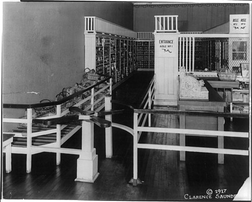
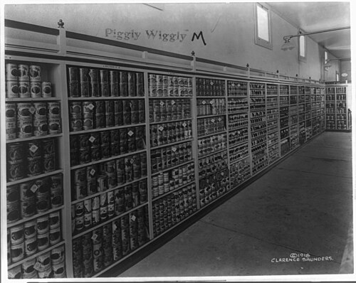

Until 1916 an American grocery was a counter. The customer stood on one side of it and the goods sat on shelves on the other, and a clerk fetched each thing asked for, measured out and wrapped what came loose, and added up the bill. Prices were often not posted, and a store could serve only as many people at once as it had clerks. In September 1916 **[Clarence Saunders](kloom:e/clarence-saunders)**, a wholesale grocer, opened a store at 79 Jefferson in **[Memphis, Tennessee](kloom:e/memphis-tennessee)**, that had no clerks on the floor at all. He called it **[Piggly Wiggly](kloom:e/piggly-wiggly)**. The customer went in and fetched the groceries herself.

## How the self-serving store worked

Saunders filed for a patent on his "Self-Serving Store" on October 21, 1916, and was granted U.S. Patent 1,242,872 on October 9, 1917. Its object, he wrote, was a store in which "the customer will be enabled to serve himself and, in so doing, will be required to review the entire assortment of goods carried in stock". The plan, drawn on the plate, divides the room into three: a lobby at the front, a salesroom in the middle and a stockroom behind, from which clerks refilled the shelves through swinging doors. Cabinets of shelving stand in rows down the salesroom, each row open at alternate ends, so that the aisles join into one "circuitous path" that "must be traversed by every purchaser who enters".

| Step | What the patent describes                                                                                                                   |
| ---- | ------------------------------------------------------------------------------------------------------------------------------------------- |
| 1    | Enter the lobby from the street                                                                                                             |
| 2    | Pass a gate opened "by the weight of the person entering", which locks so it turns one way only                                             |
| 3    | Walk four aisles in turn, up and down the salesroom, taking packages from the shelves; perishables sit in a refrigerator with a glass front |
| 4    | Leave the last aisle by an exit passage with a shelf to rest the basket on while waiting                                                    |
| 5    | At the counter, the goods are "checked up, billed on the adding machine", wrapped and paid for, and the sale rung on the cash register      |
| 6    | Leave through a second one-way gate                                                                                                         |

Everything was sold in packages, and in a second patent, filed in 1918, Saunders priced them: a tag hung on a swinging hook in front of each compartment, so that "the necessity for marking each package is obviated" and a customer saw goods and price "at a single glance". The photographs of 1917 and 1918 show both: the turnstile, the baskets and the register, and shelves of cans under diamond-shaped tags.

The patent claims that the system let a grocer cut his margin by more than half and sell three or four times as much as a store served by clerks. Those are Saunders's own figures. The growth was real: Piggly Wiggly had 615 stores in 1921 and 2,660 at its peak in 1932, many of them franchised, though Saunders himself lost the company in 1923 after a failed attempt to corner its stock.

## The supermarket

**[Self-service](kloom:e/self-service)** was only half of what came next. **[Michael J. Cullen](kloom:e/michael-j-cullen)**, a branch manager for the **[Kroger](kloom:e/kroger)** chain in southern Illinois, wrote in 1930 to a vice-president of the company proposing "monstrous stores", some forty feet wide and up to 160 deep, a few blocks off the high-rent district "with plenty of parking space", selling at low prices on large volume. Accounts differ on who received the letter, but none says it was answered. Cullen left, and on August 4, 1930, opened **[King Kullen](kloom:e/king-kullen)** in a former garage at 171st Street and Jamaica Avenue in Queens, New York, advertised as "the world's greatest price wrecker". When the Food Marketing Institute and the Smithsonian later looked for the first **[supermarket](kloom:e/supermarket)**, they defined one by self-service, separate departments, discount pricing, marketing and volume selling, and chose King Kullen.

The **[Great Depression](kloom:e/great-depression)** made shoppers count every cent, and the big chains followed. By 1938 the **[Great Atlantic & Pacific Tea Company](kloom:e/a-and-p)** had opened more than 1,100 supermarkets, and by 1940 it had closed 5,950 of its small grocery stores. Small grocers fought back through the anti-chain movement, and the **[Robinson–Patman Act](kloom:e/robinson-patman-act)** of 1936 forbade suppliers to sell to big buyers at lower prices where that harmed competition. Whether that was fair play or protection is still argued. The Supreme Court upheld it in 1948, finding that Congress considered it "an evil that a large buyer could secure a competitive advantage over a small buyer solely because of the large buyer's quantity purchasing ability." But enforcement was hard from the start, lapsed in the late 1960s, survived an attempt at repeal in the 1970s and faded again after the 1990s, while the chains grew; in 2024 members of Congress urged its revival to bring food prices down.

## What it did to food

A shopper choosing from a shelf chooses by the package. A Piggly Wiggly advertisement of 1920 promised: "You won't be asked to buy. You will not be criticized for not buying. Nationally advertised is the class of merchandise." _Time_ wrote in 1929 that self-service succeeded partly because "neat packages and large advertising appropriations have made retail grocery selling almost an automatic procedure." The brand, not the grocer, now sold the food.

The last step was the checkout. In 1973 the grocery trade adopted the **[Universal Product Code](kloom:e/universal-product-code)**, a number for every package printed as a **[barcode](kloom:e/barcode)**, and at 8:01 a.m. on June 26, 1974, the first was scanned at the checkout of Marsh Supermarket in Troy, Ohio: a ten-pack of Wrigley's Juicy Fruit gum, which rang up 67 cents on an **[NCR](kloom:e/ncr-voyix)** register. Scanners spread slowly: by 1984 about eight percent of American grocery stores had one. The economists Emek Basker and Timothy Simcoe found that firms grew and registered more trademarks after adopting the code, and that the number of products on a grocer's shelves rose in the same years. The same self-service would reach the restaurant kitchen next, at a drive-in in San Bernardino.
