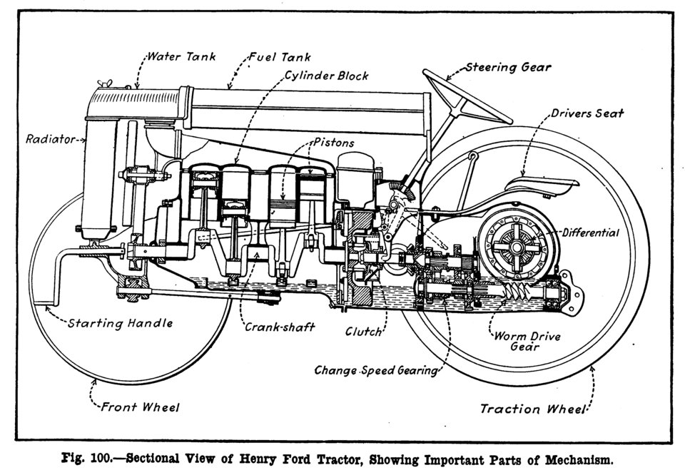

In 1917, with German submarines sinking the ships that fed it, Britain needed to plow up grassland and could not find the horses to do it. The Ministry of Munitions ordered thousands of a light [tractor](kloom:e/tractor) that **[Henry Ford](kloom:e/henry-ford)** had not yet put on sale at home. "We sent in all five thousand tractors across the sea in the critical 1917-18 period when the submarines were busiest," Ford wrote in _My Life and Work_ (1922), and he said they were "run mostly by women". The machine was the **[Fordson](kloom:e/fordson)**, made by his family firm, Henry Ford & Son. It went on sale in the United States in 1918, and within a few years it had begun to retire the horse.

## A quarter of the land for the team

In 1910 the farms of the United States worked with more than 24 million horses and mules, and on 1 January 1918 there were 26.7 million, by our arithmetic from the [Department of Agriculture](kloom:e/united-states-department-of-agriculture)'s estimates. They had to be fed. The department reckoned each horse or mule of working age ate 800 pounds of oats, 1,600 pounds of shelled corn and 1.8 tons of hay a year, and from that it worked out the land the feed came from: in 1910, 88 million of the 325 million acres of harvested crops, 27 percent by our arithmetic. More than a quarter of the harvested land fed the team, not people.

Ford printed what a wartime government test found plowing cost:

| Plowing, per acre       | Eight horses, $1,200 | Fordson, $880 |
| ----------------------- | -------------------: | ------------: |
| Depreciation            |                $0.30 |        $0.221 |
| Repairs                 |                      |        $0.026 |
| Feed, 100 working days  |                $0.40 |               |
| Feed, 265 idle days     |               $0.265 |               |
| Kerosene, 2 gallons     |                      |         $0.38 |
| Oil                     |                      |        $0.075 |
| Drivers at $2 a day     |                $0.50 |         $0.25 |
| Total, as Ford gives it |                $1.46 |         $0.95 |

The horses ate on 265 idle days as well as 100 working ones. These are Ford's figures, printed to sell tractors, though he thought the test had overstated the tractor's costs.

## From steam to the Fordson

Steam [traction engines](kloom:e/traction-engine) had been built since the 1870s, but at more than 30,000 pounds they sank in all but the driest soils and cost too much for most farms. In 1892 **[John Froelich](kloom:e/john-froelich)**, in Clayton County, Iowa, mounted a gasoline engine on a running gear and drove it; his company failed by 1895. Charles Hart and Charles Parr of Charles City, Iowa, built fifteen gasoline machines in 1903, and their firm's word for them, "tractor", stuck.

Ford wanted power without weight. The Fordson weighed 2,425 pounds, started on gasoline and ran on kerosene, and had no frame at all. The engineer **[Eugene Farkas](kloom:e/eugene-farkas)** made the engine block, the gearbox case and the housing of the worm drive to the rear axle carry the loads themselves, bolted end to end. The cutaway of 1918 shows the unit: there is no chassis under it. Fewer parts meant a cheaper machine, and it was built the way the [Model T](kloom:e/ford-model-t) was: at the [River Rouge](kloom:e/ford-river-rouge-complex) plant, Ford wrote, "the work flows exactly as with the automobiles", each part riding a conveyor to its assembly. The price was $750 in 1918 and $395 in 1922, and by 1923 the Fordson had 77 percent of the American market. It had a flaw: with a short wheelbase and a drawbar hitch, a plow that caught on a rock could make it rear up and turn over backward onto its driver.

## Three points

**[Harry Ferguson](kloom:e/harry-ferguson)**, an engineer from Belfast, spent the decade from 1916 on a better way to hitch a plow. His British patent, filed in 1925 and granted in 1926, coupled the plow to the tractor so that changes in its draft worked the machinery that set its depth, and his American patent drew the coupling on "an ordinary Fordson". The **[three-point hitch](kloom:e/three-point-hitch)** that came of it joins the implement by two lower links and one top link, as the plate draws. Rigidly held, the plow's pull is turned into a downward load on the rear wheels, so a light tractor grips like a heavy one, and the same geometry holds the front down. In the later hydraulic version the top link senses the draft: as the plow bites harder the top link feels it, and the hydraulics lift the plow a little until the draft falls back. Ford put Ferguson's system on the Ford 9N in 1939.

| Year | Horses and mules, millions | Tractors, millions | Cropland feeding them, million acres |
| ---- | -------------------------: | -----------------: | -----------------------------------: |
| 1910 |                       24.2 |              0.001 |                                   88 |
| 1920 |                       25.7 |               0.25 |                                   90 |
| 1930 |                       19.1 |               0.92 |                                   65 |
| 1940 |                       14.5 |               1.57 |                                   43 |
| 1950 |                        7.8 |               3.39 |                                   19 |
| 1960 |                        3.1 |               4.69 |                                    5 |

## What it did

By 1960 the land that fed work animals had shrunk from 88 million acres to 5 million, freed for other crops or left to go back to grass and forest. Farm employment fell from 13.6 million in 1910 to 9.9 million in 1950. Horses and mules, William White writes, had eaten more than a fifth of the food they helped to grow. White, an economist who counts combines and cotton pickers in with the tractor, estimates that the country would have been almost 10 percent poorer in 1955 without it. Farms grew larger, small market towns emptied, and the mechanical cotton picker sent families out of the Deep South. Why horses lingered on farms for forty years has been argued too: Alan Olmstead and Paul Rhode, treating it as the slow replacement of capital, found the switch far faster than historians had thought. The next frame comes to the Great Plains, where the plowing had gone too far.
