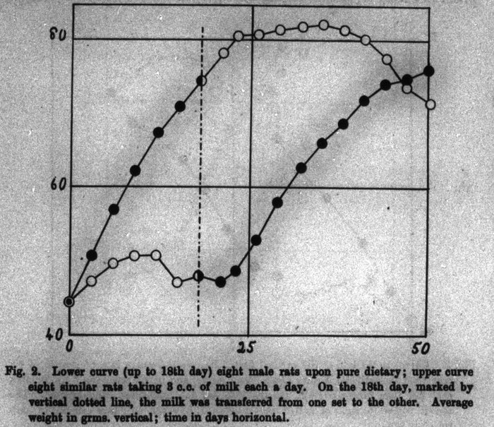

In the 1880s the Dutch army in the East Indies was losing men to **[beriberi](kloom:e/thiamine-deficiency)**, a wasting of the nerves that left soldiers unable to walk and could kill a man suddenly. A government commission came out in 1886 to find its cause, and looked for a germ; and when it went home its young assistant, **[Christiaan Eijkman](kloom:e/christiaan-eijkman)**, stayed on, from 1888 as director of the laboratory in the military hospital at **[Batavia](kloom:e/batavia-dutch-east-indies)**, on Java. "Then a chance happening put me on the right track," he wrote in his Nobel lecture. The laboratory's chickens fell ill with a palsy very like beriberi, and then recovered. The keeper, Eijkman found, had been feeding them cooked rice from the hospital kitchen. From 17 June to 27 November they had eaten polished rice; the disease broke out on 10 July and cleared up in the last days of November, after a new cook refused to give military rice to civilian chickens.

## Something missing

Chickens fed polished rice fell ill after three or four weeks; chickens fed whole rice stayed well, and sick birds recovered when their food was changed. Whatever protected them lay in the "silver skin" and germ that milling strips from the grain, which the plate draws in section. At Eijkman's request the medical inspector Adolphe Vorderman surveyed 101 prisons on Java and Madura, holding almost 300,000 inmates, and found beriberi some 300 times commoner where the staple was polished rice. Eijkman called it an "anti-beriberi factor", as if an antidote. It was his successor, **[Gerrit Grijns](kloom:e/gerrit-grijns)**, who argued in 1901 that the bran held a substance the body needed, and that its lack was a "partial hunger".

At Cambridge, **[Frederick Gowland Hopkins](kloom:e/frederick-gowland-hopkins)** showed the same thing in rats. In a paper of 1912 he fed sixteen young males a diet of purified casein, starch, sugar, lard and salts. Eight also had three cubic centimeters of milk a day, so little that its solids were at most a few percent of what they ate. Those eight grew; the others did not. On the 18th day he moved the milk from one set to the other, and the curves crossed. Something present "in astonishingly small amount", he wrote, was needed for growth: "accessory factors".

That year in London **[Casimir Funk](kloom:e/casimir-funk)**, trying to isolate the anti-beriberi substance from rice polishings, proposed the name "vitamine", a vital amine, and argued that beriberi, [scurvy](kloom:e/scurvy), pellagra and rickets were each the lack of one. Who discovered [vitamins](kloom:e/vitamin) was argued for years. Funk protested in 1925 against Hopkins being called the discoverer; Hopkins, in his own Nobel lecture of 1929, called part of Funk's review "essentially disingenuous". The prize went to Eijkman and Hopkins. Grijns was passed over, and the Japanese chemist Umetaro Suzuki, who had extracted the same factor from rice bran in 1910, was hardly noticed outside Japan. In 1920 Jack Drummond dropped the "e": not every vitamin was an amine.

## An alphabet

At Wisconsin **[Elmer McCollum](kloom:e/elmer-mccollum)** kept the first rat colony in the United States bred for nutrition research. In 1913 he and **Marguerite Davis** found that young rats on a ration with lard stopped growing after about eighty days, and grew again when butterfat or an extract of egg fat was added. The factor became vitamin A. Each new vitamin was shown the same way: a diet that lacks it, a disease that follows, and a cure.

| Vitamin    | What its lack causes      | How it was shown                                                      | Who, when                                 |
| ---------- | ------------------------- | --------------------------------------------------------------------- | ----------------------------------------- |
| B1         | Beriberi                  | Chickens on polished rice fell ill and recovered on whole rice        | Eijkman, 1890s; Grijns, 1901              |
| A          | Stunting; night blindness | Rats on lard stopped growing and grew again on butterfat              | McCollum and Davis, 1913                  |
| C          | Scurvy                    | Guinea pigs on grain got scurvy; an acid from adrenal glands cured it | Holst and Frølich, 1907; King, 1932       |
| D          | Rickets                   | Cod-liver oil with its vitamin A destroyed still cured rickets        | McCollum, 1922                            |
| K          | Bleeding                  | Chicks on fat-free feed bled                                          | Dam, 1929                                 |
| B3, niacin | Pellagra                  | Prisoners on a corn diet got pellagra; nicotinic acid was the factor  | Goldberger, 1915; Elvehjem, 1937          |
| B12        | Pernicious anemia         | Liver cured it; its structure was solved by X-ray crystallography     | Minot and Murphy, 1920s; Hodgkin, 1955–56 |

The letters ran on through [vitamin K](kloom:e/vitamin-k), which **[Henrik Dam](kloom:e/henrik-dam)** found in 1929 in chicks that bled on fat-free feed and which the liver needs to make clotting factors, to vitamin B12, whose structure **[Dorothy Hodgkin](kloom:e/dorothy-hodgkin)** worked out by X-ray crystallography in the 1950s.

## Pellagra

[Pellagra](kloom:e/pellagra), the disease of the "three Ds", dermatitis, diarrhea and dementia, struck the American South from about 1906: some three million cases and over 100,000 deaths by 1940. Most doctors thought it an infection. **[Joseph Goldberger](kloom:e/joseph-goldberger)** of the US Public Health Service thought it was the diet of poverty: corn, and little else. In 1915 Mississippi's governor offered twelve white convicts at a prison farm near Jackson a pardon if they would eat what Goldberger gave them. From 19 April they lived on biscuits, mush, grits, corn bread, rice, gravy, cane syrup, sweet potatoes and greens, 2,952 calories a day, with no meat or milk on the menu. By the end of October, "not less than 6" of the 11 who remained had pellagra's rash, he reported; no one else at the camp had any sign of it. Their consent was bought with a pardon, and some, by later accounts, asked to stop and were refused.

Conrad Elvehjem found the missing factor, nicotinic acid, or niacin, in 1937. From 1938 bakers began adding it, and in 1943 the War Food Administration banned, for a time, bread that was not enriched. Federal rules still set what a pound of **[enriched flour](kloom:e/enriched-flour)** must hold: 2.9 milligrams of thiamine, 1.8 of riboflavin, 24 of niacin, 0.7 of folic acid and 20 of iron. Pellagra had almost vanished by the 1950s. How much enrichment did, and how much better diets did as the South grew less cotton and more food, is still argued; a 2000 review concluded that fortification "played a significant role". The next frame turns from the body to the farm, and the machine that replaced the horse.
