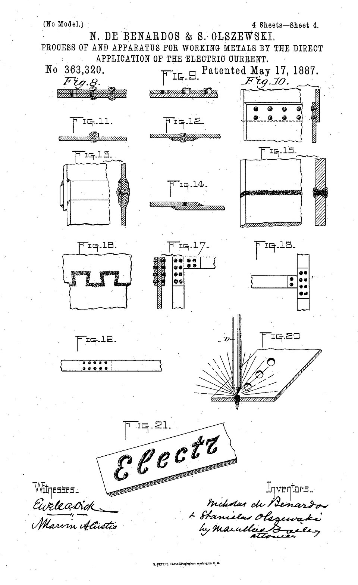
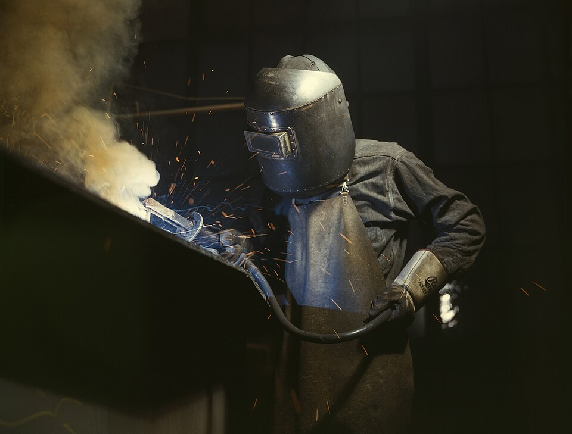

In his _Elements of Chemical Philosophy_ of 1812, **[Humphry Davy](kloom:e/humphry-davy)** described the most powerful battery then in existence, two thousand pairs of plates paid for by subscription in the laboratory of the **[Royal Institution](kloom:e/royal-institution)** in London. When two sticks of charcoal wired to it were touched together and drawn apart, "a constant discharge took place through the heated air", making "a most brilliant ascending arch of light". Platinum held in that arch "melted as readily in it as wax in the flame of a common candle"; quartz and sapphire ran. Davy's arch gave the arc its name. It took seventy years before anyone used it to join metal: **[arc welding](kloom:e/arc-welding)**.

## The first arc welders

The first patent went to the Frenchman Auguste de Méritens in 1881, for a carbon arc that welded the lead plates of storage batteries. It was too cool for steel. In 1881 and 1882 **[Nikolay Benardos](kloom:e/nikolay-benardos)**, a Russian inventor, and **[Stanisław Olszewski](kloom:e/stanislaw-olszewski)**, a Polish engineer, worked out a method that was not, and patented it in France on 10 October 1885 and in England eleven days later. Their American patent of 1887 says what was new: the arc is struck between a carbon rod in an insulated holder and "the metal to be worked", which "constitutes in itself the other pole". They called it Elektrogefest, "the electric Hephaestus". Wikipedia's article on arc welding has Benardos presenting it at the electrical exhibition in Paris in 1881; its article on Olszewski dates the work to 1881–82, and the patents are four years later.

A carbon rod only supplies heat. In 1888, at the cannon works at Perm, **[Nikolay Slavyanov](kloom:e/nikolay-slavyanov)** used a rod of metal instead, which melts into the joint as it goes and fills it. He called it "electric casting". He made a cup of seven different metals welded together, and won a gold medal at the Chicago exhibition of 1893. Bare metal electrodes gave a wandering arc and brittle welds, and the cure was a coat on the rod. The Swedish ship's engineer **[Oscar Kjellberg](kloom:e/oscar-kjellberg)**, who had founded a welding company in 1904, patented an iron wire dipped in carbonates and silicates in 1907; Wikipedia's article on arc welding gives 1904 for his electrode, and its article on him 1907.

## Striking and holding an arc

The US War Department's welding manual of 1943, TM 9-2852, sets out how it is done:

| Step            | What the manual says                                                                          |
| --------------- | --------------------------------------------------------------------------------------------- |
| Set the current | for a bare or lightly coated electrode ⅛ inch (3.2 mm) thick, 110 to 135 amperes              |
| Strike the arc  | sweep the end down onto the plate in a short curve, or tap it straight down, then lift        |
| Hold the gap    | an arc about as long as the electrode is thick, which gives "a sharp crackling sound"         |
| Feed and travel | feed the rod down as fast as it melts, tilted 5 to 15 degrees towards the direction of travel |
| What goes wrong | lift too slowly and the rod sticks to the plate; too fast and the arc goes out                |

The arc runs at 17 to 30 volts and, the manual says, 5,000 to 10,000 °F, about 2,800 to 5,500 °C. By our arithmetic a ⅛-inch rod at 125 amperes and 25 volts puts about 3 kilowatts into the joint. A small pool of the plate melts under the arc, drops of the rod cross into it, and the pool freezes behind the moving rod as the bead. A short arc matters because its flame is also a shield: molten steel left open to the air, the manual explains, absorbs nitrogen and oxygen and turns brittle. A heavy coating burns to a cloud of gas around the arc, leaves a slag over the cooling bead to be chipped off, and adds substances that ionize easily and keep the arc steady.

## Welded ships

Riveting had been a third of the labor cost in earlier freighters. The **[Liberty ship](kloom:e/liberty-ship)**, the US Maritime Commission's version of a British design, replaced much of it with welding, and eighteen American yards built 2,710 of them between 1941 and 1945, most from prefabricated sections welded together by a workforce newly trained, many of them women. The first took about 230 days; by 1943 the median was 39. The _Robert E. Peary_ was launched four days and fifteen and a half hours after her keel was laid, a publicity stunt with much left to finish afloat. Some of the welded hulls cracked in cold seas, and a few broke in two. Why they broke is the Materials science trail's frame on Griffith's cracks.

Fire had shaped metal for thousands of years. The next segment turns from heat to accuracy: machines that make machines, beginning with John Wilkinson's cylinder-boring machine.
