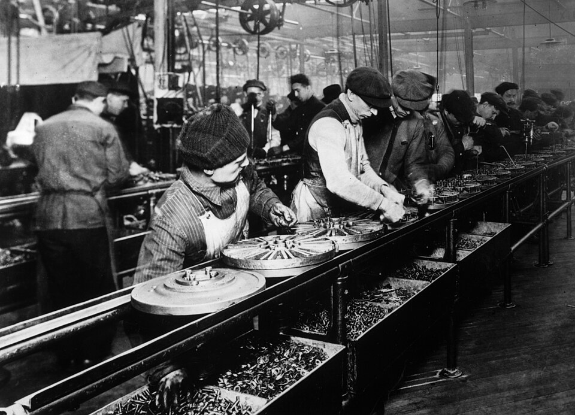
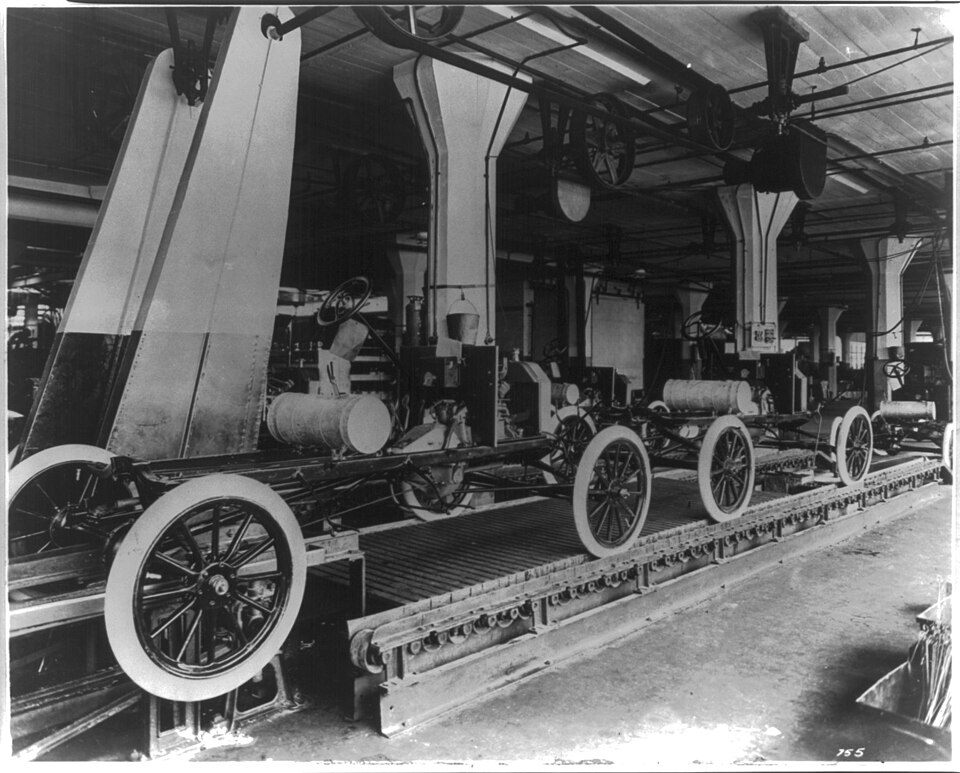

On or about 1 April 1913, at the **[Ford Motor Company](kloom:e/ford-motor-company)**'s plant in **[Highland Park](kloom:e/highland-park-ford-plant)**, Michigan, a row of men stood along a waist-high rail and assembled the flywheel magneto of the **[Model T](kloom:e/ford-model-t)**, the part that made the spark for its engine. Until then one man had built each magneto from start to finish, turning out 35 to 40 in a nine-hour day, about twenty minutes apiece. On the rail the job was split into 29 operations, and each man did one of them and slid the work to the next. The time came down to 13 minutes 10 seconds of labor for each magneto, and within a year to five. By April 1914 the same idea had cut the labor in a whole chassis from twelve and a half hours to an hour and a half. This was the **[moving assembly line](kloom:e/assembly-line)**, and **[Henry Ford](kloom:e/henry-ford)**'s factory made it the way the world makes almost everything.

## Taking the work to the men

In _My Life and Work_, the memoir he wrote with Samuel Crowther in 1922, Ford put the rule in one sentence: the first step was "taking the work to the men instead of the men to the work." Tools and men were set in the order of the operations, each part was dropped where the next man could reach it, and gravity or a moving line carried it on. The idea, he wrote, "came in a general way from the overhead trolley that the Chicago packers use in dressing beef."

Others told it differently. William Klann, who worked in the plant, remembered bringing the idea back from a visit to Swift's slaughterhouse in Chicago. Charles Sorensen, Ford's production executive, wrote in 1956 that no one invented it: it grew out of five years of rearranging the plant between 1908 and 1913. Ford's own book is ghostwritten and late, and the dates and numbers that follow come from the engineering writers Horace Arnold and Fay Faurote, whose book of 1915 printed the plant's records.

## The chassis

In August 1913, 250 assemblers and 80 men carrying parts to them built chassis on the floor where each stood, at 12 hours 28 minutes of labor a chassis. In the same slack season a chassis was pulled 250 feet across the floor on a rope by a windlass, with six men walking beside it picking parts from piles, and the time fell to 5 hours 50 minutes. The first real line began on 7 October, and from February 1914 the chassis rode on rails at working height, drawn by a chain, two lines at 24½ inches for shorter men and one at 26¾ for taller ones. On 30 April 1914 the three lines finished 1,212 chassis in an eight-hour day.

| When            | How                      | Labor per chassis |
| --------------- | ------------------------ | ----------------: |
| August 1913     | each chassis stationary  |       12 h 28 min |
| Late 1913       | rope and windlass        |        5 h 50 min |
| 7 October 1913  | first moving line        |        2 h 57 min |
| 1 December 1913 | line lengthened          |        2 h 38 min |
| 30 April 1914   | three chain-driven lines |        1 h 33 min |

Those are hours of labor, not the time a chassis spent on the line: Arnold and Faurote divided the hours worked by the chassis made. Wikipedia's article on the assembly line turns the 93 minutes into "production time", and its article on the plant gives the old figure as 728 minutes, a slip that goes back to Arnold and Faurote themselves: 12 hours 28 minutes is 748.

## Balancing the line

A moving line works at one pace, so its whole art is dividing the work into pieces that take the same time. The pace is the cycle time: the working time divided by the number to be made. The magneto line shows it. By our arithmetic from Arnold and Faurote's figures, 29 men making 1,188 magnetos in nine hours finished one every 27.3 seconds, and 29 × 27.3 seconds is about 13 minutes, Ford's 13 minutes 10 seconds of labor. Each man's share of the work had to fit in 27 seconds.

The slowest station sets the pace for everyone. Here is a line of five stations, with invented times:

| Station        |   1 |   2 |   3 |   4 |   5 | Total |
| -------------- | --: | --: | --: | --: | --: | ----: |
| Work (seconds) |  40 |  55 |  48 |  62 |  45 |   250 |
| Rebalanced     |  50 |  50 |  50 |  52 |  48 |   250 |

As first divided, the line can send a part on only every 62 seconds, and the other four men wait: 250 seconds of work in 5 × 62 = 310 seconds of paid time, 81 percent used, by our arithmetic. Shift tasks between stations until none takes more than 52 seconds, and the pace is 52 seconds and the line 96 percent used. Ford's men also tuned the speed by trial: the magneto rail at 60 inches a minute was too fast, at 18 too slow, and settled at 44. The chain, Arnold and Faurote wrote, ended up "hurrying the slow men, holding the fast men back."

## Five dollars a day

The work was relentless, and men left: to add 100 workers, the company found it had to hire 963. On 5 January 1914 Ford announced that every worker with six months' service who met the company's conditions would earn at least five dollars for an eight-hour day, more than double what most had been paid, the difference credited as a share of profits. It paid for itself in men who stayed. With the line and the wage, the Model T's price fell to $360 by 1916. The next frame makes the parts themselves in one stroke: injection molding.
