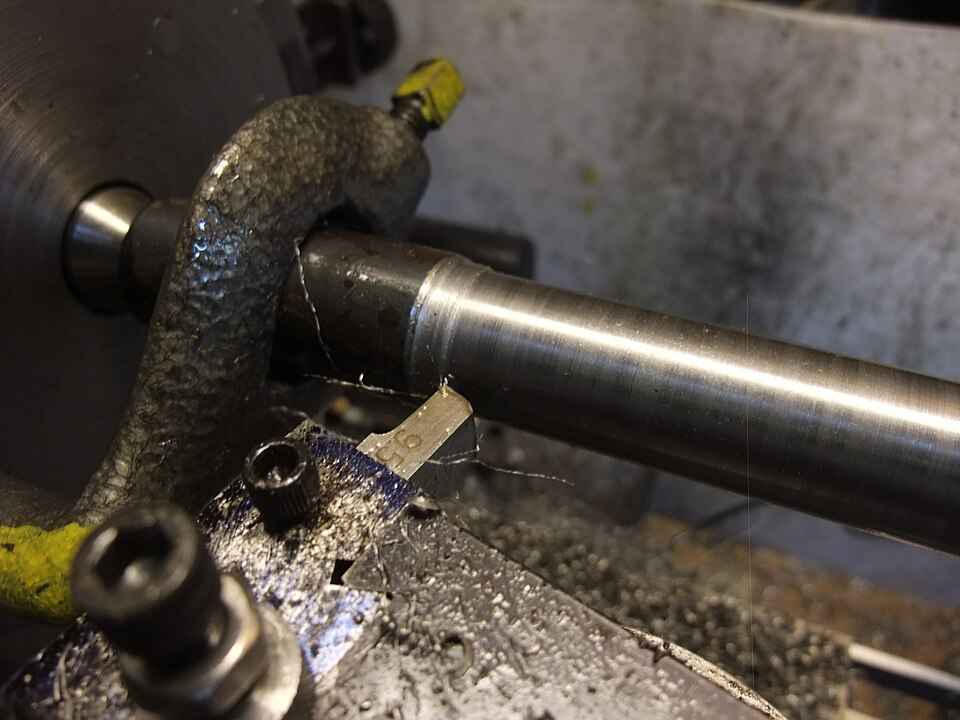
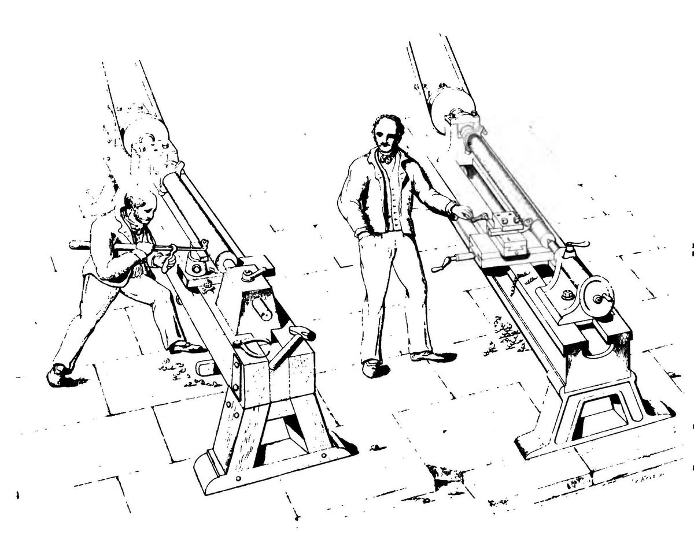

**[Joseph Moxon](kloom:e/joseph-moxon)**, the London printer who wrote the first English how-to books for tradesmen, began his chapter on turning with the whole of it in two sentences. Anything "pitcht steddy upon two points (as on an Axis)" and spun on them traces circles round that axis; an edge held still against it "will in a Circumvolution of that Substance, cut off all the parts of Substance that lies farther off the Axis", and leave the outside "Concentrick to the Axis". "This is a brief Collection, and indeed the whole Sum of Turning." The two points are the lathe's centres. Moxon's were steel-tipped iron pikes on a pole lathe, with a horn of oil hung on one puppet for greasing them. Their descendants carry the shafts, axles and spindles of every machine since, and the reason is a single property: the axis lives in the work, not in the lathe.

## Two holes and a dog

Each end of the work is drilled with a small conical hole. A **[lathe center](kloom:e/lathe-center)** sits in each: a hardened cone with a 60° included angle in a hole of the same angle, with a little clearance beyond the point. The centre in the headstock turns with the spindle, so it was called the _live_ centre; the one in the tailstock stands still and the work turns on it, so it was the _dead_ centre, and the US Army's machinist's manual of 1996 still tells the turner to grease it with oil and white lead and stop now and then to grease it again. Today a tailstock centre often runs in ball bearings and turns with the work, so "live centre" has come to mean that.

A centre cannot drive anything. A **[lathe dog](kloom:e/lathe-dog)**, a clamp tightened onto the end of the work, puts its tail into a slot in a driving plate on the spindle, and the plate drags the work round.

The manual gives the method's "chief advantage": the work "can be removed from the lathe and later replaced for subsequent operations without disturbing the trueness of the turned surface in relation to the center holes of the workpiece." A shaft can be turned, taken off to be hardened or to have a keyway cut, and put back, and every diameter on it still runs about the same axis. The centres must be truly in line. If the tailstock stands off the line by 0.1 millimetre, the axis is tilted and, by our arithmetic, the two ends of a shaft turned parallel to the bed differ by 0.2 millimetres in diameter: a taper. Turners set the tailstock over on purpose when they want one.

## From the hand to the iron hand

In Moxon's lathe the turner held the tool. **[James Nasmyth](kloom:e/james-nasmyth)**, writing in 1841, drew what that meant on a lathe for metal: a man leaning his weight on a long tool laid on the rest, who, if he once cut a little too deep, had to take the whole surface down to match or leave the mark. Then he drew the same lathe with the tool bolted into "a species of iron hand" on a slide moved by a screw, the workman barely touching the handle. Nasmyth added the self-acting feed: an iron finger fixed to the work knocks a star wheel on the screw round one tooth each revolution, so the tool creeps along by itself. "How could we, for instance, have good steam engines," he asked, "if we had not the means of boring out a true cylinder, or turning a true piston rod, or planing a valve face?" He credited the slide rest to **[Henry Maudslay](kloom:e/henry-maudslay)**, whose lathe is this trail's anchor.

## How fast, how far

With the tool held by the slide rest, the turner chooses three numbers. _Cutting speed_ is how much of the work's surface passes the tool each minute. It depends on the material, so the spindle must turn faster for a thin bar and slower for a thick one: _n_ = 1000 _v_ ÷ π*d*, with _v_ in metres a minute and _d_ in millimetres. The manual's table gives 24.4–30.5 metres a minute for low-carbon steel with a high-speed steel tool, the low end for roughing and the high end for finishing. So 30 metres a minute on a 50-millimetre bar needs, by our arithmetic, 191 revolutions a minute (the manual's shop rule, 320 × 30 ÷ 50, gives 192). _Feed_ is how far the tool moves along at each revolution: 0.6 millimetre roughing low-carbon steel, 0.3 finishing. _Depth of cut_ may be up to five times the feed. Here is a 200-millimetre length taken down from 50 millimetres, by our arithmetic:

| Pass      | Diameter | Speed      | Spindle | Feed       | Depth   | Time for 200 mm |
| --------- | -------- | ---------- | ------- | ---------- | ------- | --------------- |
| Roughing  | 50 mm    | 24.4 m/min | 155 rpm | 0.6 mm/rev | 3 mm    | 2.1 min         |
| Finishing | 44 mm    | 30.5 m/min | 221 rpm | 0.3 mm/rev | 0.25 mm | 3.0 min         |

The roughing cut is as heavy as the machine and tool will bear; the finishing cut is light and goes to size in a single pass. The tool feeds towards the headstock, so that the push of the cut goes into the driving end rather than pulling the work off its centres. Chatter marks mean too much feed or a blunt tool, and a long, slender bar wants a lighter feed; carbide tools allow two to three times the speed.

A shaft between centres comes off round and true. To cut a thread on it, the carriage must move in step with the spindle, and that is the next frame: cutting a screw thread.
