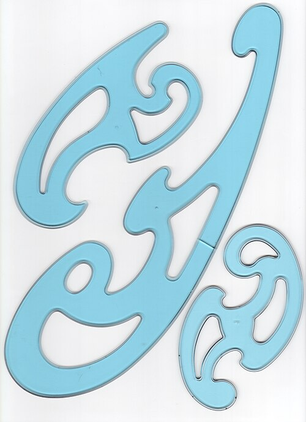
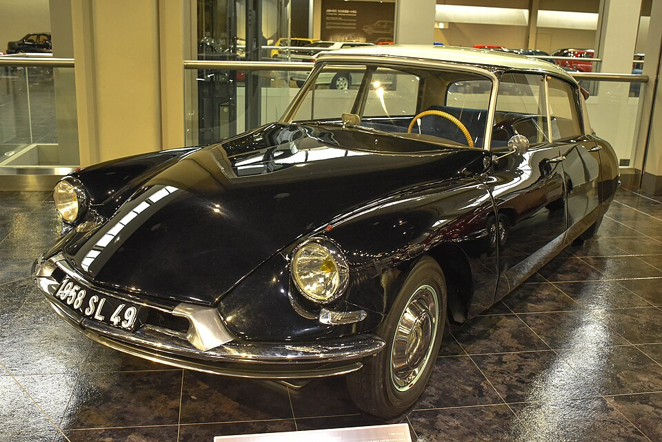

On 1 April 1958 a young mathematician from the École Normale Supérieure, **[Paul de Casteljau](kloom:e/paul-de-casteljau)**, started work at **[Citroën](kloom:e/citroen)**, in a laboratory that was trying to cut tools along paths worked out by calculation. It had punched-tape readers, stepper motors cooled with compressed air, and a Swiss boring machine turned into a three-axis mill. It had nothing to calculate. A car's body was then drawn by eye with French curves, carved full size, and corrected again and again on the shop floor. In de Casteljau's telling, the left and right wings of the DS differed by 9 millimetres, so as to look symmetrical to the eye. A machine needed a curve given exactly, in a few numbers that a designer could still steer.

## Poles

De Casteljau's answer was a curve set by a handful of points, most of which it does not pass through. His department head, Jean de la Boixière, named them _pôles_. The curve starts at the first pole, heads towards the second, bends towards the third and ends at the last, always inside the polygon they make. An activity report of December 1958 already writes the cubic as *p*³*A* + 3*p*²*qB* + 3*pq*²*C* + *q*³*D*, with _p_ + _q_ = 1. Citroën lodged his method in a sealed envelope at the French patent office in 1959, extended it to surfaces in 1963, and kept it secret. It became the core of Citroën's own design system and was taught to its body designers from the early 1960s.

At **[Renault](kloom:e/renault)**, not far away, **[Pierre Bézier](kloom:e/pierre-bezier)** reached the same kind of curve by another road. He had joined the company in 1933 as a toolmaker and built its automatic transfer lines. In 1957 he was put in charge of a new machine-tool division to catch up with American numerical control, and when it was dissolved in 1960 he was left, in his words, with no mission at all. He spent the time on the gap between a stylist's drawing and the stamping die. To get the work past sceptical managers, he said later, he credited the mathematics to an invented professor, Onésime Durand.

Bézier published from 1966, and by 1971 Renault's **[UNISURF](kloom:e/unisurf)** system was in use. A designer chose a curve's end points and three vectors, saw it drawn in seconds on a drawing machine 7 metres long, and had a patch milled in foam; a small computer of 8K sixteen-bit words ran both machines, to about a tenth of a millimetre. So they became **[Bézier curves](kloom:e/bezier-curve)**. De Casteljau's work became known outside Citroën only after Wolfgang Boehm asked the company about it in 1975. The sources differ on whether Bézier worked alone: Wikipedia says he found the curves independently, but a 2024 study of de Casteljau's papers, by Andreas Müller, says Bézier knew of Citroën's approach in outline through engineers who moved between the firms, though not how it worked.

## The construction, at _t_ = ½

**[De Casteljau's algorithm](kloom:e/de-casteljaus-algorithm)** finds any point on the curve with nothing but repeated halving, or more generally repeated division in a ratio _t_. Take four invented control points, in millimetres: *P*₀ = (0, 0), *P*₁ = (20, 60), *P*₂ = (90, 80), *P*₃ = (120, 20). For the point half way along, _t_ = ½:

| Step         | Midpoints of                     | Result                        |
| ------------ | -------------------------------- | ----------------------------- |
| First level  | *P*₀*P*₁, *P*₁*P*₂, *P*₂*P*₃     | (10, 30), (55, 70), (105, 50) |
| Second level | the three points above, in pairs | (32.5, 50), (80, 60)          |
| Third level  | those two                        | (56.25, 55)                   |

The last point is on the curve, by our arithmetic. The formula agrees: (*P*₀ + 3*P*₁ + 3*P*₂ + *P*₃) ÷ 8 is (450 ÷ 8, 440 ÷ 8), or (56.25, 55). The construction also hands over two new sets of control points, (0, 0), (10, 30), (32.5, 50), (56.25, 55) and (56.25, 55), (80, 60), (105, 50), (120, 20), each describing one half of the curve exactly; and since a curve leaves its end along the line to its next pole, the line through the two second-level points is the tangent at the middle. Split the halves again and again, and the control polygons close in on the curve until each is flat enough to cut as a straight line: the chords of the frame before.

With _t_ = ¼ or any other value the steps are the same, dividing each segment a quarter of the way along instead. De Casteljau said he was inspired by the old way of generating a parabola from points and tangents. The curve with three poles is exactly an arc of a parabola, and the one with four is a cubic. A designer who drags a pole sees the whole curve lean towards it, smoothly, which a list of points never allowed.

## Everywhere since

In 1972 Robin Forrest showed that Bézier's curves are built on polynomials that Sergei Bernstein had defined in 1912. Adobe's **[PostScript](kloom:e/postscript)** made the cubic its curve in 1984: its `curveto` takes the three further points, and its manual states the two properties above, that the curve stays inside the quadrilateral of its four points and leaves each end along the line to the next. Type 1 fonts are drawn with cubics, TrueType with quadratics. The next frame is the language that carries those cuts to a machine, G-code.
