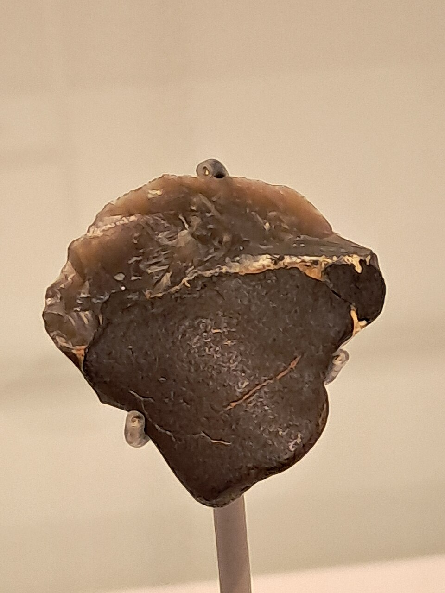
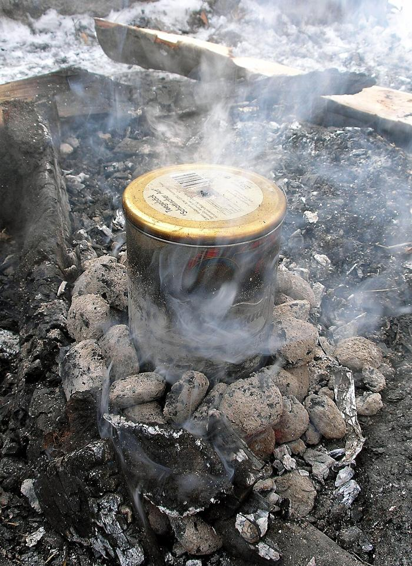

In a gravel quarry at Campitello, in Tuscany, two flint flakes were found still wearing lumps of black glue where a handle had been fixed to them. They are about 200,000 years old, from a time when the only people in Europe were **[Neanderthals](kloom:e/neanderthal)**, and the glue is **[birch tar](kloom:e/birch-bark-tar)**. A birch tree has no sap or resin that looks anything like an adhesive. To get tar from it you have to heat its bark without letting it burn, a process that turns one substance into another. That makes birch tar the oldest known synthetic material, and the first thing anyone made that is found nowhere in nature. A stone tool is a shaped stone. A hafted tool, with tar holding a blade to a shaft, is the first object made of parts.

## What the fire has to do

Birch bark is rich in [betulin](kloom:e/betulin), the compound that makes it white, and in other waxy triterpenes. Heated in the open, they burn. Heated with little or no air, they break down and sweat out a sticky brown-black tar, which can be boiled down until it sets hard when cool and softens again when warmed. The trick is to keep the bark hot and starved of oxygen. In 2017 Paul Kozowyk and colleagues at Leiden tried three ways of doing that with nothing but bark, earth, ash and fire, and recorded the temperatures and the yields:

| Method           | How                                                                 | Tar from 100 g of bark |
| ---------------- | ------------------------------------------------------------------- | ---------------------: |
| Ash mound        | a tight roll of bark buried under hot embers and ash                |              about 1 g |
| Pit roll         | a roll of bark over a small pit, capped with embers                 |            up to 2.4 g |
| Raised structure | bark on a mesh over a pit and a bark cup, earthed over, fire on top |            up to 9.6 g |

In every successful run, some point in the fire passed 400 °C while another, in the bottom of the roll or pit, stayed below about 200 °C. Between those two, in a gradient, the bark distills; for birch it starts somewhere between 250 and 300 °C. So the control needed was coarser than had been assumed. What a Neanderthal had to judge was not a temperature but the result: whether the brown ooze was sticky enough to hold.

The larger lump of tar on a Campitello flake would have weighed at most 14.6 grams when fresh, by Kozowyk's estimate. That is six to eleven of Kozowyk's best runs with the ash mound or the pit roll. With the raised structure, by our arithmetic, it is one run on about 150 grams of bark, a few strips from a single tree.

## The easy way, and the hard one

In 2019 Patrick Schmidt and colleagues at Tübingen found a simpler way. Burn a roll of birch bark in the open next to a smooth stone, and tar condenses on the stone where the smoke touches it, to be scraped off and gathered. It needs no pit, no seal and no plan, and it might have been discovered by accident beside any campfire. So, they argued, tar alone does not prove that its makers could plan as we do.

Then they asked which way the Neanderthals had actually used. **[Königsaue](kloom:e/konigsaue)**, in an opencast coal mine in central Germany, has given two lumps of birch tar between 45,000 and 80,000 years old, the larger still molded around the stone tool it once held. In 2023 Schmidt's team compared their chemistry with tars made every known Stone Age way. Tar made in the open, with oxygen around it, has a different fingerprint. The Königsaue tar was made underground, in a deliberately sealed space where the process could not be watched. A method like that is unlikely to have been invented in one step, they concluded; it looks like the condensation trick improved over generations, a cumulative culture.

The same glue turns up on a flint flake found in 2016 by Willy van Wingerden on the Zandmotor, a beach of dredged sand off The Hague, radiocarbon dated to about 50,000 years ago. The tar coats its back, a backing for a small everyday tool, as on the Campitello flakes.

## After the Neanderthals

Birch tar stayed in use for tens of thousands of years. **[Ötzi](kloom:e/otzi)**, the man who died in the Alps around 3230 BC, carried arrows whose points were fixed with it, and a copper axe hafted the same way. People chewed it, too: a lump chewed 5,700 years ago in southern Denmark kept enough of its chewer's DNA to sequence her whole genome. It is still made, now in a sealed tin in a campfire.

Stone, shaped. Stone and wood, joined with a material made by fire. The next segment turns to another material fire transforms: wet clay, and the wheel that shapes it.
