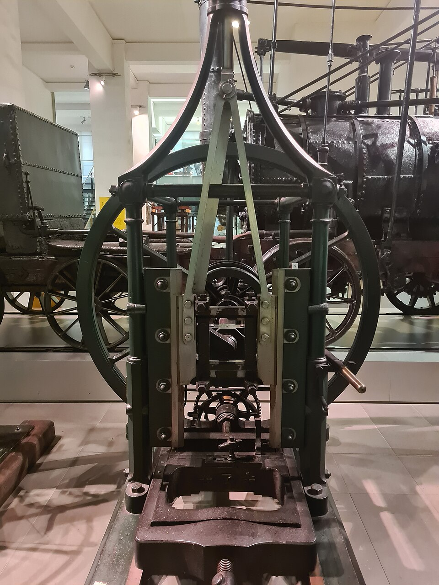

A sailing warship hung its rigging from wooden pulleys, and it needed a great many of them. **[Pulley blocks](kloom:e/block-sailing)**, as the navy called them, were each a shell of wood with one or more grooved wheels, the sheaves, turning on an iron pin inside it. A ship of the line carried about a thousand, and during the wars with Revolutionary and Napoleonic France the **Royal Navy** bought more than 100,000 a year, every one shaped by hand by contractors. Between 1803 and 1807 a row of machines at Portsmouth Dockyard took the job over. The **[Portsmouth Block Mills](kloom:e/portsmouth-block-mills)** were the first place where a product was made from start to finish by a sequence of machine tools, each doing one step, and run by men who had never been apprenticed to the trade.

## Bentham, Brunel and Maudslay

The mills began with **[Samuel Bentham](kloom:e/samuel-bentham)**, made Inspector General of Naval Works in 1795 to bring steam and machinery into the dockyards. By 1798 he had a steam engine at Portsmouth pumping the docks and driving saws. He had sketched block machines of his own when **[Marc Isambard Brunel](kloom:e/marc-isambard-brunel)** came to him. Brunel was a French naval officer and royalist who had fled the Revolution to New York; there, as the engineer Joseph Roe told it in 1916, a guest at Alexander Hamilton's dinner table complained of the cost of ships' blocks, and Brunel answered that the mortises might be cut by machinery. He reached England in 1799 and patented a set of machines in 1801. The navy's contractors, Fox and Taylor, turned it down: Taylor wrote that he had "no hope of anything better ever being discovered". Bentham saw that Brunel's scheme was better than his own and recommended it, and the Admiralty agreed in 1802. (The _Dictionary of National Biography_ gives May 1803.)

Brunel was a designer, not a mechanic, and the machines were built by **[Henry Maudslay](kloom:e/henry-maudslay)** in his small London shop, in iron and brass, where Brunel's patent had drawn wooden frames. The finished designs owed a good deal to Maudslay and to Bentham's staff as well as to Brunel. The first set, for medium blocks, went in in January 1803, a set for small blocks in May and one for large blocks in 1805, and by September 1807 the mills could meet all the navy's needs. In 1808 they made 130,000 blocks.

## A block, machine by machine

The work was split into steps and each step given a machine, so that a block passed from one to the next. For the shell:

| Step | Machine        | What it did                                                                            |
| ---: | -------------- | -------------------------------------------------------------------------------------- |
|    1 | Saws           | cut slices from the trunk, then square blanks from the slices                          |
|    2 | Boring machine | bored the hole for the pin and, at right angles, holes to start each mortise           |
|    3 | Mortiser       | a chisel cut the slot for the sheave, the block fed past it, and the machine stopped   |
|    4 | Corner saw     | took the corners off at an angle set by guides                                         |
|    5 | Shaping engine | ten blocks on a wheel; a cutter led by a former curved one face of each, then the next |
|    6 | Scoring        | cut a groove round the outside for the rope that holds the block                       |

The sheaves took their own line. A saw cut discs of lignum vitae, a dense tropical wood, at an even thickness set by a lead screw; a rounding saw trued the rim and bored the centre; a bush of bell metal, the coak, was riveted in; its bore was broached to size for the pin; and a lathe faced both sides and cut the rope groove. The iron pins were forged, turned and burnished. Only the end was done by hand: a man smoothed each shell with a spokeshave and put the parts together.

Two things made the sequence work. The first was in step 2. The clamp of the boring machine pressed small marks into the blank, and every later machine gripped the block by those same marks. Roe called them working points. Each cut was placed from the same points, not from wherever the last one happened to fall, so small errors did not pile up from step to step. The second was that the machines did the judging. The mortiser, Roe says, made 150 strokes a minute and threw out its own feed at the end of the cut; the shaping engine turned all ten blocks a quarter turn at once with a worm gear. A labourer had only to load, start and unload, and each man was trained to run two or more machines. Steam engines drove them all through shafts under the floor and belts to each machine, among them a **[Boulton and Watt](kloom:e/boulton-and-watt)** engine ordered in 1800.

## Ten men for a hundred and ten

The counts disagree in their small numbers. The _Dictionary of National Biography_ gives 43 machines, Roe 44, and Wikipedia 45 of 22 kinds. They agree on the result: Brunel's assistant Richard Beamish wrote that ten men could do "what formerly required the uncertain labour of one hundred and ten". The saving in the first full year was put at £24,000, and Brunel, paid by the saving, received £17,000.

Admiral Nelson toured the mills on the morning he left Portsmouth for Trafalgar. Yet the method spread no further. Roe noted that the machinery ran for two generations with little influence on British manufacturing until, in 1855, Britain bought American gun-making machinery and with it what was called the American system. Nor were the blocks quite interchangeable: a sheave and pin would fit any shell, but nothing was gauged against a limit. The machines made blocks until the 1960s, and several are now in the **[Science Museum](kloom:e/science-museum-london)** in London. The next frame is where parts were first made alike on purpose: interchangeable parts.
