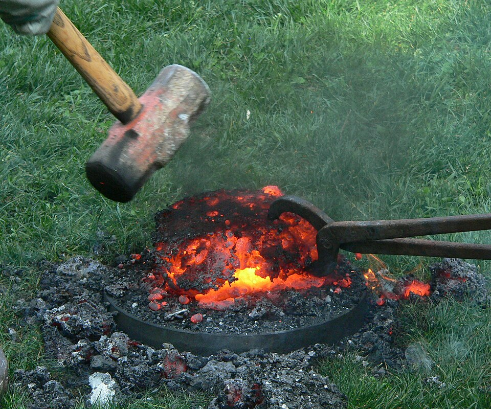
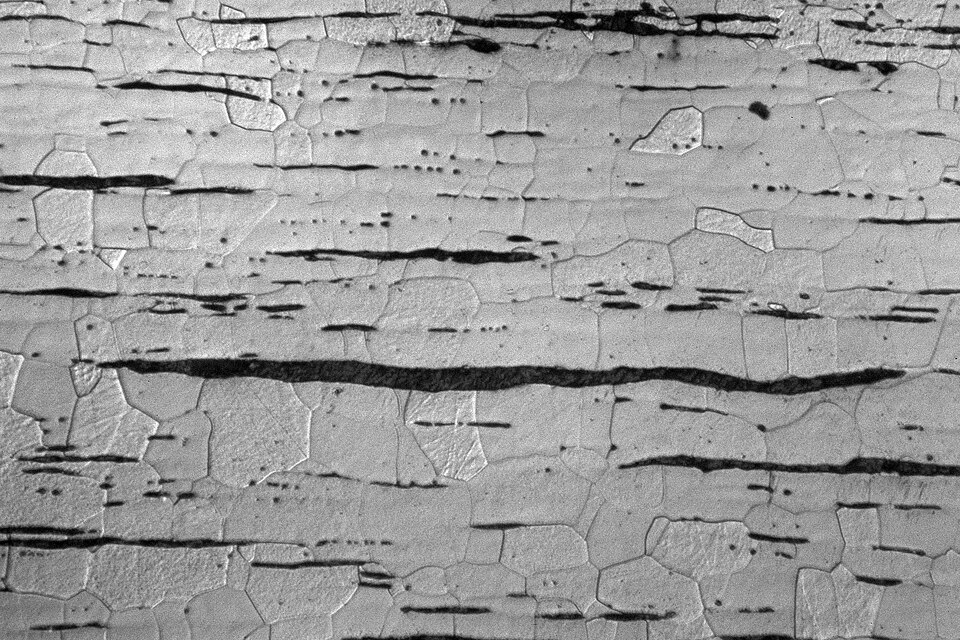

In 1925 Howard Carter, unwrapping the mummy of Tutankhamun, found two daggers against the king's body: one with a blade of gold, and one with a blade of iron that had not rusted. In 2016 a team led by Daniela Comelli measured that blade with a portable X-ray fluorescence spectrometer and found 10.8 percent nickel and 0.58 percent cobalt, a match for iron meteorites and far from any iron smelted from ore before the nineteenth century. **[Tutankhamun's meteoric iron dagger](kloom:e/tutankhamuns-meteoric-iron-dagger)**, made around 1330 BC, was iron that had fallen from the sky. Iron was then a royal gift: the **[Amarna letters](kloom:e/amarna-letters)** list iron daggers and a bracelet sent by Tushratta, king of Mitanni, to Amenhotep III, who may have been Tutankhamun's grandfather. Within seven centuries iron was an everyday metal across the Near East. What made it common was a furnace that never melted it, the **[bloomery](kloom:e/bloomery)**.

## From the sky to the ground

Nathaniel Erb-Satullo's 2019 review of the evidence finds that the iron objects analyzed from before 2000 BC are meteoritic, and that small amounts of iron were smelted in Anatolia early in the second millennium BC. In the thirteenth century BC the **[Hittite](kloom:e/hittites)** king Hattušili III wrote to an Assyrian king that his store of "good iron" had run out and "it is not a suitable time to produce iron". That letter once supported the idea of a Hittite monopoly on iron; the review counts the idea "convincingly rejected". Iron turns up more regularly after about 1200 BC, the conventional start of the **[Iron Age](kloom:e/iron-age)** in the eastern Mediterranean, with Cyprus and the southern Levant among the first to take it up, but workshops and their debris become common only in the tenth and ninth centuries.

Why iron won is still argued. It was not harder: unless carbon is worked into it and it is quenched, iron is no harder than a bronze of 10 percent tin, and the review finds little sign that early smiths did either consistently. But iron is everywhere. The Earth's crust holds about 54,000 parts per million of iron against 50 of copper, and the tin that bronze needs may have come from as far away as Central Asia.

## The smelt

A bloomery is a clay shaft with a pipe, the tuyere, near its foot, through which bellows blow air. It is filled with charcoal and charged from the top with alternate loads of broken ore and charcoal. The charcoal burns short of air to carbon monoxide, which takes the oxygen from the iron oxide, the same chemistry as smelting copper. What it leaves is not liquid metal but specks of solid iron, which sink into a pool of liquid **[slag](kloom:e/slag)**, the iron-rich silicate of the ore's rock, and stick together there into a spongy lump: the bloom.

Lee Sauder and Skip Williams, smiths in Virginia, published their method in 2002, from a furnace of roughly a Roman shaft furnace's proportions. Smelt 25 ran like this:

| Step                | What they did                                                     |
| ------------------- | ----------------------------------------------------------------- |
| The furnace         | 350 mm across, 1.0 m of shaft above a tuyere 230 mm off the floor |
| The ore             | goethite, 58% iron, roasted and broken to under 20 mm             |
| Preheating          | a wood fire, then charcoal and blast, for 1½ hours                |
| Charging            | 6.8 kg of charcoal, then 6.8 kg of ore, about every 20 minutes    |
| The blast           | 1,275 to 1,625 liters of air a minute                             |
| Tapping and feeding | slag drawn off, broken up and fed back with charcoal              |
| Last charge         | fresh ore, to take carbon out of the bloom                        |
| After 5½ hours      | a 14 kg bloom: 60% of the iron in the ore, for 94 kg of charcoal  |

## Why the iron never melts

Pure iron melts at 1,538 °C. A bloomery reduces ore at around 1,200 °C, by the usual account, and Sauder and Williams's probe, 400 mm above the tuyere, read 1,000 to 1,050 °C. But they judge the fire by looking down the tuyere, and there, they found later, the hot zone runs at 1,450 to 1,650 °C. The bloom grows below the blast, under a cover of liquid slag that keeps the air off it. The real danger is carbon. Iron that lingers in hot charcoal soaks it up, and with 4.3 percent of carbon its melting point falls to 1,146 °C, so it runs as cast iron, which no hammer can shape. Their first eleven smelts gave fist-sized blooms with so much carbon that most could not be forged. "It is difficult not to produce high carbon steel in a bloomery," they write: the cure was a constant flow of iron-rich slag across the bloom, whose iron oxide takes carbon out of the metal (FeO + C → Fe + CO), and the last charge of fresh ore.

## From bloom to bar

A bloom is full of slag, and it becomes **[wrought iron](kloom:e/wrought-iron)** only by hammering at a welding heat, squeezing the slag out and the iron together. A smith and two strikers took a 7.7 kg half-bloom to a 5 kg billet in 29 heats. Forged on into small bars, only 21 percent of the ore's iron was left. By their count a kilogram of bar took 23 hours of work, from mining to smithing, an order of magnitude less than Peter Crew's estimate of 25 working days. What remains is iron with almost no carbon, under about 0.1 percent, and up to 2 percent of slag drawn out into threads.

The bar was only the beginning. The trail At the forge follows it to the anvil: drawing out, forge welding, pattern-welded blades and hardening. On the spine, the next frame goes east, to China, where iron was melted after all.
