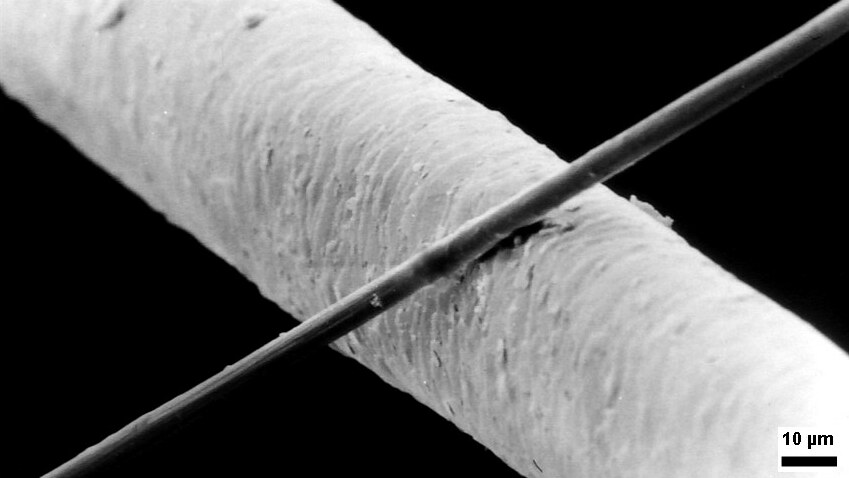
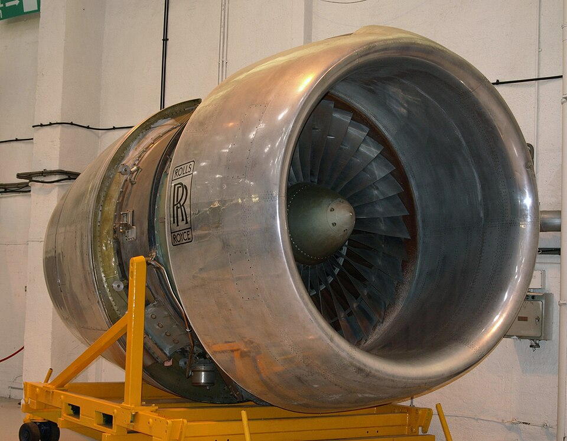

Graphite is soft enough to write with, yet within each of its sheets of carbon atoms it is one of the stiffest things known. William Watt of the **[Royal Aircraft Establishment](kloom:e/royal-aircraft-establishment)** gave the figures in 1970: along the sheets, a stiffness of about 1,000 GPa, five times steel's; across them, 35. A fiber whose sheets all lay along its length would be stiff, strong and light, since graphite weighs less than a third as much as steel. The problem, as Watt put it, was to make a fiber of many small crystals with all their sheets lying the same way. Three laboratories found ways in the next seven years, and their answer, **[carbon fiber](kloom:e/carbon-fibers)**, now makes up much of the structure of a modern airliner.

## Three starts

At **[Union Carbide](kloom:e/union-carbide)**'s laboratory at Parma, Ohio, in 1958, the physicist Roger Bacon broke open a carbon deposit from an arc and found whiskers of nearly perfect graphite, a tenth the width of a hair, with a strength of 20 GPa. They cost, he estimated, $10 million a pound. Union Carbide went on to make fiber by baking rayon and stretching it at over 2,800 °C. In Osaka in 1961, Akio Shindo of the Government Industrial Research Institute published a better starting point: a synthetic textile fiber, **[polyacrylonitrile](kloom:e/polyacrylonitrile)** (PAN), which he noticed did not melt when heated but grew tough, and which carbonized into fiber stiffer than rayon's. At Farnborough, Watt, with L. N. Phillips and W. Johnson, found the step that made PAN fiber stiffer still. Wikipedia dates their process to 1963; the American Chemical Society's history says 1964.

## Baking a textile

Watt described the process the laboratory ran, and why each step was there:

| Step       | What is done                                                      | What it does                                                                                                        |
| ---------- | ----------------------------------------------------------------- | ------------------------------------------------------------------------------------------------------------------- |
| Restrain   | Tows of PAN fiber are wound on frames so that they cannot shrink  | keeps the long polymer chains lying straight along the fiber                                                        |
| Oxidize    | A few hours in an air oven at 220 °C, until the fibers turn black | the chains link side by side into a "ladder" that will not melt                                                     |
| Carbonize  | Off the frames, heated to 1,000 °C with no air                    | drives off nearly everything but carbon; the fiber shrinks 42% across, 13% in length                                |
| Heat-treat | Taken on to between 1,500 and 2,500 °C                            | grows the graphite sheets; hotter gives stiffer fiber; 1,500 °C gives fiber that stretches further before it breaks |

PAN, Watt explained, can be pictured as a chain of polythene with a nitrile group on every second carbon. Held taut while it oxidized, it could not curl back into a tangle, and the carbon fiber it became kept its chains' alignment as sheets of graphite lying within 10° of the fiber's axis. The result had a stiffness of 410 GPa, twice steel's. Its strength, 2 GPa on average, was set by flaws, and short lengths tested stronger than long ones, as **[A. A. Griffith](kloom:e/alan-arnold-griffith)** found for glass fibers.

## Laying up

A single fiber is useless as a structure. It is set in a resin, usually an epoxy, as a thin ply with every fiber running one way, and that ply is stiff along its fibers and feeble across them. Toray's data sheet for its T300 fiber gives such a ply a tensile strength of 1,820 MPa along the fibers and 76 MPa across. So plies are stacked at different angles. The commonest recipe is 0°, +45°, −45° and 90°, mirrored about the middle: written [0/±45/90]s. The mirror matters. A NASA primer on laminates explains that a stack which is not symmetrical about its midplane bends when it is stretched, and warps as it cools from curing. Each +45° ply is paired with a −45° one, so that their tendencies to shear cancel. The plate draws the four plies and the stiffness of one ply against direction, beside the near-circle of the stack.

| Material                                  | Stiffness (GPa) | Density (g/cm³) | Stiffness per density |
| ----------------------------------------- | --------------: | --------------: | --------------------: |
| Steel                                     |             200 |             7.9 |                    25 |
| Aluminum                                  |              70 |             2.7 |                    26 |
| Carbon-epoxy ply, along the fibers        |             138 |            ≈1.6 |                    86 |
| Carbon-epoxy ply, across the fibers       |               9 |            ≈1.6 |                     6 |
| [0/±45/90]s stack, any direction in plane |              55 |            ≈1.6 |                    34 |

The ply's stiffnesses are those of NASA's worked example; the stack's 55 GPa, and the last column, are our arithmetic, by classical lamination theory. A ply along its fibers is more than three times as stiff for its weight as steel; a stack laid up to be equally stiff every way is only about a third better. Designers lay more plies along the loads they know, and that is the craft.

## A bird and a bankruptcy

Rolls-Royce licensed the Farnborough process and chose carbon fiber, which it called Hyfil, for the fan blades of its new **[RB211](kloom:e/rolls-royce-rb211)** engine, ordered for the Lockheed TriStar. The blades saved weight over titanium, and a bird striking a fan was the danger everyone knew: in 1970 J. I. Goatham of Rolls-Royce described laying thin metal foils between the plies at the blade's most vulnerable places, to spread the blow. In May 1970, after passing other tests, a Hyfil fan shattered when a chicken carcass was fired into it. Rolls-Royce had a titanium blade in reserve, at the cost of more weight. On 4 February 1971, with the engine late and over budget, the company went into receivership and was nationalized.

Japanese makers took the lead in PAN fiber from the late 1960s. As of September 2026 the **[Boeing 787](kloom:e/boeing-787-dreamliner)** is, by Boeing's account, 50 percent composite by weight, and the Airbus A350's airframe 53 percent. The fiber that failed a bird test now makes the A350's wings. This frame ends the Materials science trail, which began from the steel of the Japanese sword.
