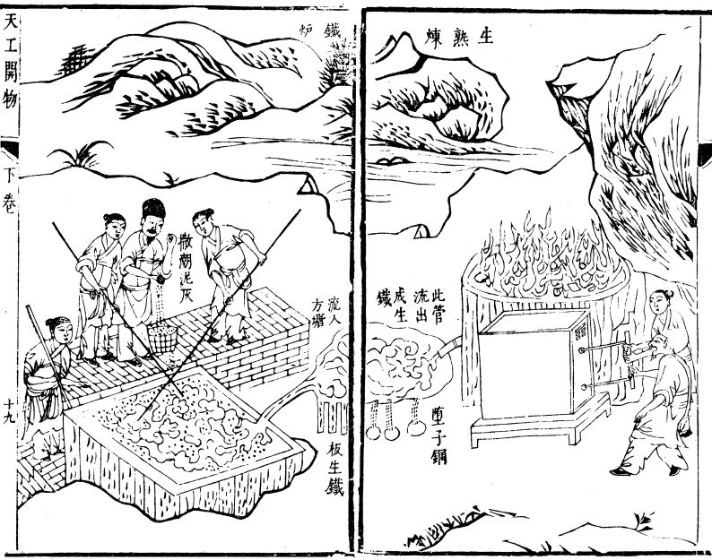
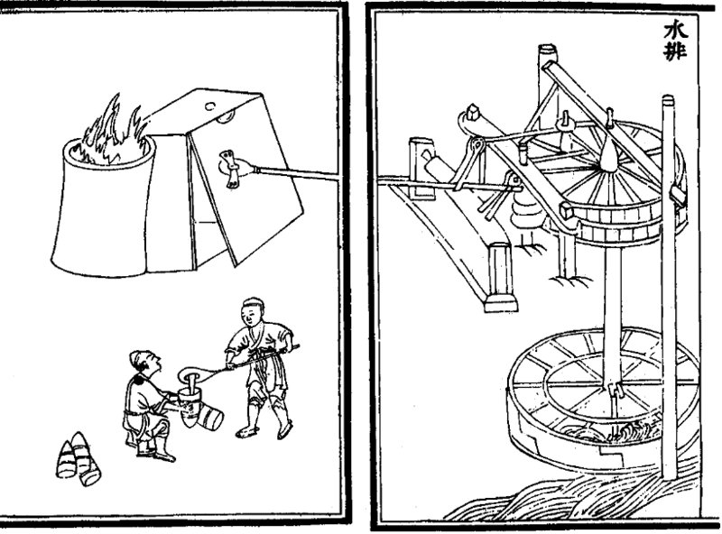

In a grave of the early fifth century BC at Luhe, in Jiangsu, in the territory of the ancient state of Wu, archaeologists found a lump of **[cast iron](kloom:e/cast-iron)**: iron that had been melted and poured. By the historian of Chinese metallurgy Donald Wagner's reckoning in 1999, it is the oldest properly published and reliably dated piece of cast iron in the world. (Wikipedia's article on cast iron dates the Luhe finds to the eighth century BC; Wagner allows that older pieces from Wu exist but are uncertainly dated or not properly published.) From the fifth century BC, iron tools cast in moulds turn up in quantity across the Central Plains of China. In western Europe, cast iron came into use only in the fifteenth century AD.

Wagner's own view changed with the evidence. The first smelted iron in China, he concluded, was wrought bloomery iron, borrowed from the west by way of the northwest. Casting iron was a Chinese invention, probably in the south, by founders who already commanded the finest bronze casting in the world.

## Why iron can be poured

Pure iron melts at 1,538 °C. But carbon dissolved in iron pulls its melting point down, and the more carbon, the lower it goes, until at 4.3 per cent carbon iron melts at only 1,146 °C. That lowest point is a **[eutectic](kloom:e/eutectic-system)**, the same kind of dip that lets **[type metal](kloom:e/type-metal)**, lead with antimony, melt below either of its metals. Past 2.1 per cent carbon, iron is cast iron.

| Iron                       | Carbon         | Melts at                           |
| -------------------------- | -------------- | ---------------------------------- |
| Pure iron                  | none           | 1,538 °C                           |
| Wrought iron, from a bloom | under 0.1%     | close to 1,538 °C                  |
| Cast iron begins           | 2.1%           | about 1,350 °C, by a straight line |
| The eutectic               | 4.3%           | 1,146 °C                           |
| The Cangzhou lion, AD 953  | 3.96% and 4.3% | close to the eutectic              |

A bloomery runs at about 1,200 °C, by the usual account, below the melting point of all but the most carbon-rich iron. A **[blast furnace](kloom:e/blast-furnace)** runs hotter, about 1,400 °C, probably with gas richer in carbon monoxide. In it the iron reduced from the ore has time to soak up carbon as it sinks, until it melts and runs to the hearth, where iron and slag are tapped separately while fresh ore and charcoal go in at the top, without stopping. The plate draws the melting line straight between the two measured points, a simplification, and marks where each furnace's heat crosses it: by our arithmetic, about 3.7 per cent carbon is enough to melt at 1,200 °C, and about 1.5 per cent at 1,400 °C. Wagner suggests that the first iron castings may have been made not in a blast furnace at all but by heating bloomery iron in charcoal until it took up carbon and melted, in the kind of furnace used to melt bronze.

## Hard, brittle and cheap

Early Chinese cast iron held almost no silicon, so it froze as white cast iron, full of iron carbide, harder than quartz and too brittle to forge. The two analyses of the **[Iron Lion of Cangzhou](kloom:e/iron-lion-of-cangzhou)**, cast in AD 953 and estimated at 50 tons, found 0.09 and 0.04 per cent silicon, where a modern founder would want about 2. White iron can still be cast, and for digging tools that was enough: it was cheaper than bronze. A foundry of the third century BC excavated in Xinglong County, Hebei, held moulds of cast iron for casting iron implements.

To make it tough, founders burned the carbon out again. From the fifth century BC castings were annealed: held at about 900 °C in an oxidising fire until carbon left the surface. From about the second century BC cast iron was fined, _chaogang_, "stir-fried steel": remelted in an open hearth under a strong blast and stirred until it lost its carbon and came out as a soft, hammerable lump. **[Song Yingxing](kloom:e/song-yingxing)**'s encyclopedia **[_Tiangong Kaiwu_](kloom:e/tiangong-kaiwu)**, printed in 1637, shows the two side by side, the blast furnace's iron running straight into the fining hearth. Bessemer's converter would do the same thing, two thousand years later, by blowing air through the molten iron.

## Water at the bellows

A blast furnace needs a great deal of air. The _Book of the Later Han_ records that in AD 31 **[Du Shi](kloom:e/du-shi)**, the new prefect of Nanyang, "invented a water-power reciprocator for the casting of (iron) agricultural implements", so that smelters who had blown their fires with push-bellows could use rushing water instead. No such machine survives, and Wagner notes that nobody knows whether its bellows were leather bags or wooden fans. The oldest picture is in Wang Zhen's _Nong Shu_ of 1313: a horizontal waterwheel, a belt to a smaller wheel, and a crank and connecting rod working a fan bellows to and fro.

The next frame stays with melted iron, but in a crucible in south India, where it became steel: wootz.
