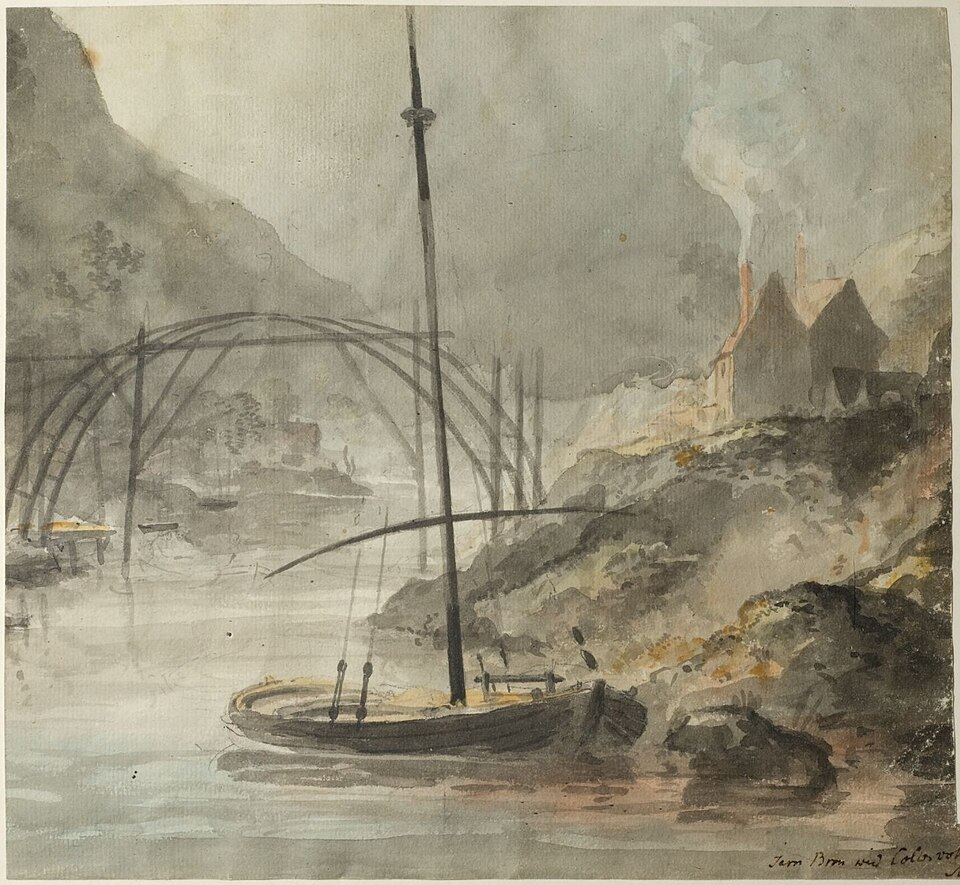
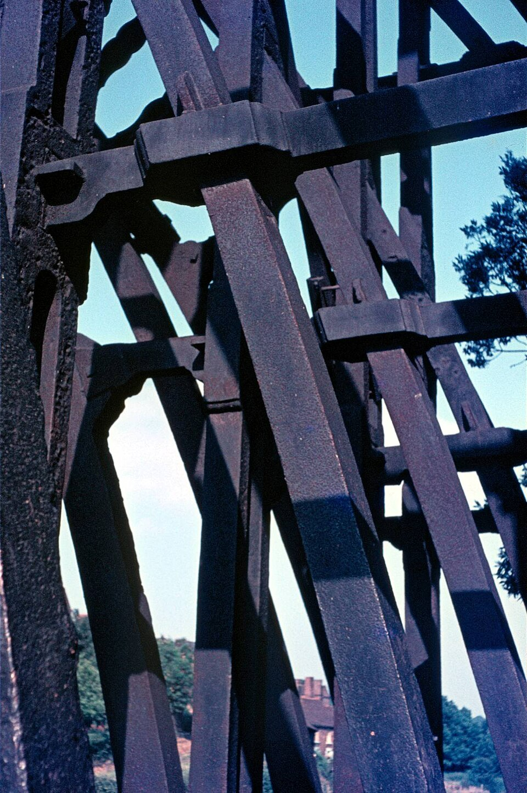

On 2 July 1779, a local newspaper reported, the first arch of an iron bridge reached across the River Severn, in a wooded gorge in Shropshire. Two curved ribs, each cast in one piece some seventy feet long, met in mid-air over the river and were bolted together, by men who, if the reconstruction below is right, balanced on a timber brace to do it. By the end of the summer there were five such arches. **[The Iron Bridge](kloom:e/the-iron-bridge)** spans 100 feet 6 inches, about 30.6 meters, and holds some 378 tons of iron. It was the first large bridge in the world made of cast iron, and it was put together as a carpenter would put together a frame of oak.

## Coke at Coalbrookdale

The iron came from **[Coalbrookdale](kloom:e/coalbrookdale)**, and its story starts seventy years earlier with **[Abraham Darby I](kloom:e/abraham-darby-i)**, a Quaker from Bristol who had made brass and had learned to cast thin iron pots in molds of sand rather than loam, a method he patented in 1707. In September 1708 he leased an old blast furnace at Coalbrookdale. His first account book survives, and it records "charked" coal in January 1709 and the furnace brought into blast on the tenth of that month.

Charking was making **[coke](kloom:e/coke-fuel)**: baking coal to drive off its tar and sulfur, as maltsters already did to dry malt. Iron had always been smelted with charcoal, and charcoal meant woods, which were growing scarce and dear. About 1775 **[Abiah Darby](kloom:e/abiah-darby)**, his son's widow, wrote down the story as the family told it. He came about 1709, she wrote, and at first blew the furnace with charcoal; "sometime after" he tried raw coal, which "did not answer", then had it "coak'd into Cynder, as is done for drying Malt", and found "that only one sort of pit Coal would suit". Her "sometime after" and the account book's first month do not quite agree. The local "clod coal" was low in sulfur, which probably helped.

Coke iron was good for castings. Coalbrookdale sold pots and kettles, and from 1723 it cast cylinders for **[Newcomen](kloom:e/thomas-newcomen)**'s pumping engines. For decades the forges would not take it to make bar iron; Abiah Darby dates the first successful trials to her husband, about 26 years before she wrote, and other sources to about 1754. Coalbrookdale was not strictly the first furnace to burn coke, but it was the first in Europe to keep doing so.

## A bridge cast to fit

In 1773 the Shrewsbury architect **[Thomas Farnolls Pritchard](kloom:e/thomas-farnolls-pritchard)** proposed a single iron arch, to keep the river clear for boats. He died in December 1777, a month after work began, and the bridge was cast and built by **[Abraham Darby III](kloom:e/abraham-darby-iii)**, the first Darby's grandson. The large ribs were cast in open molds dug in the casting sand. Nobody recorded how the parts were raised, until in 1997 a watercolor by the Swedish artist Elias Martin turned up in Stockholm, showing tall derrick poles standing in the river.

In 2001 a half-size model was built to that picture. The survey that went with it, by the Ironbridge Gorge Museum Trust and English Heritage, found that 70% of the parts, including every large casting, were made individually to fit, and differ slightly from one another. How many parts there are depends on what you count: David de Haan gives 482 main castings and 1,736 with the deck and railings, Wikipedia "almost 1,700", and Grace's Guide "more than 800 castings of 12 basic types".

## Carpentry in iron

The joints were detailed by Thomas Gregory, a foreman at the works, and every one would be familiar to a carpenter:

| Joint                     | What it does in timber                     | Where it is on the bridge                                   |
| ------------------------- | ------------------------------------------ | ----------------------------------------------------------- |
| Mortise and tenon, wedged | a tongue through a hole, locked by a wedge | the ribs into the uprights and cross members at each end    |
| Blind dovetail            | a flared tongue that cannot pull out       | the arched ribs into the radials, half the iron's thickness |
| Scarf, bolted             | two lengths overlapped into one            | the two half-ribs at the crown, with three bolts            |
| Wedges and packing        | taking up the slack in a loose joint       | every joint, with iron blocks, sealed in with lead          |

The difference is the material. Oak crushes a little and springs back, so a joint can be driven tight. Gray cast iron is as strong as mild steel in compression but stretches only about half of one percent before it snaps, so it cannot be driven tight. An iron tenon forced into a tight mortise would split it. The joints on the bridge are loose, and iron wedges and packing fill the gaps: the survey found bearing faces about 20 centimeters wide that miss each other by 3 to 6 centimeters. It also counted more than 200 nuts and bolts: Bill Blake, English Heritage's survey manager, called the bridge a migration "from joinery-driven fixing to engineering-driven techniques".

The arch keeps the iron in compression, which is why the bridge stands. Where the banks moved, and the iron swelled and shrank with the seasons, it cracked, and it has been patched ever since; around 1870 the engineer Benjamin Baker advised bolting plates across the breaks and not screwing "up the bolts too tight". The joints themselves, in wood, are the Joinery trail's dovetail and mortise and tenon. The next frame is Benjamin Huntsman's crucible steel.
