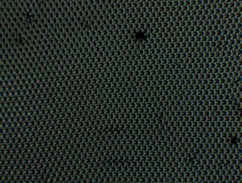
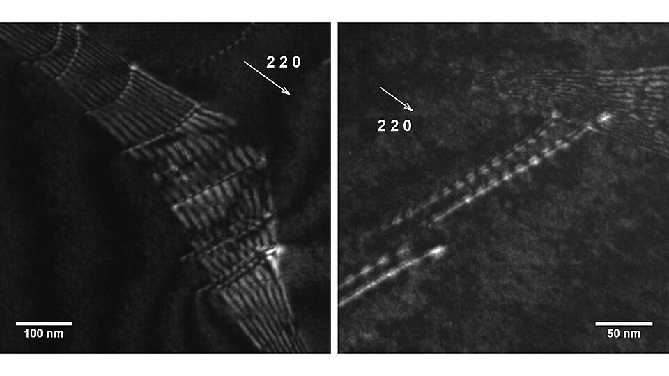

A metal bends where glass snaps, and by the 1920s that was itself a puzzle. X-rays had shown a metal crystal to be atoms in perfect rows. To bend it, one plane of atoms must slide over the next, and a simple calculation says that sliding a whole plane at once needs a shear stress of about a sixth of the metal's shear modulus: thousands of megapascals. Real crystals began to slip at under ten, and pure ones at under one. In 1934 three men, working apart, gave the same answer. **[Egon Orowan](kloom:e/egon-orowan)** in Budapest and **[Michael Polanyi](kloom:e/michael-polanyi)** in Manchester, both lately of Berlin, and **[G. I. Taylor](kloom:e/g-i-taylor)** in Cambridge each proposed that a crystal slips one row of atoms at a time, at the edge of a flaw Taylor named a **[dislocation](kloom:e/dislocation)**.

## A ruck in a rug

To move a heavy rug across a floor, you can drag the whole of it, against the friction of every square inch at once. Or you can kick a ruck into one end and push the ruck across. Only the strip of rug in the ruck moves at any moment, and when the ruck leaves the far edge the whole rug has shifted by the ruck's width. A dislocation is the ruck. The plate draws one in a crystal: an extra half-plane of atoms wedged in above the slip plane, ending at the core (⊥), the rows above it squeezed together and those below pulled apart, each atom placed by the elastic solution for such a defect that Vito Volterra had worked out in 1907 (some accounts say 1905).

| Step                       | What happens to the bonds                                                          |
| -------------------------- | ---------------------------------------------------------------------------------- |
| A shear stress is applied  | the atoms at the core, already strained, are nearest to changing partners          |
| The core moves one spacing | one line of bonds across the slip plane breaks and remakes; the rest are untouched |
| It moves on, row by row    | the half-plane passes through the crystal like the ruck through the rug            |
| It leaves the far side     | the top of the crystal has slipped one atomic spacing over the bottom: a step      |

Because only one line of bonds is under strain at a time, the stress needed is a tiny fraction of the stress to shear a whole plane. Taylor's paper, received by the Royal Society on 7 February 1934, called the passing slip "analogous to the propagation of a crack", the idea **[A. A. Griffith](kloom:e/alan-arnold-griffith)** had used for glass, and drew the atoms row by row.

Taylor's own example gives the size of the gap. He quoted Erich Schmid's single crystals of zinc, which began to slip at 49 grams on a square millimetre when nearly pure, about 0.48 MPa, and at 94 grams with a little more impurity. Zinc's shear modulus is about 43 GPa, and a sixth of that is about 7,000 MPa. By our arithmetic, the purest crystal gave way at about one fourteen-thousandth of the stress a perfect one would need. (Zinc is stiffer in some directions than others, so this is a rough figure.)

## Seeing them

For twenty years dislocations were a theory, and too convenient a one: they could explain, W. T. Read wrote in 1954, "virtually any conceivable result, usually in several different ways". In 1947 **[Lawrence Bragg](kloom:e/lawrence-bragg)** and John Nye at the Cavendish Laboratory showed what one might look like with a raft of soap bubbles on water, packed like atoms, which formed rows, grain boundaries and dislocations as a crystal does.

The sight itself came in 1956. In **[Peter Hirsch](kloom:e/peter-hirsch-metallurgist)**'s telling, he and Michael Whelan had been looking since October 1955 at beaten aluminium foil in a new Siemens **[electron microscope](kloom:e/electron-microscope)** at the Cavendish, operated with Robert Horne, and had seen rows of dots along the boundaries of grains, which might have been dislocations or might have been moiré patterns from overlapping crystals. On 3 May 1956, at 40,000 times magnification, they took out an aperture, and the dots and lines began to move across the foil, leaving tracks along the crystal's slip planes. They published in July. Walter Bollmann in Geneva saw dislocations in stainless steel the same year, but his microscope could not show them moving.

## Why metal hardens

Dislocations explain how a smith makes metal stronger. Every method puts something in their way.

| Method                                      | What stops the dislocations                                                                |
| ------------------------------------------- | ------------------------------------------------------------------------------------------ |
| Work hardening: hammering, rolling, bending | new dislocations multiply and tangle; strength rises with the square root of their density |
| Alloying                                    | foreign atoms distort the lattice, and dislocations catch on them                          |
| Smaller grains                              | dislocations pile up at the boundaries between crystals                                    |
| Heating and slow cooling                    | undoes the tangles: annealing restores softness                                            |

Taylor saw the first of these in 1934: his crystals hardened in proportion to the square root of how far they had been strained, and his tangled dislocations gave the same curve. A wire bent back and forth stiffens, and annealed it goes soft again. The next frame turns from metals to a fibre made by baking a textile: carbon fibre.
