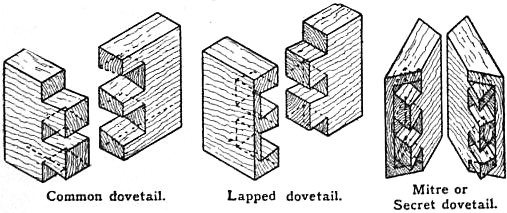

A **[dovetail joint](kloom:e/dovetail-joint)** joins two boards at a corner with a row of flared tongues. The tails, cut on the end of one board, widen towards its end like a bird's spread tail; the pins, cut on the other, fill the spaces between them. Glued or dry, the joint cannot be pulled apart in the direction the tails point, because each tail is wider than the gap it came through. It needs no nail or peg, and it is the joint that usually holds a drawer's sides to its front.

## Five thousand years of corners

The furniture historian Clive Edwards, in a survey of the joint's history given to a conservators' symposium in 2010, traces it to Egypt by the First Dynasty, around 3000 BC, in furniture, boxes, coffins and ivory work. The anchor of this trail describes the dovetailed canopy of Queen [Hetepheres](kloom:e/hetepheres-i), from about 2600 BC. **[Vitruvius](kloom:e/vitruvius)** describes a dovetail, the _securicla_ or "little axe", in roof beams, and the Romans cut small ones in furniture. A record of 1104 describes the coffin of St Cuthbert as "joined and united by the toothed tenons of the boards". A walnut chest that belonged to the barber-surgeon of the **[Mary Rose](kloom:e/mary-rose)**, Henry VIII's warship, sunk in 1545 and raised in 1982, is dovetailed. In 1632 the London companies of joiners and carpenters settled which trade could make what, and gave the joiners all chests, cabinets, boxes and cupboards "framed duftalled pynned or Glued".

Edwards reads the history in the slope of the tails. The earliest are steep and coarse. By the 1680s dovetails were usual in English drawers, and from about 1690 the lapped, or half-blind, dovetail hid the tails' end grain behind a solid front that could take veneer. As the eighteenth century went on, drawer sides thinned from about 13 millimeters to as little as 3, and the dovetails became finer and their slope shallower.

| Slope  | Angle, by our arithmetic | Where Edwards finds it                      |
| ------ | -----------------------: | ------------------------------------------- |
| 1 in 1 |                      45° | the earliest dovetails                      |
| 1 in 3 |                    18.4° | the 1600s and early 1700s, often 1 in 2     |
| 1 in 4 |                      14° | later machine-cut dovetails                 |
| 1 in 6 |                     9.5° | "generally accepted" as strongest           |
| 1 in 8 |                     7.1° | fine work of the later 1700s, "flamboyance" |

The rule now repeated, 1 in 6 for softwood and 1 in 8 for hardwood, is in neither of the two books read for this frame. William Fairham's _Woodwork Joints_, an early twentieth-century joiner's manual, calls 1 in 8 "correct", says "no hard and fast rule need be obeyed", and allows no steeper than 1 in 6. A test reported in 1958 by Britain's Forest Products Research Laboratory pulled machine-cut dovetails apart at four angles, from 7.5° to 17.75°. Dry, the wider angles held better. Glued, every joint failed by shearing along the short grain, and the angle made no difference.

## Laying out a drawer

Fairham's method for a lapped dovetail at a drawer front:

1. Square the ends of the drawer sides and front, or "the finished drawer will be in winding".
2. Set a cutting gauge a trifle under the thickness of the side and cut a line 1/32 inch deep across the inside of the front: it severs the fibers where the chisel will stop. Reset it to leave a ¼-inch lap on the front, and gauge the ends of the side.
3. Make the bevel: plane an edge true, square a line across it, measure 8 inches along it and 1 inch across, and join the points. Set a joiner's bevel to that angle, 7.1° by our arithmetic, or cut a zinc template.
4. Space the pins on the front's end with the bevel, square them down to the gauge line, and saw them.
5. Chop out the waste: cut a small channel ⅛ inch from the gauge line, so the chisel set on the line cannot be driven back past it, and chop holding the chisel upright. Lean it, and the dovetail is undercut and weak.
6. Lay the front on the side and mark the tails from the pins with an awl, or by drawing the saw back through each kerf. Saw just inside the marks, chop out, and drive the joint together.

It took a skilled hand. The nineteenth century set out to replace it. **[Samuel Bentham](kloom:e/samuel-bentham)**'s woodworking patents of 1791 and 1793 cut dovetail grooves with a beveled circular saw (Edwards names his brother Jeremy, but the engineer George Molesworth, writing in 1858, Samuel); H. J. Betjeman patented an English dovetailing machine in 1851; and between 1833 and 1900 Americans took out 106 patents for dovetailing machines. The Burley machine was advertised in 1861 as making 75 to 100 dovetails an hour, "the work of twenty men for one day". On 2 April 1867 Charles B. Knapp of Waterloo, Wisconsin, patented a machine that made a joint of round pins in semicircular sockets (Edwards's text gives 1870, his footnote the 1867 patent). Of all the machine joints, Edwards calls Knapp's "a clear success".

The **[Iron Bridge](kloom:e/the-iron-bridge)** at [Coalbrookdale](kloom:e/coalbrookdale) was put together with dovetails cast in iron. The next frame leaves joints cut in the wood for metal driven into it: the nail and the screw.
