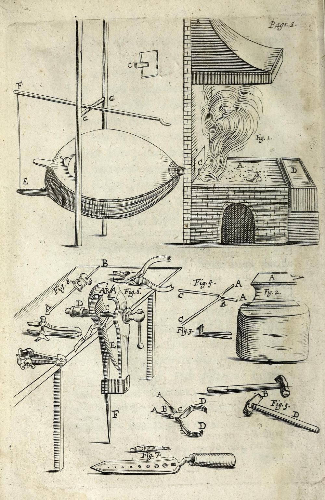

In 1677 a London printer, globe-maker and hydrographer to the king, **[Joseph Moxon](kloom:e/joseph-moxon)**, began to publish, in parts, a book called _Mechanick Exercises, or the Doctrine of Handy-Works_. Its first trade was the **[blacksmith](kloom:e/blacksmith)**'s. It was one of the first books in English to teach a craft to someone who wanted to do it, rather than describe it to someone who did not, and the next year Moxon became the first tradesman elected to the **[Royal Society](kloom:e/royal-society)**. A smith of his day had no thermometer and no drawings. What he had was a forge, a pair of bellows, an **[anvil](kloom:e/anvil)**, tongs, a vice and hammers, all engraved on Moxon's first plate, and a handful of operations that turn a bar into almost anything.

## Four ways to move hot iron

Iron hammered hot does not break or wear away: it moves, and its volume stays the same. Every operation at the anvil is a way of choosing where the metal goes.

| Operation   | What the smith does                               | What the bar does              |
| ----------- | ------------------------------------------------- | ------------------------------ |
| Drawing out | strikes across the bar, turning it a quarter      | grows longer and thinner       |
| Upsetting   | strikes the end of a bar heated only where wanted | grows shorter and thicker      |
| Punching    | drives a steel punch halfway, turns, finishes     | gains a hole; nothing is lost  |
| Bending     | lays the bar over the edge of the anvil or horn   | changes direction, not section |

Moxon's smith drew out with "the Pen of your Hammer", its narrow back, which, like the round-nosed tool smiths call a fuller, spreads metal faster than a flat face can, and then smoothed away "the Dents the Pen made" with the face. To upset, he stood the heated end on the anvil and hammered the cold end, "till the heated end be beat, or up-set, into the Body of your Work". To punch, he hardened a steel punch, drove it until a bulge rose on the far side, and turned the work over to finish from there, popping the punch into water whenever it began to change color.

## Heats by color

Moxon named three heats. A blood-red heat was for smoothing work that already had its shape; a white, or flame, heat for forging it into shape; and a sparkling, or welding, heat for joining. Too cold, and iron "will not feel the weight of the Hammer". Too hot, and some iron will "Red-sear", cracking under the hammer. He gave no degrees, and nobody could have measured them. A later engineering table, Chapman's, as Wikipedia gives it, lets us put rough numbers to his names, though the matching is ours:

| Moxon's heat    | His use              | The nearest color in Chapman | About          |
| --------------- | -------------------- | ---------------------------- | -------------- |
| Blood-red       | smoothing, finishing | dark red to cherry red       | 705–870 °C     |
| White, or flame | drawing out, shaping | yellow to yellow-white       | 1,090–1,310 °C |
| Sparkling       | welding              | white                        | above 1,315 °C |

## Drawing a taper

Two and a quarter centuries later, **John Lord Bacon**, who taught forge-work at the Lewis Institute in Chicago, wrote down what Moxon's smiths knew without saying. Draw out at "as high a heat as it will stand without injury". On the face of the anvil a blow spreads the bar sideways as much as it lengthens it, so the smith must turn it on edge and flatten the width back out, and "only about one half the force of the blow is really used". Laid over the horn, which acts as a blunt wedge, the bar barely spreads, and nearly all of the blow goes into length.

Here is a taper worked through, with invented numbers. A bar of **[wrought iron](kloom:e/wrought-iron)** 20 millimeters square is to end in a square taper 150 millimeters long, 4 millimeters square at the tip. The volume of a tapering square bar is its length divided by three, times the sum of the two end areas and the square root of their product: 150 ÷ 3 × (400 + 16 + 80) = 24,800 cubic millimeters. Divided by the bar's section of 400 square millimeters, that is 62 millimeters of bar, by our arithmetic. Drawn right to a point it would be 50 millimeters, exactly a third, as it is for any pyramid. A smith would cut a little more, because every heat loses some iron as scale.

The order of work matters as much as the arithmetic. The taper is drawn square, keeping it square at every heat. If the bar starts to forge into a diamond, Bacon has the smith strike the high corners with a sliding blow that drives the metal back into the bar. Only when the taper is to size are the corners knocked off to an octagon, and then, in as few blows as possible, the octagon is rounded. Hammered round and round from the start, the outside of a bar is pushed away from its center, which can open into a split running up the middle of the point.

Upsetting is the same arithmetic run backwards. Heat 60 millimeters of the same bar and hammer it down to 30, and its section doubles, to about 28 millimeters square. Bacon's warning is that light blows spread only the very end, while heavy blows reach the middle of the heat.

"One quarter of an hour spent at the Forge", Moxon wrote, "may save him an hours work at the Vice." Drawing and upsetting shape a single bar. The next frame joins two of them into one: forge welding.
