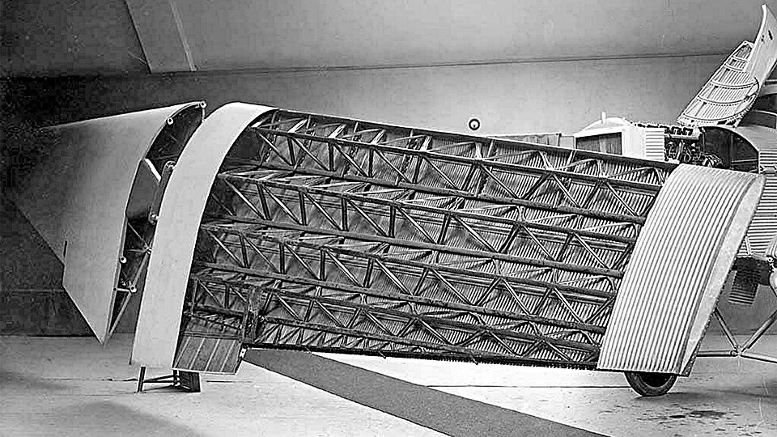
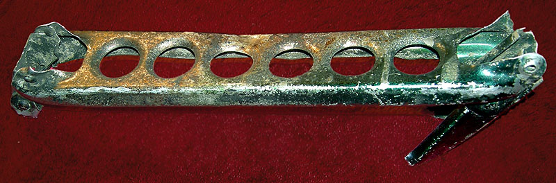

At Neubabelsberg, outside Berlin, a private laboratory working for the German military, the Zentralstelle für wissenschaftlich-technische Untersuchungen, set the metallurgist **[Alfred Wilm](kloom:e/alfred-wilm)** to find an [aluminium](kloom:e/aluminium) alloy strong enough to replace brass in cartridge cases. Aluminium had been cheap since electrolysis began to make it by the ton in the 1880s, but on its own it is soft. Wilm added copper and a little magnesium, heated the alloy and quenched it, as a smith hardens steel. It did not harden, or not at once. In the story told of it, his hardness tests were interrupted by a weekend, and when they were resumed on the Monday the samples had grown harder while they lay on the bench.

When this happened is uncertain. Wikipedia's article on Wilm puts the discovery in 1901 and his alloy in 1906; its article on **[duralumin](kloom:e/duralumin)** puts the discovery in 1903 and the finished alloy in 1909, the year of his patent. The United States Bureau of Standards, in 1919, wrote that Wilm made his discoveries "during the years 1903–1911". Wilm published nothing on it until 1911. The patent went to the Dürener Metallwerke, whose trade name for the alloy joined Düren to aluminium and to _dur_, hard.

## Solution, quench, wait

The Bureau of Standards study, by P. D. Merica, R. G. Waltenberg and H. Scott, set out to find the best way to do what Wilm had found by accident. Their alloy held 3 to 4.5 per cent copper, 0.4 to 1 per cent magnesium and up to 0.7 per cent manganese. The treatment they recommended, with one step from a United States Navy officer's account of 1927, is:

| Step   | What is done                                                                     | Why                                                 |
| ------ | -------------------------------------------------------------------------------- | --------------------------------------------------- |
| Heat   | to 510–515 °C, held 10 to 20 minutes for sheet                                   | the copper compound dissolves in the aluminium      |
| Quench | into boiling water                                                               | holds it dissolved; hot water cracks less than cold |
| Work   | bend, form or rivet at once                                                      | after about an hour it is too hard to work easily   |
| Age    | one to three days at room temperature, or about five days at 100 °C for the best | the alloy hardens, and becomes more ductile as well |

What goes wrong is the heat. The more copper is dissolved, the harder the alloy can become, so the hotter the better, up to a limit: at about 520 °C the undissolved compound melts at the grain boundaries, and the metal is spoiled, "burnt". The Bureau's tests show both effects. By our reading of their graph, their alloy C11 quenched from 295 °C rose from about 16 to 24 on the scleroscope in a month; quenched from 500 °C it reached 29 in a day and 34 in a month.

| Quenched from (°C) | 371 | 422 | 478 | 500 | 510 | 520 | 525 | 533 |
| ------------------ | --: | --: | --: | --: | --: | --: | --: | --: |
| Strength (MPa)     | 184 | 275 | 322 | 328 | 307 | 308 | 319 | 260 |

The figures are the means of the paper's tests on its alloy C8, converted by our arithmetic from pounds per square inch. The sheet quenched from 533 °C also stretched only 5 to 9 per cent before breaking, against 12 to 26 for the others.

## What happens while it waits

Merica's group proposed the explanation in the same paper. Aluminium holds more of its copper compound in solution at 520 °C than at room temperature. The quench traps the excess, and while the metal waits, it comes out of solution not as visible crystals but "in very highly dispersed form", too fine to see, which hardens the metal; they likened it to the hardening of steel. They had no way to see it. In 1938 André Guinier and George Preston, working separately with X-rays, found the clusters: regions rich in copper 3 to 10 nanometres across, now called **[Guinier–Preston zones](kloom:e/guinier-preston-zone)**. The process is **[precipitation hardening](kloom:e/precipitation-hardening)**, and the strong aluminium alloys of today's 2000, 6000 and 7000 series are hardened by it.

## Into the air

Aged, duralumin reached 50,000 to 60,000 pounds per square inch, the Bureau reported, at a density of about 2.8. The **[Zeppelin](kloom:e/zeppelin)** company's P-class airships of 1915 were framed in it, and most of its later airships. **[Hugo Junkers](kloom:e/hugo-junkers)**, who had built a heavy all-steel monoplane in 1915, made the D.I fighter of 1918 entirely of duralumin, and in 1919 the **[Junkers F 13](kloom:e/junkers-f-13)**, the first all-metal airliner, its wings built on nine duralumin tubes under corrugated duralumin skin. The last F 13 in commercial service was retired in Brazil in 1951.

Duralumin is hardened by obstacles a few nanometres wide. Why metals need such obstacles at all, and why they break so far below the strength of their atomic bonds, begins with a crack: the next frame, Griffith's.
