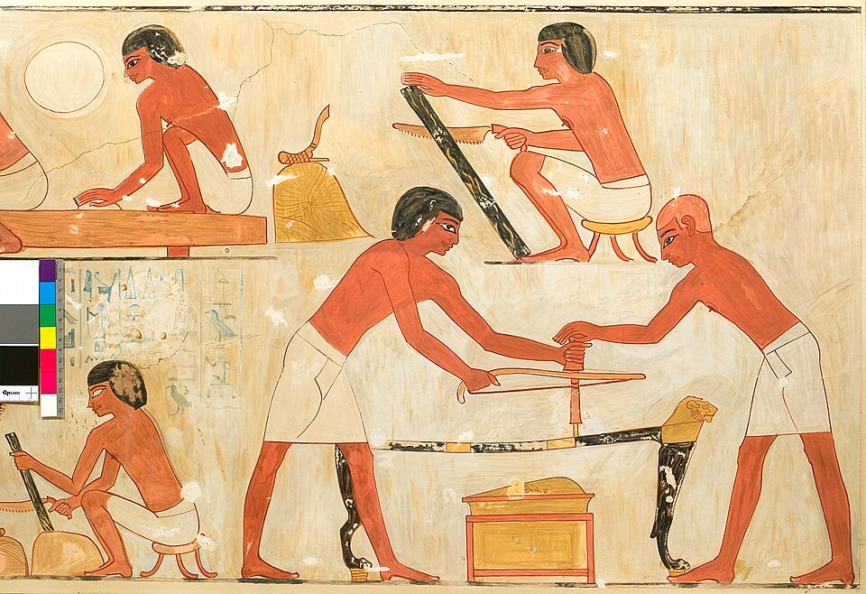
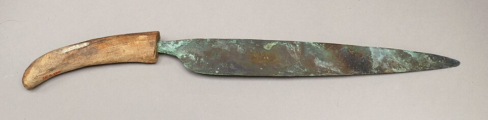

On 9 March 1925 a photographer working for the Harvard and Boston expedition at Giza noticed a patch of plaster where he expected bare limestone, close to the **[Great Pyramid](kloom:e/great-pyramid-of-giza)**. Under it was a shaft 85 feet deep, and at the bottom a jumble of gold sheet, copper fittings and wood rotted to grey ash. The expedition's leader, **[George Reisner](kloom:e/george-andrew-reisner)**, worked out that it was the reburied furniture of **[Queen Hetepheres I](kloom:e/hetepheres-i)**, wife of Sneferu and mother of Khufu, from about 2600 BC. Years of patient work recovered a bed, an armchair, a curtain box, a carrying chair and a canopy to hang curtains round them all. The canopy's roof poles were dovetailed into its top rails, and every joint was sheathed in folded copper so that it would not wear when the frame was taken down and put up again. Furniture that could be packed for a journey was being made in **[Egypt](kloom:e/ancient-egypt)** while the pyramids went up, and it took a carpenter's whole kit to make.

## The kit

Egypt's own trees gave only small timber, and the best wood, cedar, came from Lebanon. The tools that worked it were copper. The earliest known cache of them, from the reign of Djer in the First Dynasty, was found by Walter Emery in tomb 3471 at Saqqara: saws, adzes with blades lashed to straight wooden shafts, chisels and awls. A mortise chisel had a square-section blade, so that it would not bend as it levered chips from a deep hole, and a flat top for the mallet. The adze did the work that a plane does now, trueing and smoothing a surface.

Saw marks on Early Dynastic boards run across them in every direction, which tells us the first saws were short. By the pyramid age, wrote **[Flinders Petrie](kloom:e/flinders-petrie)**, the saw was about three feet long and worked with both hands.

## Ripping a board

Egyptian carpenters had no sawpit. To turn a log into boards they lashed it upright to a sawing post set in the ground of the workshop yard and sawed down it. Scenes of the method run through Egypt's whole dynastic history, and the clearest is in the tomb of the vizier **[Rekhmire](kloom:e/rekhmire)** at Thebes, of the fifteenth century BC. The sawyer pulled the blade towards himself, and that matters for a copper saw. A thin blade of a soft metal buckles when it is pushed but runs straight when it is pulled, because the pull puts it in tension.

| Step | What the carpenter did                                               | Why                                                  |
| ---- | -------------------------------------------------------------------- | ---------------------------------------------------- |
| 1    | Lashed the green log upright to the post                             | the post holds it while both hands work the saw      |
| 2    | Sawed straight down through it, cutting on the pull                  | a soft blade stays straight in tension               |
| 3    | Moved the lashings down as the cut went down                         | so the saw never meets the cord                      |
| 4    | Pushed a wedge or lever into the top of the cut, weighted by a stone | the narrow cut would otherwise close and jam the saw |
| 5    | Cut the whole log into parallel boards, "through and through"        | the least waste, though such boards cup as they dry  |

The fourth step comes from the teeth. A modern rip saw's teeth are bent alternately left and right, so its cut, the kerf, is wider than the blade. An Egyptian saw's teeth were punched out of the blade from one side, as Geoffrey Killen describes them, so they spread the cut barely at all. In wet timber that kerf closed behind the blade, and only the wedge kept it open. The boards were then stacked out of the sun to season for a few months.

Not everyone has read the saws the same way. Petrie, in 1917, found no ancient saw with its teeth set alternately, which Killen confirms, but he also concluded that the first saws scraped out a groove pushing and pulling alike, and that a saw with its teeth raked to cut on the pull began only around 900 BC. Killen, who reads the tomb scenes as a carpenter would, calls the Rekhmire sawyer's tool a pull saw. A saw buried under Hatshepsut's temple about 1470 BC is 38 centimetres long.

## The bow drill

Holes were made with a **[bow drill](kloom:e/bow-drill)**. In the **[Mastaba of Ti](kloom:e/mastaba-of-ti)** at Saqqara, of about 2400 BC, a kneeling carpenter drills a handle hole in a box lid. A cord is tied to both ends of his bow and taken once round the drill's wooden shaft; his other hand presses down on a stone cup over its top, and a copper bit does the cutting. Each stroke of the bow spins the shaft one way, and the return spins it back. With invented numbers, a 45-centimetre stroke on a shaft 1.5 centimetres across turns it, by our arithmetic, 45 ÷ (π × 1.5), or about nine and a half times, then nine and a half times back. In the Rekhmire painting two men work one drill through a bed frame, one bowing and one pressing.

## A ship of planks

In 1954 Kamal el-Mallakh found a sealed pit beside the pyramid holding the **[Khufu ship](kloom:e/khufu-ship)**, taken apart into 1,224 pieces of cedar. Reassembled by Hag Ahmed Youssef Moustafa, it is 43.4 metres long. Its planks are joined edge to edge with unpegged tenons and sewn together with rope, and its two mid-sheer planks are 23 metres long, 40 centimetres wide and 14 centimetres thick, curved to the hull. Cheryl Ward and J. Richard Steffy, who studied it, held that they were carved from a trunk. In 2024 Moshe Bram and Yoav Me-Bar argued from the plank's straight grain that it was bent, not carved, as Egyptians were already bending wood over boiling water to make bows.

The joints themselves, the tenon, the dovetail and the screw, have their own trail, Joinery. Egypt's carpenters never had a plane: that came with the Romans, the next frame.
