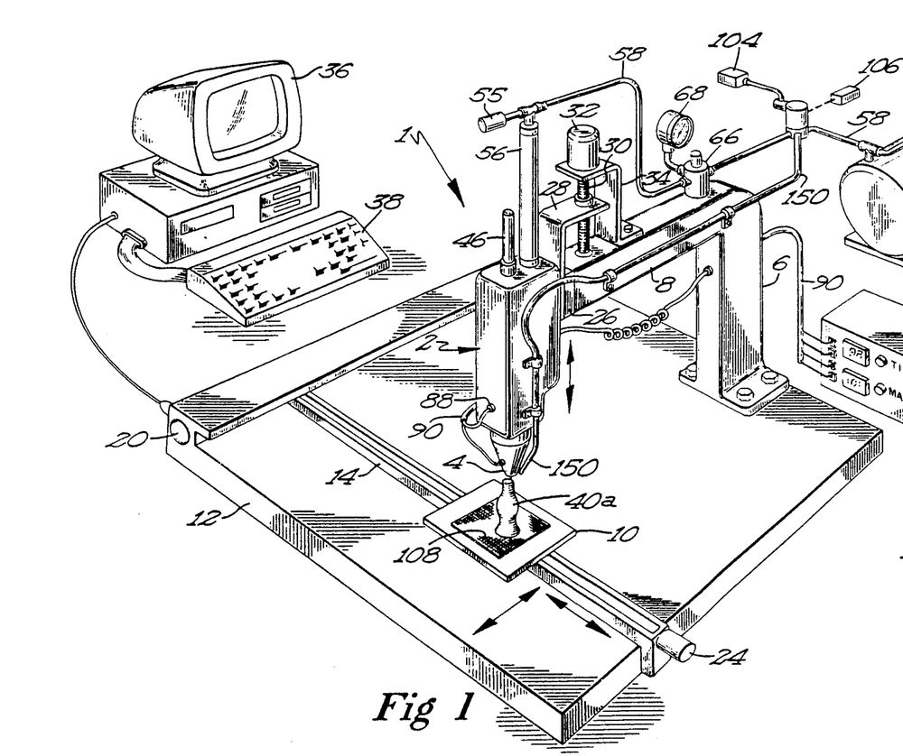
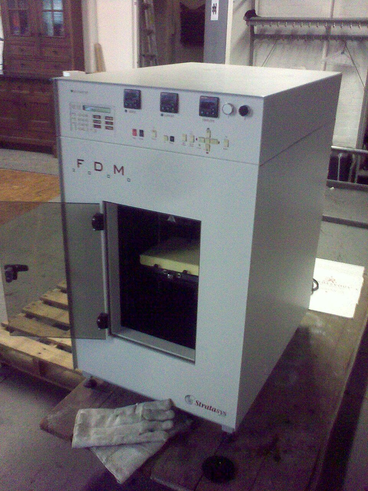

In 1988, the story goes, a Minnesota engineer decided to make his young daughter a toy frog with a glue gun. **[S. Scott Crump](kloom:e/s-scott-crump)** loaded the gun with a mixture of polyethylene and candle wax and built the frog up layer by layer, then wondered how a machine might do it for him. He spent $10,000 on digital plotting equipment and his weekends on the problem. The frog is Crump's story, retold in histories of his company, and nothing else records it. The machine is better documented. It became **[fused deposition modeling](kloom:e/fused-filament-fabrication)**, now the most common way of 3D printing: a thread of plastic melted in a hot nozzle and laid down as a bead, one layer on another.

## The patent

Crump filed his patent on 30 October 1989, and it was granted on 9 June 1992 as US 5,121,329. It describes a dispensing head moved over a base plate along three axes by motors, under a computer whose software slices a drawing into layers. The material arrives as a solid rod or as "a flexible strand", about 1/16 of an inch thick, wound on a reel and pushed by rollers into a heated nozzle. A controller holds it about 1 °C above its melting point, so that it freezes almost the moment it leaves the tip. Wax, thermoplastics, metals and even glass are all proposed. The patent's machine built on sandpaper, which held the first layer and peeled away afterwards.

The patent's background names its ancestors honestly. It cites the hot-melt glue guns made by the Parker Manufacturing Company and a wax gun for modeling jewelry, and notes that nobody had yet put either under mechanical control. It also cites **[Charles Hull](kloom:e/chuck-hull)**'s stereolithography, which built objects from a vat of light-cured liquid, and objects to its "curable photopolymer liquids which are hazardous". Crump wanted something a designer could run at a desk.

Crump and his wife Lisa founded **[Stratasys](kloom:e/stratasys)** to make it. The company history gives the founding as 1988 and the incorporation as August 1989; other sources give 1989 for both. Its first product, the 3D Modeler, was sold in April 1992.

## Pushing plastic through a hole

A desktop printer today does what the patent's strand version did. A pair of geared rollers pushes a filament of **[polylactic acid](kloom:e/polylactic-acid)** (PLA), 1.75 mm across, into a heated block. PLA is a thermoplastic, softening whenever it is heated and setting whenever it cools, so a bead can melt onto the one below and set with it. Prusa Research recommends 210 °C for PLA, well above its melting range of 130–180 °C, so the plastic flows freely through a brass nozzle with a hole 0.4 mm wide. The nozzle rides one layer height above the last layer and squashes the bead flat, wider than the hole. Prusa's guidance is to keep the layer under 80 percent of the nozzle's width.

The printer has to push exactly as much plastic as the bead needs. The slicer Slic3r models a bead in section as a rectangle with a semicircle at each end, so its area is (_w_ − _h_)·_h_ + π(_h_/2)². Here is the arithmetic for a 0.4 mm nozzle and a 0.2 mm layer, with Prusa's bead width of 0.45 mm and a head speed of 60 mm/s that is our own, moderate choice:

| Quantity                      | Value                            |
| ----------------------------- | -------------------------------- |
| Layer height _h_              | 0.2 mm                           |
| Bead width _w_                | 0.45 mm                          |
| Bead section                  | 0.05 + 0.031 = 0.081 mm²         |
| Volume at 60 mm/s             | 0.081 × 60 = 4.9 mm³/s           |
| Filament section (1.75 mm)    | π × 0.875² = 2.41 mm²            |
| Filament fed into the hot end | 4.9 ÷ 2.41 = 2.0 mm/s            |
| Spacing between beads         | 0.45 − 0.2 × (1 − π/4) = 0.41 mm |

So, by our arithmetic, the head moves thirty times faster than the filament goes in. Neighboring beads are laid 0.41 mm apart, closer than their width, so that each squeezes into the hollow its neighbor's rounded side leaves. Too much plastic and the paths overlap; too little and gaps open and the layers part. Ask for more than the hot end can melt and the filament slips in the rollers. Prusa puts an ordinary all-metal hot end at 8 to 12 mm³ a second. At 10, the bead in the table could be laid no faster than about 120 mm/s, by our arithmetic.

## When the patent ran out

Crump's patent expired on 30 October 2009, twenty years after it was filed. Stratasys kept the trademark "FDM", so the open-source **[RepRap](kloom:e/reprap)** project named the same process _fused filament fabrication_. Wikipedia's article credits the expiry with a fall in price of two orders of magnitude, and the ends of that range are easy to find: Stratasys's first modeler was offered at $130,000, and by 2017 a RepRap kit could be bought for about $100.

Crump's patent left the hardest question to "commercially available software": where every bead should go. The trail _Slicers and supports_ follows a model from its triangle mesh to the layers, the supports and the fits that make a printed part work. On the main spine, the next frame is RepRap, the printer that set out to print itself.
