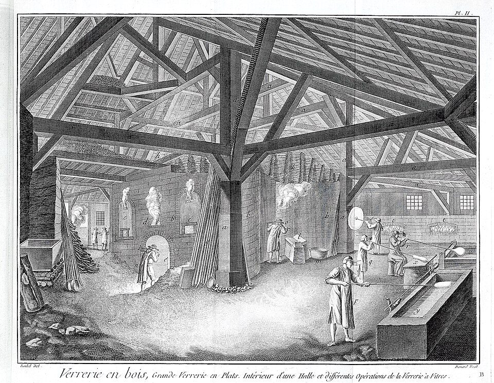

On 20 January 1959 the glassmakers **[Pilkington](kloom:e/pilkington)** Brothers, of **[St Helens](kloom:e/st-helens-merseyside)** in Lancashire, announced a new way of making flat glass, **[float glass](kloom:e/float-glass)**. A ribbon of molten glass was run out of the furnace onto a bath of molten **[tin](kloom:e/tin)**, floated there until both its faces were flat and bright, and cooled until it was hard enough to lift off onto rollers. It needed no grinding and no polishing. The man who had thought of it in 1952, **[Alastair Pilkington](kloom:e/alastair-pilkington)**, was no relation of the family that owned the firm: he had joined it in 1947 as a technical officer, after four years as a prisoner of war. The account here is largely his own, given as a lecture to the Royal Society in February 1969.

## Two bad ways to make a window

Every earlier window process, Pilkington explained, either stretched hot glass or ground it flat. In the **[crown](kloom:e/crown-glass-window)** process, which made most windows until the middle of the nineteenth century, a blown bubble was opened on an iron rod and spun in front of a furnace until it flashed out into a disc, usually about 1.4 meters across; square panes were cut from the circle around a thick lump at its center, the bullion. Cylinder glass, blown as long cylinders up to 4 meters long, then split and flattened, made bigger panes. Sheet drawn straight up from the melt, from about 1914, kept the bright "fire finish" of glass that has cooled untouched. But stretching turns every slight unevenness in the glass into ripples, and none of these could make glass for mirrors, coach windows or shop fronts.

For those there was **[plate glass](kloom:e/plate-glass)**: cast on a table, rolled, annealed, then ground flat on both faces with ever finer sand and polished with rouge. Britain's first plate glass was cast at Ravenhead, St Helens, in 1773, in a hall 103 meters long. By 1935 Pilkington's "twin grinder" at Doncaster ground both faces of a moving ribbon at once, driven by 1.5 megawatts. Plate was distortion-free, but about a fifth of the glass was ground away as waste, and the machinery was enormous. The engraving of a glasshouse spinning crown glass is from Diderot's **[_Encyclopédie_](kloom:e/encyclopedie)**, published in 1772.

## The float bath

What Pilkington and his colleague Kenneth Bickerstaff applied to patent in December 1953 was a way to get fire finish and flatness at once, by letting liquid surfaces do the work. Others had proposed floating glass on molten metal before: William Heal's American patent of 1902 names tin, and Halbert Hitchcock's of 1905 a bed of molten metal. Neither became a working process. The bath had to hold a metal that would stay liquid from about 600 to 1,050 °C, be dense enough to float glass, and give off almost no vapor. His lecture set out the choice:

| Metal   | Melts at | Boils at | Density at 1,050 °C | Why not                                        |
| ------- | -------: | -------: | ------------------: | ---------------------------------------------- |
| Lithium |   179 °C | 1,329 °C |           0.5 g/cm³ | too light to float glass                       |
| Lead    |   328 °C | 1,740 °C |           9.8 g/cm³ | its vapor condenses and spoils the glass       |
| Bismuth |   271 °C | 1,680 °C |           9.1 g/cm³ | vapor pressure too high                        |
| Gallium |    30 °C | 2,420 °C |           5.5 g/cm³ | possible, but reacts more and is harder to get |
| Tin     |   232 °C | 2,623 °C |           6.5 g/cm³ | least reaction with glass, easiest to get      |

The glass pours over a lip onto the tin at about 1,050 °C, where its viscosity is about 10⁴ poise, and is held there for about a minute while gravity and surface tension smooth away every ripple. Then it is cooled as it moves along the bath, under a roof of nitrogen and hydrogen that keeps the tin from oxidizing, until at about 600 °C it is stiff enough for rollers to touch. Even tens of parts per million of oxygen or sulfur in the tin sent up vapors that fell back as specks.

## Six millimeters, whatever you do

The surprise came in the first experiments. Whatever thickness of glass was rolled onto the tin, it settled at close to 6 millimeters. A pool of glass on tin spreads until the pull of its own weight is balanced by the surface tensions at its top, its underside and the bare tin around it. The balance fixes a thickness _T_, with *T*² = (*S*g + *S*gt − *S*t) × 2ρt ÷ *g*ρg(ρt − ρg), where the _S_ are the three surface tensions and the ρ the densities of glass and tin. For ordinary soda-lime glass Pilkington gives _T_ as about 7 millimeters, in the same lecture that calls it close to 6. That was lucky: half the market for plate was 6-millimeter glass.

For the other half, the bath had to be fooled. To make glass thinner, a wide ribbon was formed at the usual heat, gripped at its stiffened edges by rollers, then reheated to about 850 °C and stretched, so that it narrowed and thinned evenly, to as little as 2 millimeters. Pulling faster narrows the ribbon instead: one early try took it from 6 to 4 millimeters thick and from 2.5 to 0.75 meters wide. To make it thicker, guides kept the glass from spreading, up to 15 millimeters.

It took seven years and £4 million to make saleable glass, and £7 million before float could replace plate. The first full-sized plant ran from May 1957 and made nothing saleable until July 1958, at £100,000 a month. By 1969 every major flat-glass maker in the world had a license, and a line could run at 14 meters a minute. The batch it melts is the same as ever: sand, soda ash, limestone, dolomite and salt cake. Wikipedia's article says that windows today are usually made of float glass.

The next segment turns from things made by fire to things cut from trees, starting with the oldest carpentry known.
