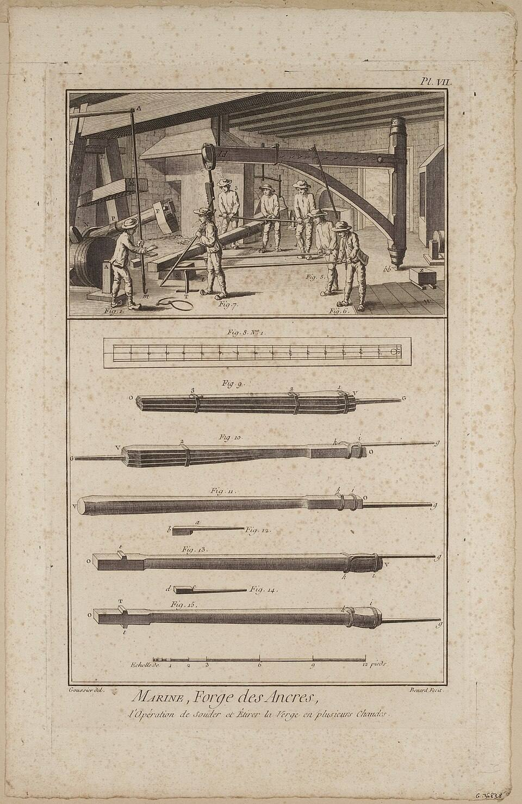
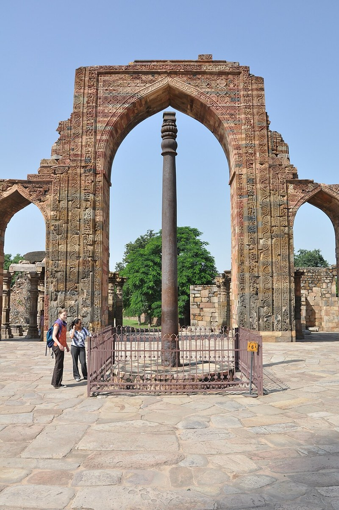

Among the offerings at **[Delphi](kloom:e/delphi)**, **[Herodotus](kloom:e/herodotus)** wrote in the fifth century BC, the one most worth seeing was a great silver bowl given by Alyattes, king of Lydia, standing "on a stand of welded iron". It was the work of **[Glaucus of Chios](kloom:e/glaucus-of-chios)**, "the only one of all men who discovered how to weld iron". Six centuries later the travel writer **[Pausanias](kloom:e/pausanias-geographer)** found the bowl gone and the stand still there, shaped like a tower and built of iron strips set like the rungs of a ladder. "Each plate of the stand is fastened to another," he wrote, "not by bolts or rivets, but by the welding." Herodotus was wrong about the discovery, if not about the stand. Smiths had joined iron to iron for centuries before Glaucus, because every lump of iron from a bloomery had to be welded into a solid bar before it could be used at all. And the Greek word for what Glaucus did means "gluing together", which some translate as soldering; Wikipedia's article on him does, though Pausanias's description reads like **[forge welding](kloom:e/forge-welding)**: two pieces of iron made into one by heat and the hammer, with nothing between them.

## Why iron sticks to iron

John Lord Bacon, teaching forge-work in Chicago in 1904, put it plainly. As iron heats it grows softer, "until at last a heat is reached at which the iron is so soft that if another piece of iron heated to the same point touches it, the two will stick together." Only metals that pass slowly from solid to liquid through a pasty state weld easily, which is why iron and mild steel weld at the anvil; copper and its alloys, Wikipedia's article on forge welding adds, do so only with great difficulty.

The enemy is scale. Hot iron in air grows a skin of iron oxide, which will not melt at a heat the iron can survive, and a skin left between two pieces keeps them apart. The smith's answer is a flux, a dust thrown on at a yellow heat. Joseph Moxon's smiths in 1677 took "a little white Sand between your Finger and your Thumb". Bacon's used sand or **[borax](kloom:e/borax)**, or four parts borax to one of sal ammoniac for tool steel. The flux melts over the iron, keeps air off it and dissolves the oxide already there into a runny slag that the blows squeeze out of the joint. It is not a glue, Bacon insists: it "does not in any way stick the pieces together". The same article gives the chemistry of the oldest flux: silica from the sand joins the iron oxide to make fayalite, an iron silicate that melts just below the welding heat. Slag of that kind, the archaeometallurgist Alan Williams notes, runs liquid at about 1,100–1,200 °C.

How hot is a welding heat? Moxon said the iron should be almost "ready to Run" inside as well as out, Bacon that it should "seem almost white", and both warned that a little more burns it. Bacon's sign of burning iron is a shower of white, exploding, star-shaped sparks; burnt iron comes out spongy and brittle, "absolutely worthless". In the colour table Wikipedia attributes to Chapman, almost white is about 1,260–1,310 °C. Wikipedia's article on forge welding puts pure iron higher, at 1,400–1,500 °C, close to its melting point, and steel lower the more carbon it holds, down to 900–1,100 °C at 2 per cent: the more carbon, the lower the welding heat.

## A lap weld, step by step

Bacon's instructions for joining two flat bars end to end:

| Step  | What the smith does                                                                              | Why                                                        |
| ----- | ------------------------------------------------------------------------------------------------ | ---------------------------------------------------------- |
| Upset | thickens both ends                                                                               | welding hammers the joint thinner, and scale eats iron     |
| Scarf | draws each end to a wedge, first with the pene at about 45°, then with the face; slightly convex | a convex scarf touches in the middle and squeezes slag out |
| Heat  | brings both to the same heat slowly, in a clean fire with little blast; flux at a yellow heat    | an uneven or dirty heat will not stick                     |
| Lay   | the helper's piece scarf up, the smith's scarf down on top, thin edges over the thick ridge      | so the blows close the joint from the middle outwards      |
| Weld  | rapid blows, the thin edges and points first                                                     | they cool first                                            |

The scarf should be about one and a half times as long as the bar is thick: three quarters of an inch on a half-inch bar, or, by our arithmetic, 30 millimetres on a bar 20 millimetres thick. A concave scarf is the classic mistake. Its edges meet first, weld shut, and trap a pocket of melted scale in the middle of the joint. A weld taken too cold fails the other way: the pieces "will not stick, and no amount of hammering will weld them".

## Anchors, pillars and barrels

Big work was built the same way, many bars at a time. Moxon noted that anchor-smiths chose Spanish iron "because it abides the Heat better than other Iron". A plate drawn by Louis-Jacques Goussier for the **[Encyclopédie](kloom:e/encyclopedie)** shows the shank of a ship's anchor being made as a bundle of bars, bound with iron hoops and slung from a crane, to be welded and drawn out "in several heats", a gang of men working it with long levers.

Bacon called it faggot or pile welding: scrap tied into a pile, brought to a welding heat in a furnace with sand for flux, and hammered into one lump. Because iron was made in small amounts, Wikipedia's article on forge welding notes, any large object had to be built up from smaller pieces. The **[iron pillar of Delhi](kloom:e/iron-pillar-of-delhi)**, made for the Gupta emperor Chandragupta II around AD 400, is more than six tonnes of iron, 7.21 metres tall, forge welded from pieces of wrought iron.

Electric and gas welding have largely replaced the hammer weld, and in a later frame an arc does the work. The next frame is the weld's most beautiful use: pattern welding, where the joins themselves became the decoration.
