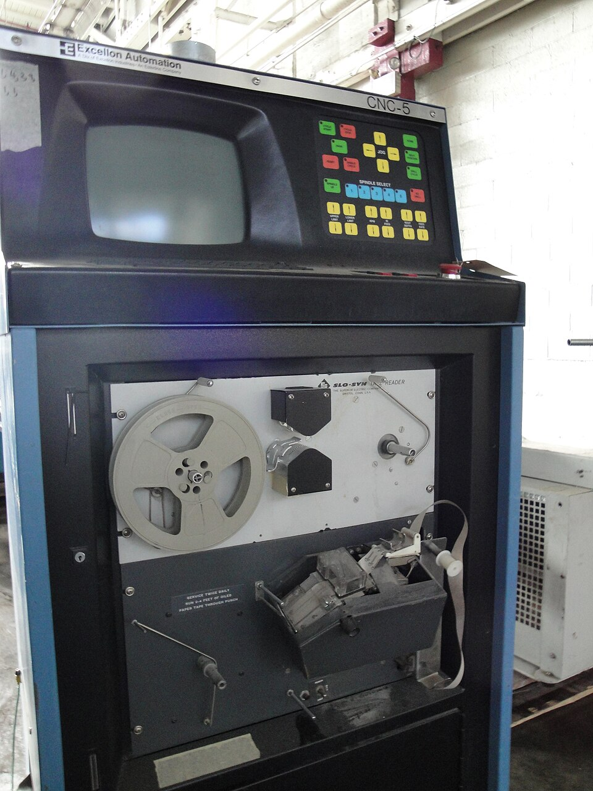
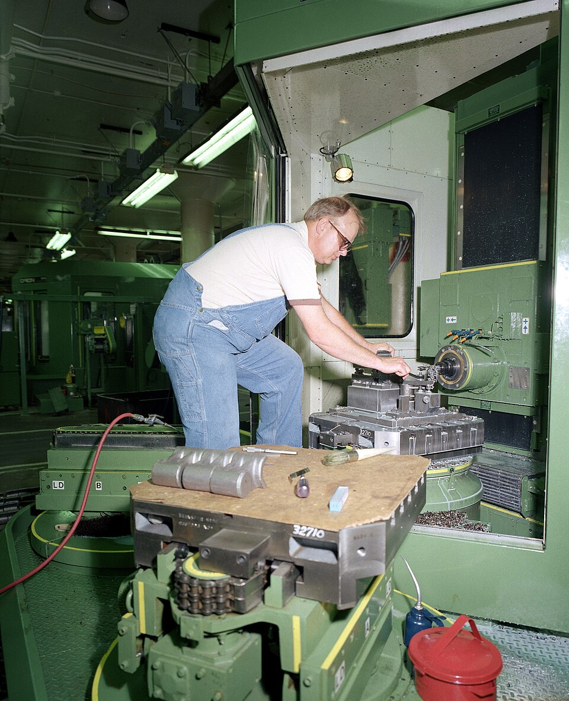

[APT](kloom:e/apt-programming-language) let a programmer describe a part in geometry, but its output, a list of cutter positions, could not be fed to a machine as it stood. Each make of controller read its own tape. What the machines came to share was a lower language, a line of letters and numbers for every move, which the **[Electronic Industries Association](kloom:e/electronic-industries-alliance)** published as the standard RS-274 in 1963. Its revisions merged the formats for positioning and for contouring in 1974, and the last, RS-274-D, was approved in 1979; outside the United States the **[International Organization for Standardization](kloom:e/international-organization-for-standardization)** issued it as ISO 6983 in 1982. It is known as **[G-code](kloom:e/g-code)**. Wikipedia expands the G as "geometric"; the manual of the **[National Institute of Standards and Technology](kloom:e/national-institute-of-standards-and-technology)** (NIST), below, calls a G word a "general function".

## A line is a block of words

Every line, or block, is a series of words, and each word is a letter and a number. NIST's manual for its own interpreter, written in 2000, sets out the grammar. N is an optional line number. G words choose what kind of motion, units or mode follows; M words are miscellaneous machine functions such as the spindle and coolant; X, Y and Z are positions; F is the feed rate, S the spindle's speed in revolutions a minute, T a tool. Spaces don't matter and nor does case. Most G words are _modal_: they stay in force until another word from their group replaces them, so a program says only what changes.

Here is a program for a part we have invented: a slot outline 2 millimetres deep, straight on three sides and with a round end of 10 mm radius, cut with a 6 mm end mill. The plate draws it, and the table gives it line by line.

| Line | Words             | What the machine does                                               |
| ---- | ----------------- | ------------------------------------------------------------------- |
| N10  | G21 G90 G17       | millimetres; absolute coordinates; arcs in the XY plane             |
| N20  | T1 M6             | change to the tool in slot 1                                        |
| N30  | S3000 M3          | spindle at 3,000 rpm, turning clockwise                             |
| N40  | G0 X0 Y0 Z5       | rapid move to 5 mm above the corner                                 |
| N50  | G1 Z-2 F100       | feed down into the metal, 2 mm, at 100 mm a minute                  |
| N60  | G1 X40 F300       | cut along the bottom edge at 300 mm a minute                        |
| N70  | G3 X40 Y20 I0 J10 | cut anticlockwise to (40, 20), round a centre 10 mm above the start |
| N80  | G1 X0             | cut back along the top                                              |
| N90  | Y0                | still in G1: cut down the left side                                 |
| N100 | G0 Z5             | rapid up and clear                                                  |
| N110 | M2                | end the program; the spindle stops                                  |

By our arithmetic, at 3,000 rpm and 300 mm a minute each of a two-fluted cutter's teeth takes a chip 0.05 mm thick; the whole cut, 100 mm of straight lines and 31.4 mm of arc, takes about half a minute. The order inside a line is fixed: the manual's table puts the feed rate, the speed, the tool change and the spindle before any motion, and stopping last, so N30 can never move a cutter that is not turning.

## Arcs, and what goes wrong

The interesting line is N70. In the centre format, I and J are the distances from where the cutter is to the arc's centre, not the centre's coordinates. From (40, 0), I0 J10 puts it at (40, 10). Where the 1952 machine needed a tape line for every chord, the controller now breaks the arc into steps itself. NIST's interpreter refuses an arc whose start and end lie at radii from the centre that differ by more than 0.002 mm. The other way of writing an arc, by its radius alone, the manual calls "outrageously bad" for a nearly full circle, because a tiny change in the end point moves the centre a long way.

Most mistakes are one wrong letter. Write G2 for G3 and the cutter goes clockwise round the same centre, into the part, leaving a hollow end instead of a round one. Write I40 J10, taking the centre's own coordinates, and the centre lands at (80, 10): both ends are 41.2 mm from it, so nothing is refused, and by our arithmetic the cutter swings 332° round a circle 82 mm across. A program in inches read as millimetres makes every move 25.4 times too small. And G0 is for moving through air: the manual says cutting is not expected during it.

## Still running

The standard did not make programs interchangeable. A NIST study of 1995 found that RS-274-D programs were not portable between controllers, and that CAD and CAM systems still wrote APT-style cutter locations which a post-processor turned into each machine's dialect. From the 1970s to the 1990s many machine builders settled on controllers from the Japanese firm **[Fanuc](kloom:e/fanuc)** to get round the differences. In 1993 NIST began a public-domain controller as a vendor-neutral reference, and its descendant, **[LinuxCNC](kloom:e/linuxcnc)**, runs machines on ordinary computers today. A successor, STEP-NC, was designed to send a controller the part and its tolerances rather than bare moves. Yet ISO 6983-1, in its second edition of 2009, was confirmed in 2020 and was still current on ISO's page in 2025, and G-code remains the language most machines read.

The same lines of G-code now drive 3D printers, as the Slicers trail shows. The next segment begins with that turn, from cutting material away to building it up: stereolithography.
