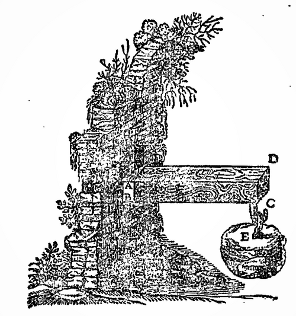
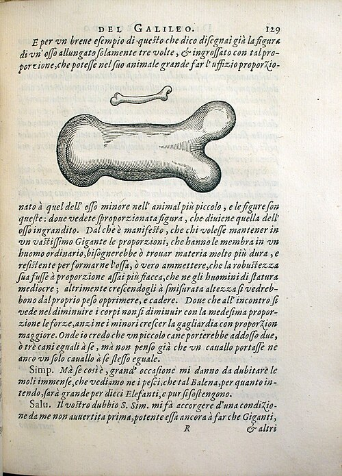

In 1638, under house arrest at Arcetri and forbidden to publish, [Galileo](kloom:e/galileo-galilei) had his last book printed at Leiden: **[_Two New Sciences_](kloom:e/two-new-sciences)**. The second of its sciences, motion, became the foundation of physics. The first was about making things. The book opens at the **[Venetian Arsenal](kloom:e/venetian-arsenal)**, the republic's great shipyard, where Salviati, Galileo's spokesman, recalls an old foreman's remark: a big ship needs far heavier stocks and scaffolding to launch than a small one, because it is in danger of breaking under its own weight. Sagredo calls it a false though common opinion, since geometry does not care about size. Salviati says the foreman is right, and sets out to prove it. The proof, the first two days of the book, is the start of the **[strength of materials](kloom:e/strength-of-materials)**: what load a beam will carry before it breaks, worked out on paper before anyone builds it.

## The beam in the wall

Galileo's figure is a cantilever: a beam fixed into a wall, with a weight hung from its end. If it breaks, he argues, it breaks at the wall, turning about the lower edge of the joint as about the fulcrum of a lever. The weight acts on the long arm, the beam's length. The resistance is the strength of all the fibers in the section, which act, he supposes, as if gathered at its center, so they work on a short arm of half the beam's depth.

From that one lever he draws the rules a carpenter needs. A beam twice as long carries half the weight at its end. Stand a flat ruler on edge and it carries more than when it lies flat, "in the ratio of the width to the thickness". The fibers are the same; only the arm they pull on has changed. A beam's own weight is worse: making it longer adds both weight and leverage, so the moment that would break it grows as the square of its length.

## A plank, worked

Put together, the rules say a beam's strength goes as its width times its depth squared, and inversely as its length. Here is a plank with invented numbers: 200 by 50 millimeters, reaching 2 meters from a wall, of a wood whose fibers break at 40 megapascals. The loads are by our arithmetic:

| The same plank, 2 m out           | Laid flat   | On edge     |
| --------------------------------- | ----------- | ----------- |
| Width × depth                     | 200 × 50 mm | 50 × 200 mm |
| Breaking load, by Galileo's lever | 5.0 kN      | 20 kN       |
| Breaking load, by elastic theory  | 1.7 kN      | 6.7 kN      |

On edge the plank is four times as strong, by either reckoning, because its depth is four times as great: that is why joists stand on edge. But the two reckonings differ by a factor of three.

## The fulcrum in the wrong place

Galileo's fibers pull with their full strength and never stretch, so the beam turns about its bottom edge. A real beam bends. Its fibers stretch above and are squeezed below, and between them, at mid-depth for a rectangle, runs a line that does neither, the neutral axis. Henry Crew, who translated the book into English in 1914, called this "the one fundamental error" of the Second Day, and gave the correction to **[Edme Mariotte](kloom:e/edme-mariotte)** in 1680 and Antoine Parent in 1713. The rule engineers use now, from the elastic beam theory of the eighteenth century, divides the beam's depth squared by six where Galileo's divided it by two: a third of his load. The error, Crew noted, spoils none of Galileo's proportions, because those compare beams with each other, not with a breaking test. Wikipedia's history of the theory adds that Jacob Bernoulli, in 1705, still put the axis at one face.

## Bones and giants

The proportions held something stranger. A beam's strength grows as the cube of its thickness, the weight bearing on it as the cube of its size. So two beams of the same shape are never equally safe: there is one size, Galileo proves, that just carries its own weight, and every larger one breaks. That is why a horse breaks its bones falling three or four cubits while a cat falls twice as far unharmed, and why an oak two hundred cubits high could not hold up its branches. It is the **[square–cube law](kloom:e/square-cube-law)**, and Galileo drew it as a bone "whose natural length has been increased three times and whose thickness has been multiplied" until it could do the same work. By our arithmetic from his eighth proposition, a beam three times longer that is to stand its own weight must be nine times thicker.

A giant built like a man, Salviati concludes, would need a harder material for his bones or would fall and be crushed. A small dog could carry two or three dogs its size; a horse could not carry one horse.

Galileo treated his material as a bundle of fibers of one strength. The next frame looks inside the material: in Sheffield, with a microscope, at steel.
