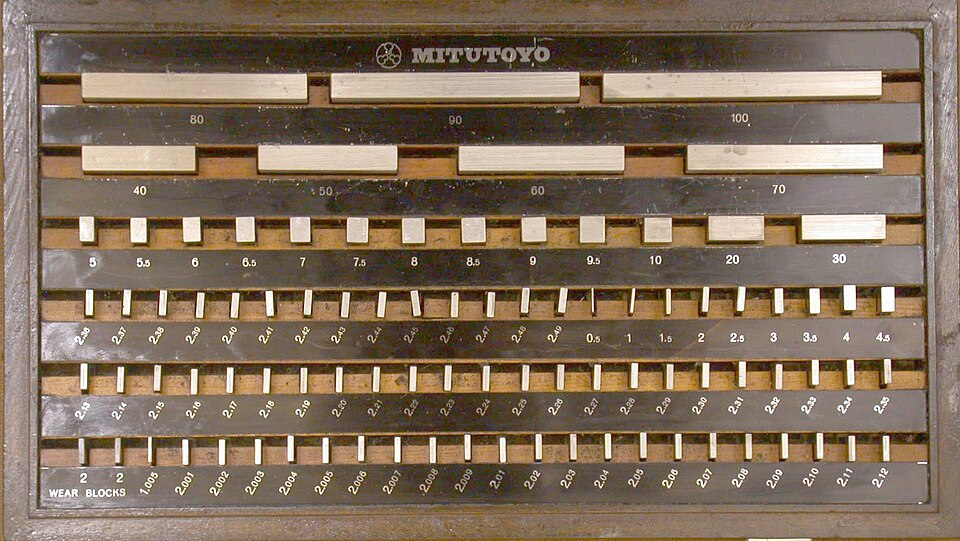
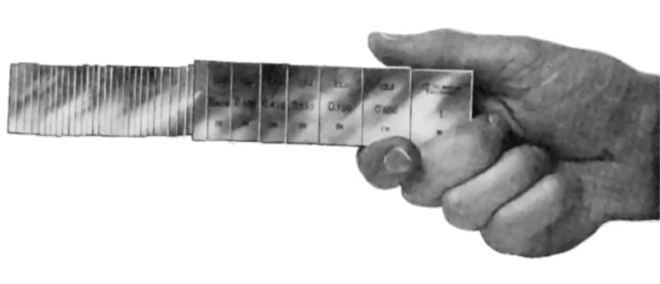

In 1896 **[Carl Edvard Johansson](kloom:e/carl-edvard-johansson)**, an inspector at the state rifle factory in **[Eskilstuna](kloom:e/eskilstuna)**, Sweden, was traveling home from the Mauser works at Oberndorf in Germany, which Sweden had licensed to copy. He had gone to learn how Mauser measured its parts and found it relied on several thousand fixed gauges, each made for one dimension of one part and useless when the design changed. On the way home, in the story the gauge maker Mitutoyo's history retells from his biography, he thought of a better way: a small set of steel blocks, each lapped to an exact thickness, that could be stacked to make up any length a shop might need. The result was the **[gauge block](kloom:e/gauge-block)**, and for most of the twentieth century it was how a factory knew what a millimeter or an [inch](kloom:e/inch) was.

## A hundred and two blocks

The principle is simple. The National Institute of Standards and Technology's handbook gives the smallest example: blocks of 1, 2, 4 and 8 millimeters, combined, make every whole millimeter from 1 to 15. Johansson's first set, as Mitutoyo describes it from his diary, had 102 blocks: 49 from 1.01 to 1.49 millimeters in steps of a hundredth, 49 from 0.5 to 24.5 millimeters in steps of a half, and four of 25, 50, 75 and 100. Together they made about 20,000 lengths from 1 to 201 millimeters, in hundredths. A block of 1.005 was added soon after, and in 1909 nine more, from 1.001 to 1.009, made a set of 112 that reached about 200,000 lengths in steps of a thousandth of a millimeter: a micrometer, or micron.

He finished the first blocks at home, lapping them on his wife's sewing machine, converted for the work. The dates of the patent disagree. His application was filed in 1898, and Wikipedia's article gives a Swedish patent, No. 17017, granted on 2 May 1901; Mitutoyo's history says the idea was so poorly understood that he had to appeal to the royal family, and the patent was established only in 1908.

## Building a length

Mitutoyo's catalog gives the rule a toolmaker follows: use as few blocks as possible, and choose them from the last decimal place backwards. To make 41.378 millimeters from Johansson's 1909 set, the thousandths come first: a 1.008 block leaves 40.370. A 1.37 takes the hundredths and leaves 39. Then 14 and 25.

| Set                      | Blocks for 41.378 mm     | Remainder after each   |
| ------------------------ | ------------------------ | ---------------------- |
| Johansson's 102, of 1896 | none: steps of 0.01 only | 41.37 = 1.37 + 15 + 25 |
| Johansson's 112, of 1909 | 1.008 + 1.37 + 14 + 25   | 40.370, 39.000, 25, 0  |
| The 2 mm set pictured    | 2.008 + 2.37 + 7 + 30    | 39.370, 37.000, 30, 0  |

Each block is allowed an error, and a stack's errors can add. By the ISO tolerance for grade 0 blocks that the NIST handbook quotes, 0.10 micrometer plus 0.0002 micrometer for every millimeter of length, the four modern blocks could be off by 0.41 micrometer between them at worst, by our arithmetic.

## Why blocks wring

The blocks are not clamped. Slid together, face on lapped face, they cling, and the stack holds as one piece: this is wringing. Johansson, in Mitutoyo's telling, first met it in 1900, when two lapped gauges he dropped would not come apart, and his patent never mentions it. In 1917 he hung 200 pounds from wrung blocks before an engineering meeting in Stockholm. The cause is still not fully understood. Wikipedia's article lists air pressure among the causes; the NIST handbook says that idea was shown wrong in 1912 and that the wrung joint holds up to 300 newtons, far more than the atmosphere could. It puts the force down to a film of oil and water about 10 nanometers thick, whose surface tension and cohesion pull the faces together. Because every stack has films in it, a block's length is defined to include one, so that lengths simply add.

## The inch, settled

Johansson worried about temperature. In 1903 he sent a 100 millimeter gauge to the **[International Bureau of Weights and Measures](kloom:e/international-bureau-of-weights-and-measures)** near Paris, which found it exactly 100 millimeters at 20.63 °C, and he made his metric blocks true at 20 °C. The international committee adopted 20 °C as the reference temperature for industrial lengths in 1931.

The inch was worse. Britain's was 25.399977 millimeters and America's 25.4000508, a difference under three parts in a million. Johansson made his inch blocks to exactly 25.4 millimeters. They sold so widely, from a first American set bought by **[Henry M. Leland](kloom:e/henry-m-leland)** of Cadillac around 1908, that British and American industry adopted the 25.4 millimeter inch in 1930 and 1933, and in 1959 the national laboratories of the English-speaking countries agreed to define the inch as exactly that. In 1923 **[Henry Ford](kloom:e/henry-ford)** bought Johansson's American company and moved it to Dearborn, where it made gauge blocks for the Ford toolroom and anyone else who could afford them.

A gauge block is an end standard, measured between its two faces like the Mètre des Archives of 1799. The next frame turns from measuring to cutting faster.
