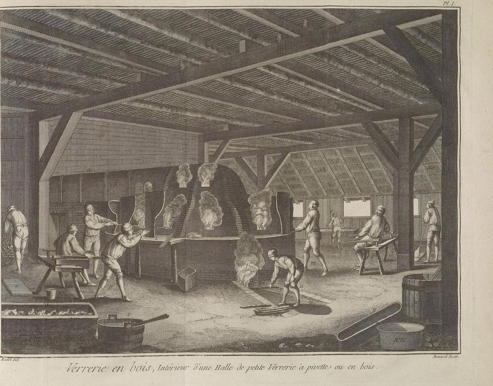
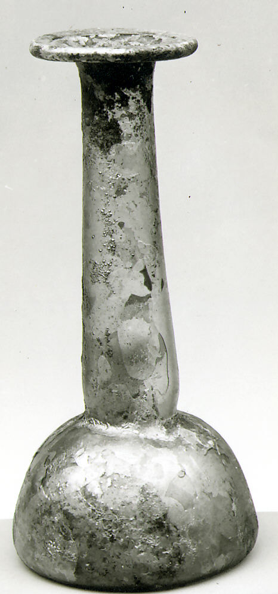

In 1970 and 1971 the archaeologist **[Nahman Avigad](kloom:e/nahman-avigad)**, digging in the Jewish Quarter of **[Jerusalem](kloom:e/jerusalem)**, cleared a group of abandoned cisterns and ritual baths over which **[Herod the Great](kloom:e/herod-the-great)** had laid a street in 37–34 BC. One was full of a glassworker's rubbish: rods, chunks, cast bowls, deformed scraps and hollow glass tubes, some pinched shut and sealed at one end, and small bulbs blown from them and never finished. Coins and pottery in the fill put the dumping no later than about 50–40 BC. It is the earliest firm evidence of **[glassblowing](kloom:e/glassblowing)**, inflating hot glass with the breath, and the sealed tubes look like someone working out how.

## Glass before the pipe

Glass was then about fifteen hundred years old. Wikipedia's article dates sustained glassmaking to about 1600 BC in Mesopotamia and 1500 BC in Egypt, and about 650 BC scribes of the Assyrian king Ashurbanipal wrote down how to make it. One tablet tells the glassmaker to grind 10 minas of a stone taken to be quartz with 15 of salicornia ash, the soda-rich ash of a salt-marsh plant, fire the mixture in a kiln, grind it again, melt it in a crucible and pour it onto a brick. Vessels were made by casting, by grinding cold blocks like stone, or by core-forming: trailing hot glass round a core of sand and clay on a rod and scraping the core out afterwards. Each was slow, and the core limited a vessel to the size of a perfume flask.

## Gather, marver, blow

Glass has no melting point. It stiffens steadily as it cools: soda-lime glass forms easily at about 900 °C and softens and slumps near 700 °C. Most blowing is done between about 870 and 1,040 °C. The steps have hardly changed since Rome, and Walter Rosenhain, describing a bottle-maker in 1908, gives them in order:

| Step   | What is done                                                                       | Why                                                    |
| ------ | ---------------------------------------------------------------------------------- | ------------------------------------------------------ |
| Gather | The warmed nose of the pipe is turned in the pot, picking glass up like honey      | Several gathers give a larger piece                    |
| Marver | The gather is rolled on a flat slab or in a wooden block                           | Rounds it on the pipe's axis and chills a skin on it   |
| Blow   | Short breaths while the pipe turns; swinging stretches the bubble                  | The air pushes evenly; turning stops the glass sagging |
| Reheat | The piece goes back to the furnace mouth                                           | Keeps it soft enough to work                           |
| Pontil | An iron rod with a blob of hot glass is stuck to the base; the pipe is cracked off | Frees the mouth to be opened and finished              |
| Anneal | The finished piece goes into a cooler chamber                                      | Lets it cool slowly enough not to crack                |

The breath works because hot glass evens itself out. Where the wall of a bubble grows thin it cools faster, stiffens and stretches less, so the thicker, hotter parts take up the expansion. **[Pliny the Elder](kloom:e/pliny-the-elder)**, writing in the 70s AD, says glass was blown into shape as well as turned and engraved, and that **[Sidon](kloom:e/sidon)**, on the Phoenician coast, had been famous for its glass-houses. Experiments at the Toledo Museum of Art found that short clay blowpipes of 30–60 centimeters work well, and fragments of clay pipes survive from a Roman workshop at Avenches, in Switzerland.

## Why glass must cool slowly

Glass conducts heat poorly. If a hot piece cools quickly, its outside goes rigid and contracts while the inside is still hot and soft. When the inside cools in turn it pulls on the rigid skin, and the piece is left full of locked-in stress; a scratch or a draft can then shatter it. A **[Prince Rupert's drop](kloom:e/prince-ruperts-drop)**, a tear of glass dropped into water, shows the extreme: it shrugs off a hammer on its head and bursts into powder when its tail is snapped.

**[Annealing](kloom:e/annealing-glass)** cures this. The piece is held at its annealing point, where the glass is stiff to the touch but can still flow a little inside, so that stresses relax in minutes; it is then cooled slowly past the strain point, below which the glass can no longer flow at all, and after that as fast as it will bear. The sources give different figures. Wikipedia's article on annealing puts the annealing point of most glasses at 454–482 °C; its article on soda-lime glass anneals at about 500 °C for some 15 minutes. Percival Marson, in a handbook in print by 1918, describes a tunnel 40 feet long, about 350 °C at its hot end, through which ordinary ware traveled for about three days, and optical glass for as long as ten. Some Roman workshops had annealing chambers beside the furnace.

## Did it make glass cheap?

Blowing spread fast. By the first century AD glassworks stood in Rome, Campania and along the Rhine, and a blower can make about 100 plain vessels a day, by an estimate of the glass historian E. Marianne Stern. Wikipedia's article on the history of glass says that glass vessels became cheap compared with pottery. Jonathan Prior, counting the glass from five sites of the first century AD in a 2015 thesis, disagrees in part: glass was already spreading before blowing, and cast vessels went on being made beside blown ones for a century. On his reading, demand for glass may have driven the new technique as much as the technique created the demand.

For most of the eighteen centuries after Jerusalem, window glass began as a blown bubble too. The next frame is the process that ended that, by letting molten glass lie flat on molten tin.
