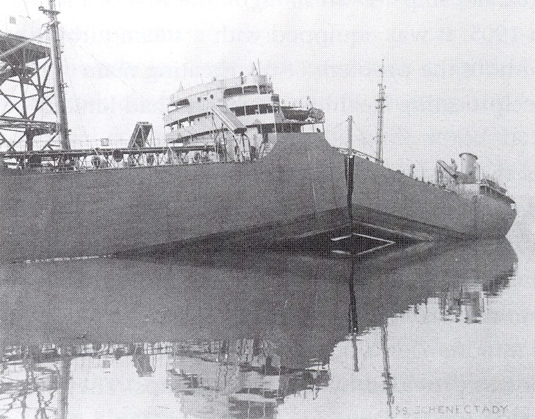

On 26 February 1920 a paper by **[A. A. Griffith](kloom:e/alan-arnold-griffith)**, a young engineer at the **[Royal Aircraft Establishment](kloom:e/royal-aircraft-establishment)** at Farnborough, was read to the Royal Society. He had set out to learn why a scratched machine part fails sooner under repeated loads than a polished one, and had come to a larger question. Theory said a solid held together by the pull of its molecules should bear a tenth of its stiffness before it broke. Real materials broke at a small fraction of that. His answer, printed in the _Philosophical Transactions_ that October, founded **[fracture mechanics](kloom:e/fracture-mechanics)**: every solid is full of tiny cracks, and a crack grows when growing pays.

## The energy of a crack

Griffith's idea was a balance of energy. A stretched plate stores elastic energy, as a spring does. Let a crack in it lengthen a little, and the material beside the crack relaxes and gives some of that energy up. But the crack's two new faces cost energy too, the surface energy that makes a drop of liquid round. The energy released grows faster with the crack's length than the cost of its faces, so beyond a certain length a crack releases more than it needs and runs, faster and faster, through the whole piece.

For a plate under a stress _σ_, with a crack of length 2*a*, the balance tips when

_σ_ = √(2*Eγ* ÷ π*a*)

where _E_ is the material's stiffness and _γ_ its surface energy per unit area. The length sits under the square root. Double a crack, and the stress that breaks the plate falls not by half but by √2, to 71 per cent. Make the crack four times as long, and the plate holds half as much. The plate draws it: the stress along the crack's line, peaking at its tips, and the breaking stress falling as the crack grows.

## Bulbs of glass

Griffith tested it on glass, which stays elastic until it breaks. He bought test tubes of a hard English glass, scratched cracks into them with a glass-cutter's diamond, annealed them at 450 °C for an hour to relieve the stresses the scratching left, and burst them from inside under pressure, each in half a minute to five minutes. If he was right, the bursting stress times the square root of the crack's half-length should come out the same every time. Here are his four spherical bulbs, converted, with the last column in his own units:

| Crack length | Bursting stress | From the first bulb, by √ | Stress × √(half-length) |
| -----------: | --------------: | ------------------------: | ----------------------: |
|       3.8 mm |        5.96 MPa |                         — |                     237 |
|       6.9 mm |        4.30 MPa |                  4.44 MPa |                     229 |
|      13.7 mm |        3.32 MPa |                  3.14 MPa |                     251 |
|      22.6 mm |        2.52 MPa |                  2.45 MPa |                     244 |

The third column is our arithmetic: each bulb's stress predicted from the first's by the square-root rule. A crack six times as long burst the glass at 42 per cent of the stress, close to the 41 per cent the rule gives. Across his bulbs and tubes the product averaged 239, against 266 from his theory.

That agreement was partly luck. The formula Griffith printed had an error in its strain energy, which he corrected in 1924 without much explanation. Dietrich Munz and Theo Fett, who traced the error in 2015, found that the corrected formula predicts a figure well below his measurements, and put the gap down to the bulging of a pressurized bulb's cracked wall, which no flat plate has.

| Fiber diameter |  Strength |
| -------------: | --------: |
| 1,016 µm (rod) |   172 MPa |
|         107 µm |   292 MPa |
|          51 µm |   549 MPa |
|          24 µm |   807 MPa |
|          13 µm | 1,345 MPa |
|         6.6 µm | 2,289 MPa |
|         4.2 µm | 3,434 MPa |

Then he drew glass into fibers, the thinner the fewer the flaws they could hold. Fibers four thousandths of a millimeter across were twenty times as strong as a thick rod, and freshly drawn ones, before the air had worked on their surfaces, stronger still. If the flaws could be removed, he wrote, the strength of technical materials "might be increased 10 or 20 times at least".

## Ships that broke in two

At 10.30 on the night of 16 January 1943 the **[SS _Schenectady_](kloom:e/ss-schenectady)**, a new tanker moored at the Kaiser yard on Swan Island in Portland, Oregon, cracked across her deck with a bang heard a mile away and folded in the middle, bow and stern on the river bed. The water was still. The air was −3 °C. The board that investigated later calculated the stress at the fracture as about 68 MPa, a modest load for ship steel.

She was one of thousands of welded ships built in a hurry, among them the **[Liberty ships](kloom:e/liberty-ship)**. The US Navy's Board of Investigation counted 4,694 such ships by 1946, of which 970 suffered fractures; eight broke in two, and eight were lost. (Wikipedia's article on the Liberty ship counts twelve that broke in half.) The fractures came most often in cold water and heavy seas, and a welded hull, one continuous plate, gave a running crack nothing to stop at. At Cambridge **[Constance Tipper](kloom:e/constance-tipper)** showed that the cracks began not in the welds but in the steel, which turned from ductile to brittle below a certain temperature, and devised a test of ship steel that bears her name. At the US Naval Research Laboratory **[George Irwin](kloom:e/george-rankin-irwin)** took Griffith's balance and added the energy a metal spends in yielding at a crack's tip, which in steel dwarfs the surface energy. By 1957 he had reduced it to one number, the stress intensity factor, and a material's fracture toughness became something to measure and specify.

Glass breaks at its cracks. Metal also flows before it breaks, for a reason the next frame gives: dislocations.
