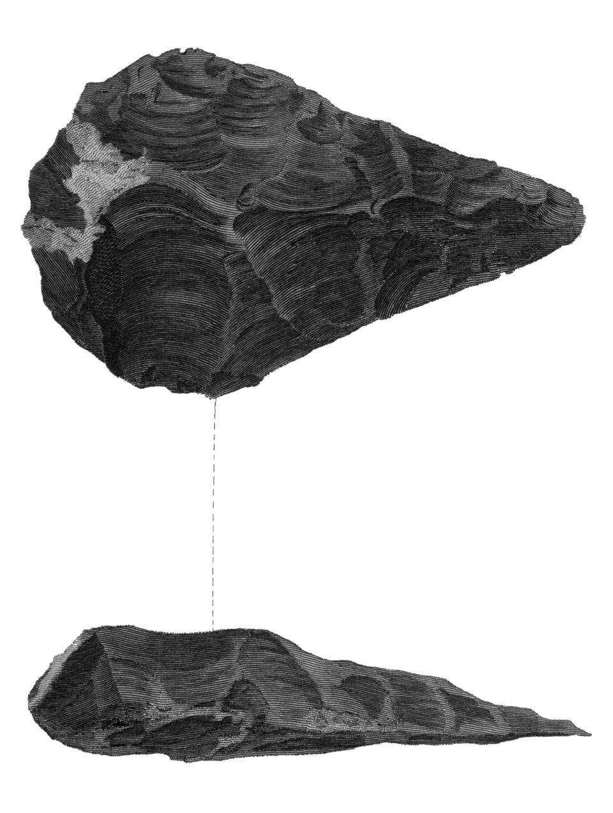
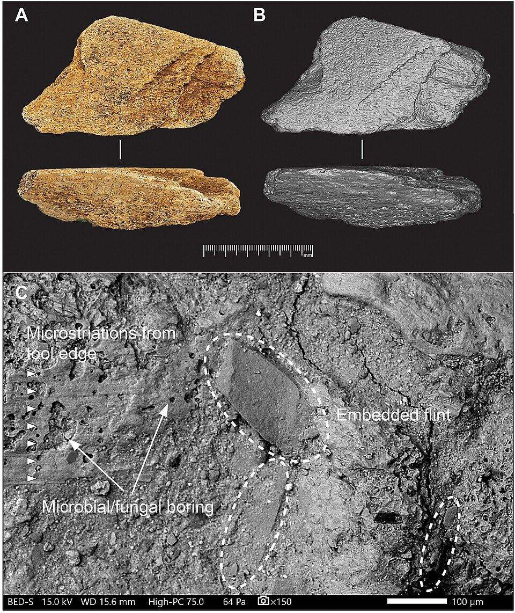

On 22 June 1797 a letter from **[John Frere](kloom:e/john-frere)**, a Suffolk landowner, was read to the **[Society of Antiquaries of London](kloom:e/society-of-antiquaries-of-london)**. Brickmakers digging clay at **[Hoxne](kloom:e/hoxne)**, he wrote, had come on flints "in great numbers" twelve feet down, five or six to the square yard, in a layer of gravel under a bed of sand that held the jawbone of some enormous unknown animal. He judged the flints "evidently weapons of war, fabricated and used by a people who had not the use of metals", and their depth tempted him "to refer them to a very remote period indeed; even beyond that of the present world". Before anyone told him they were curious, the brickmaker had emptied baskets of them into the ruts of the road. (Wikipedia's article on the [Acheulean](kloom:e/acheulean) says Frere sent them to the Royal Academy; the letter as printed was addressed to the Antiquaries' secretary.) It was printed in 1800 with an engraving, the first published picture of a **[hand axe](kloom:e/hand-axe)**, and then ignored for half a century.

## The longest-used tool

Frere's flints belong to the **Acheulean**, named after Saint-Acheul in the Somme valley, where they turned up again in the 1850s and their age was at last accepted. Its oldest examples are now known from Kokiselei 4, beside [Lake Turkana](kloom:e/lake-turkana), near the knapping sites of the frame before this one. There, in 2011, Christopher Lepre, Hélène Roche and their colleagues dated crude hand axes and picks to 1.76 million years ago, lying among ordinary Oldowan cores and flakes. Two ways of making things were in use side by side. Hand axes were then made across Africa, Europe and Asia until about 100,000 years ago, which makes them the longest-used tool in human history.

What was new was not the edge. An Oldowan flake is sharp. It was that the whole stone was shaped, on both faces, around an axis, into an outline its maker meant before the first blow: a point, two long cutting edges and a rounded base. That is the first object we know of that was made to a plan.

## Two faces, one plan

A hand axe is knapped from its edge, the knapper working round the stone and turning it over, so that flakes come off both faces and the edge between them is gradually straightened and thinned. Early hand axes, made only with stone hammers, are thick, with sinuous edges. Later ones were roughed out with a stone and finished with a "soft hammer" of antler, bone or wood, which bends a flake off rather than cracking it out and so removes broad, thin flakes that barely mark the edge. They are thinner, straighter and more symmetrical.

Archaeologists measure that thinness. **[François Bordes](kloom:e/francois-bordes)** classified hand axes by ratios of their length, greatest width and thickness, and the ratio of width to thickness is the usual measure of skill, called refinement. Here is one, with invented numbers:

| Measurement        | Value  | Ratio                               |
| ------------------ | ------ | ----------------------------------- |
| Length (L)         | 140 mm |                                     |
| Greatest width (m) | 90 mm  | L ÷ m = 1.56, Bordes's almond shape |
| Thickness (e)      | 36 mm  | m ÷ e = 2.5, its refinement         |

A thicker hand axe of the same outline, 45 millimeters through, would score 2.0. Getting from 2.0 to 2.5 is the soft hammer's work, and the knapper's.

## How long it takes to learn

In a study published in 2015, Dietrich Stout and colleagues trained six archaeology students in Paleolithic toolmaking for nearly two years, coached by expert knappers, and scanned their brains as they learned. After an average of 167 hours of practice over 22 months, the flakes they struck in Oldowan style had tripled in area. Their hand axes had not improved at all by the measure in the table: a refinement of 2.23 at the start and 2.25 at the end. An expert, on the other hand, can make a good hand axe in under fifteen minutes.

The soft hammers themselves rarely survive. The oldest are at **[Boxgrove](kloom:e/boxgrove-palaeolithic-site)** in Sussex, about 480,000 years old, where knappers used antler and bone. In January 2026 Simon Parfitt and Silvia Bello described one more from Boxgrove: a flake of elephant limb bone, itself knapped into shape, with chips of flint still embedded in its surface from resharpening hand axes.

A hand axe is stone shaped by stone, bone and antler. The next frame is something that appears nowhere in nature at all: a glue made by fire.
