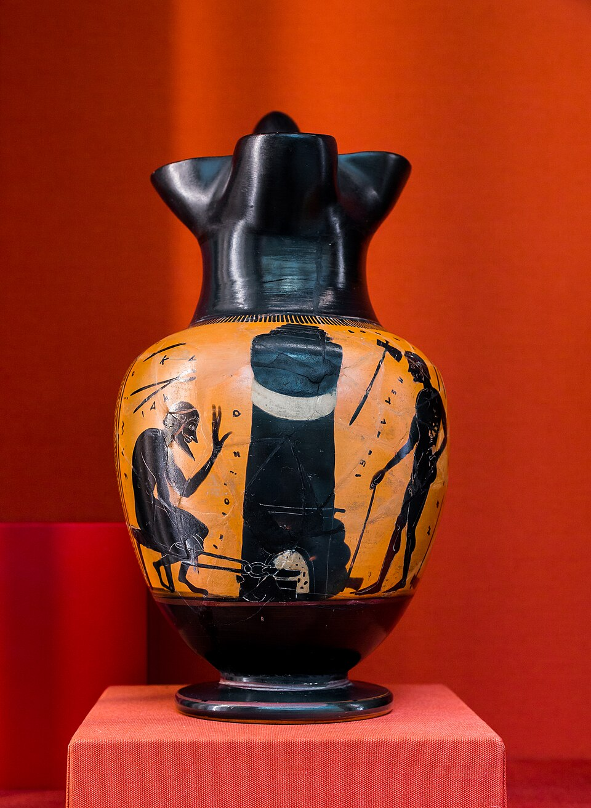
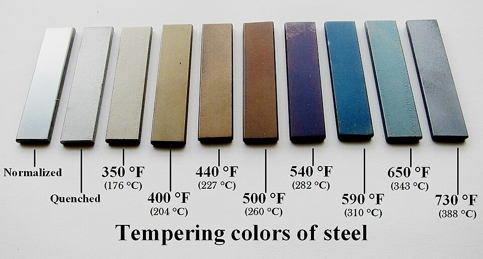

In the ninth book of the **[Odyssey](kloom:e/odyssey)**, composed perhaps in the eighth or seventh century BC, Odysseus drives a burning stake of olive wood into the eye of the Cyclops **[Polyphemus](kloom:e/polyphemus)**, and the poet reaches for a sound every listener knew. In Samuel Butler's translation: "As a blacksmith plunges an axe or hatchet into cold water to temper it—for it is this that gives strength to the iron—and it makes a great hiss as he does so, even thus did the Cyclops' eye hiss round the beam of olive wood." **[Homer](kloom:e/homer)**'s smith is hardening his axe, not **[tempering](kloom:e/tempering-metallurgy)** it in the sense a smith means now, and the confusion of the two words is old. "There is still so much confusion between the words 'temper,' 'tempering,' and 'hardening,'" the metallurgist William Roberts-Austen complained in 1889, in a passage Wikipedia's article on tempering quotes. The two are halves of one process. Steel heated red and quenched becomes hard and brittle. Heated again, gently, it gives back some of its hardness as toughness.

## Water, oil and a red-haired boy

The quench was thought to hold the secret. **[Pliny the Elder](kloom:e/pliny-the-elder)**, in his _Natural History_ of the first century AD, wrote that "the main difference results from the quality of the water into which the red-hot metal is plunged", and that water had made Bilbilis and Turiasso in Spain and Comum in Italy famous for iron they did not even mine. Small things, he added, were quenched in oil, "lest by being hardened in water they should be rendered brittle". Around 1100–1120 a monk writing as **[Theophilus Presbyter](kloom:e/theophilus-presbyter)** hardened files by sprinkling them at a glow with burnt ox horn and salt, a way of giving their surface carbon, and quenching them in water; tools for cutting glass he quenched in the urine of a goat fed on fern, or of "a young red-haired boy", which hardened them "harder than in simple water".

Only steel hardens this way. Pure iron, the archaeometallurgist Alan Williams notes, does not harden on quenching at all. A steel of about 0.8 per cent carbon might be raised from about 250 to 600 or even 800 on the Vickers hardness scale by a quench, but at the cost of brittleness, and the gentle reheating that would cure it was hard to control. In the medieval swords Williams studied, smiths mostly avoided it, quenching less fiercely, in oil or boiling water; the full quench followed by tempering seems to have come into use only in the sixteenth century. Wikipedia's article on tempering, on the other hand, gives a pick from Galilee of about 1200–1100 BC as the oldest known tempered steel.

## Reading the colours

Joseph Moxon described how to judge the reheating in 1677. Rub the hardened work bright with a grindstone, he wrote, heat it, and watch: "the Colour change by degrees, coming to a light goldish Colour, then to a dark goldish Colour, and at last to a blew Colour"; choose the colour the work needs, and quench. Light gold for files, cold chisels and punches for iron; dark gold for most edge tools; blue for springs. By 1904 John Lord Bacon could give his Chicago students temperatures for the colours. Moxon's three are set beside them by our matching:

| Colour, Bacon    | °F  | °C, by our arithmetic | Bacon's tools                           | Moxon's colour |
| ---------------- | --- | --------------------- | --------------------------------------- | -------------- |
| Very pale yellow | 430 | 221                   | light turning tools, engraving tools    |                |
| Straw-yellow     | 460 | 238                   | milling cutters, taps, reamers, punches | light goldish  |
| Brown-yellow     | 500 | 260                   | plane irons, wood chisels, twist drills | dark goldish   |
| Light purple     | 530 | 277                   | axes, cold chisels for light work       |                |
| Dark purple      | 550 | 288                   | cold chisels for ordinary use           |                |
| Blue             | 580 | 304                   | springs                                 | blue           |

The colours have nothing to do with the steel's hardness. A bright surface heated in air grows a film of oxide, which thickens as the temperature rises, and light reflected from its top and bottom surfaces interferes, so that the film's colour gauges its thickness. The colours, Bacon warns, "show nothing except the temperature to which the metal was last heated", and a tool that was badly hardened in the first place shows them just the same. Time counts too: steel held long enough at 205 °C, Wikipedia notes, turns brown, purple and blue. Its own table runs cooler than Bacon's, from faint yellow at 176 °C to light blue at 337 °C. Why a quench hardens steel at all, the hard laths of [martensite](kloom:e/martensite) it traps, is a story for the trail of materials science, which runs from Galileo's beams to the iron–carbon diagram.

## A cold chisel, step by step

Bacon's chisel uses the tool's own heat to draw the temper. Forge the chisel and let it cool until black. Heat two or three inches of the cutting end to the hardening heat, found for each steel by trial: quench test pieces at rising heats until one breaks with the finest grain and a file slips over it without catching. "Cherry-red", Bacon says, quoting Metcalf, means little, since cherries come in every shade. Quench about two inches of the end, keeping it moving, while the shank stays red-hot. Rub the end bright with emery. Heat runs back from the shank, and a band of colours creeps down towards the edge, pale yellow first and blue behind. When a deep bluish purple reaches the edge, quench the whole chisel. A lathe tool comes out of the water at yellow. Bacon's two laws: the more carbon a steel holds, the lower its hardening heat, and the faster it is cooled, the harder it becomes.

From the bloom to the tempered edge, the iron has now passed through every operation of this trail. Its anchor, the bloomery, is where it began.
