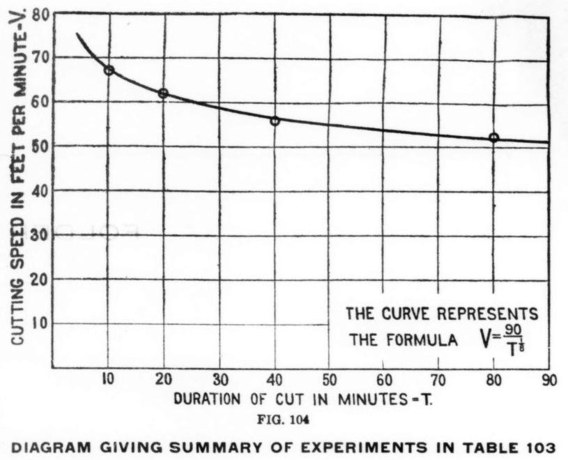

Every smith knew the rule: never overheat a tool. In 1898, at the **[Bethlehem Steel](kloom:e/bethlehem-steel)** works in Pennsylvania, **[Frederick Winslow Taylor](kloom:e/frederick-winslow-taylor)** and the metallurgist Maunsel White broke it on purpose, heating tool steel in steps of about 50 °F from a black heat to the point where it began to melt, and running each tool on a lathe to see how fast it could cut. Past the temperatures every maker warned against, the tools got better, not worse. The result, **[high-speed steel](kloom:e/high-speed-steel)**, was shown cutting at the [Paris Exposition of 1900](kloom:e/exposition-universelle-1900), and the machine shops of the world had to be rebuilt to keep up with it.

## Twenty-six years of chips

Taylor was a machinist and foreman who had risen to chief engineer at the **[Midvale Steel](kloom:e/midvale-steel)** works in Philadelphia, and from about 1880 he had been asking three questions of every cut: what tool, what speed, what feed. His answer, read to the American Society of Mechanical Engineers as his presidential address in December 1906 and printed as _On the Art of Cutting Metals_, runs to over three hundred pages. By his own count he and his colleagues, among them Henry Gantt, White and the mathematician Carl Barth, recorded between thirty and fifty thousand experiments and turned more than 800,000 pounds of steel and iron into chips. He found twelve variables that set the right speed, and ranked them. The steel of the tool, he wrote, made a difference of one to seven between a tempered carbon tool and the best high-speed tool. The experiments were meant to give each workman a written task and a time to do it in: the system later called **[scientific management](kloom:e/scientific-management)**, which made Taylor famous and is another story.

## Hotter than cherry red

Before 1898 the best tools were "self-hardening" steels, descended from the tungsten steel **[Robert Mushet](kloom:e/robert-forester-mushet)** made in 1868, which hardened as they cooled in air without quenching. Their makers set the limit at a bright cherry red. Taylor and White's patent, filed in October 1899, gives the temperatures by color:

| Heat before use           | Color, as the patent gives it | °F           | °C, by our arithmetic |
| ------------------------- | ----------------------------- | ------------ | --------------------- |
| The makers' limit         | bright cherry red             | 1,500–1,550  | 816–843               |
| "The breaking-down point" | up to a light salmon          | 1,550–1,700  | 843–927               |
| Taylor–White treatment    | above the breaking-down point | 1,725 upward | 941 upward            |
| Until the steel softens   | crumbles when touched         | 1,900–2,000  | 1,038–1,093           |

Steels with chromium and tungsten heated through the dangerous band and on towards melting, the patent says, cut one and a half to two and a half times as fast. Taylor's 1906 paper says two to four times as much work, and later summaries say speeds tripled, from 30 to 90 feet a minute. What the heat gave was not hardness: at their hardest the new tools were "little, if any, harder" than the old. It was what Taylor named _red hardness_, the property of keeping their edge "even after the tool has been heated up in use … until it is almost, or quite, red hot." In Paris a twin of Taylor's Bethlehem test lathe ran such a tool before the public. The two patents were challenged, and a court struck them down in 1909, holding that Taylor and White had invented no new composition of steel.

## Speed against life

The speed a tool can stand depends on how long it must last. Taylor measured it by running a tool until it was ruined, and fixed on twenty minutes as the standard test. For one of his high-speed tools, cutting an annealed steel forging about 24 inches across, he fitted the curve below:

Taylor wrote it as _V_ = 90 ÷ _T_ to the power ⅛, with _V_ in feet a minute and _T_ the minutes before regrinding. It is now written _VTⁿ_ = _C_, where _n_ and _C_ depend on the tool, the work and the feed. Worked through, by our arithmetic:

| Tool must last | _T_ to the ⅛ | Speed, ft/min | Speed, m/min | Revolutions a minute on that forging |
| -------------- | ------------ | ------------- | ------------ | ------------------------------------ |
| 10 minutes     | 1.334        | 67.5          | 20.6         | 10.7                                 |
| 20 minutes     | 1.454        | 61.9          | 18.9         | 9.9                                  |
| 80 minutes     | 1.729        | 52.0          | 15.9         | 8.3                                  |

Quadrupling the tool's life costs 16 percent of the speed, which is Taylor's own rule: multiply the 20-minute speed by 0.84 for an 80-minute cut. For tempered carbon tools he found _n_ was nearer one fifth, and an 80-minute cut 24 percent slower. His conclusion was that nearly every shop ran its tools too slowly, saving the grinder's time and wasting the machine's.

High-speed tools left the lathes and milling machines of the day too light and too slow to use them, and machine tools were rebuilt heavier to drive them. The next segment turns from the machines that cut parts to the ways of making many.
