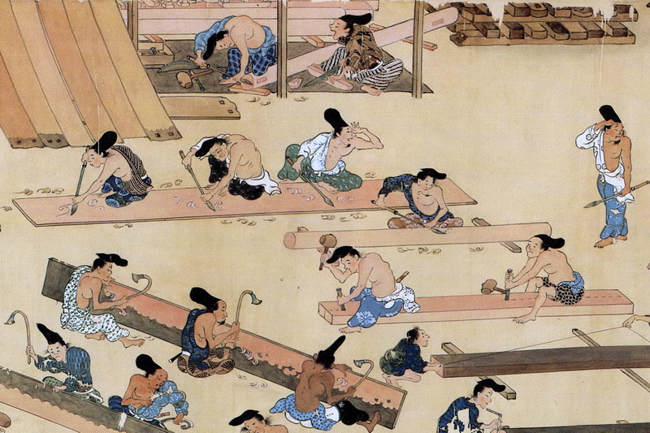
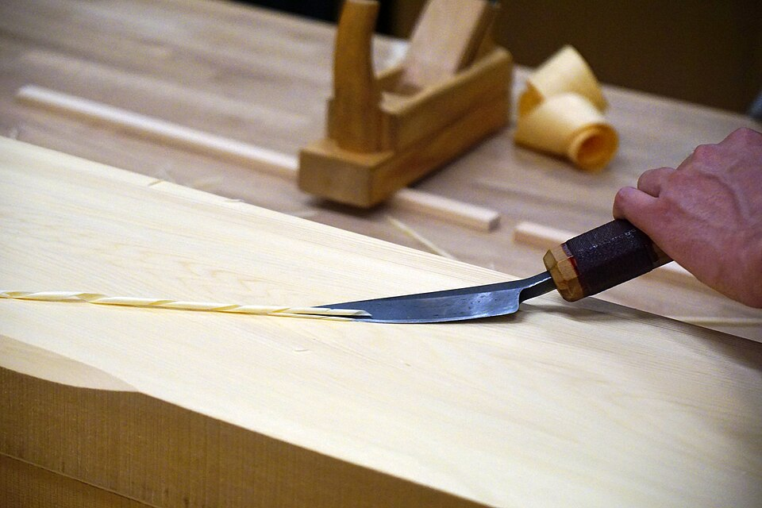

At Ikaruga, southwest of Nara, a temple founded by Prince Shōtoku in the early seventh century still stands in wood. **[Hōryū-ji](kloom:e/horyu-ji)**'s western precinct holds a main hall, the Kondō, 18.5 by 15.2 meters, and a five-story pagoda 32.45 meters tall, and they are counted the oldest wooden buildings in the world. The **[Nihon Shoki](kloom:e/nihon-shoki)**, compiled in 720, says that every building of the temple burned in 670, and for most of the last century the standing ones were taken to be a rebuilding finished around 711. In February 2001 the Nara National Research Institute for Cultural Properties announced that a slice of the pagoda's central pillar, 80 centimeters across, cut out during repairs of 1943–54, came from a cypress felled in 594. In 2004 the same institute's tree-ring dating, its **[dendrochronology](kloom:e/dendrochronology)**, led by Takumi Mitsutani, dated two ceiling boards of the Kondō to trees felled in 667–668 and 668–669. The hall was built after the fire, or was rising when it came. The pillar is harder: it was either kept unused for decades or taken from an older building, and the question is open.

## A temple without a rip saw

According to the Takenaka Carpentry Tools Museum in Kobe, Japan had no saw for cutting along the grain until the middle of the Muromachi period, around the fifteenth century, when a two-man frame saw, the _oga_, came from the continent. Saws existed earlier, and surveys during the repairs found their marks at Hōryū-ji, but they were crosscut saws, for cutting a timber to length. Every long board and beam in **[Japanese carpentry](kloom:e/japanese-carpentry)** before then was split from the log. The block plane came about the same time as the _oga_. Before it, surfaces were dressed with the _chōna_, an adze swung with both hands towards the user, and finished with the _yariganna_, a spear-shaped blade on a long handle, drawn towards the body to take off a shallow scoop.

The scene was painted in 1309 for the **[_Kasuga Gongen Genki E_](kloom:e/kasuga-gongen-genki-e)**, the handscrolls of the Kasuga shrine at Nara, about a century before the rip saw.

## Why a split beam is stronger

Splitting was not only a limit. It makes a beam that follows the tree. Wood is far stronger along its fibers than across them, and a tree's fibers are seldom quite straight. Many trunks grow with their grain wound in a slow spiral. A saw cuts in a straight line whatever the fibers do, so a sawn beam has fibers running out of its sides. A split runs between the fibers, so the piece it frees keeps them whole from end to end. So the order of work was: open the log along its grain with wedges, hew the faces with the adze, and dress them with the spear plane, cutting across the grain only to bring a piece to length.

The US Forest Products Laboratory's _Wood Handbook_ gives what a slope of grain costs. It also gives the best test for spiral grain: split a piece and look.

| Slope of grain in the piece | Bending strength | Resistance to a dropped hammer |
| --------------------------- | ---------------: | -----------------------------: |
| straight                    |             100% |                           100% |
| 1 in 25                     |              96% |                            95% |
| 1 in 15                     |              89% |                            81% |
| 1 in 10                     |              81% |                            62% |
| 1 in 5                      |              55% |                            36% |

Take an invented log whose grain winds one across in ten along, as in the plate. Sawn straight, a beam from it keeps 81 percent of its bending strength and 62 percent of its toughness. Split, its grain runs with its length, and in principle it keeps all of both.

## The last temple carpenter

Hōryū-ji's best-known carpenter of the twentieth century was **[Tsunekazu Nishioka](kloom:e/tsunekazu-nishioka)**, born beside the temple in 1908, grandson and son of its master carpenters, a temple carpenter (_miyadaiku_) and himself its master carpenter from 1934. He worked on its pagoda and its Kondō, where a fire during the repairs of 1949 badly damaged the building and its seventh-century murals; perhaps 15 to 20 percent of the hall's original timber survives. In old age he rebuilt the Kondō and West Pagoda of **[Yakushi-ji](kloom:e/yakushi-ji)** in Nara, and had his carpenters take up the spear plane again. He died in 1995.

He taught by the oral precepts of the temple's carpenters: buy the mountain, not the tree, and assemble a building by each tree's character, not only its measurements. A tree from a south slope, in his telling, goes on the south side. He held that **[hinoki](kloom:e/chamaecyparis-obtusa)**, the Japanese cypress, lives a second life in a building, growing stronger for about two centuries after felling and lasting a thousand years, a claim that rests on the wood scientist Jiro Kohara's tests of old timbers in the 1950s. In 1975 he argued in a newspaper against putting iron into a rebuilt pagoda at Hōrin-ji, because iron rusts in three or four hundred years and the wood would go with it. Later measurements are more cautious. In 2009 Misao Yokoyama and colleagues at Kyoto tested old hinoki, much of it from Hōryū-ji: once they allowed for density and moisture, it was neither stiffer nor stronger along the grain than new wood, but far more brittle across it. Well-kept old wood is safe, they concluded, so long as it is not loaded across the grain.

The joints that hold such timbers together, without nails, are the Joinery trail's subject. The next frame crosses the world to a roof whose span outran every timber in England.
