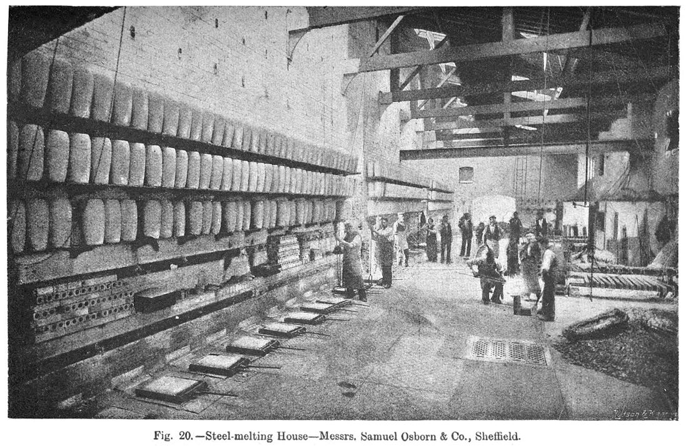
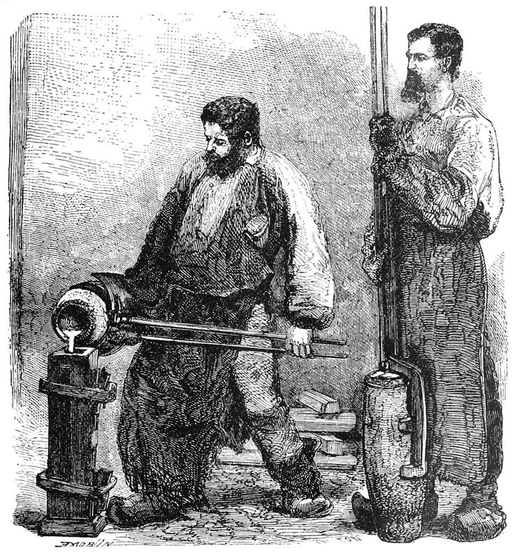

**[Benjamin Huntsman](kloom:e/benjamin-huntsman)**, born in Lincolnshire in 1704 to a Quaker family, was a maker of clocks, locks and tools in **[Doncaster](kloom:e/doncaster)**, and like many clockmakers he was unhappy with the steel he could buy for springs. A clock spring flexes all its working life, and the springs kept breaking. The steel of the day was blister steel, made by baking bars of Swedish iron packed in charcoal until carbon crept into them, the **[cementation process](kloom:e/cementation-process)**. It had never been molten. Its carbon was high at the surface and low inside, and threads of slag from the iron still ran through it. Huntsman reasoned, so far as anyone can tell, that if the steel could be melted it would come out the same all through, with the slag floated off. In Europe nobody had done it. Steel had been melted only in the crucibles of south India, as the frame on **[wootz steel](kloom:e/wootz-steel)** tells.

## The pot and the fire

Melting steel needs more than 1,400 °C, and a pot that will survive it. The heat was the easier half. Huntsman borrowed the brassmakers' updraught furnace, a narrow pit fired with coke, which by the eighteenth century was becoming the ironmaster's fuel. The pots were harder. A crucible had to stay solid at that heat, be thick enough to bear the steel, survive its first firing, and go back in the fire for more melts. The answer was the purest refractory clay, the kind glassmakers used for their pots. The fire also had to be balanced: too much oxygen and the steel loses its carbon and freezes as soft iron, too much carbon and it turns to cast iron.

He worked in secret. He moved from Doncaster to the **[Sheffield](kloom:e/sheffield)** area, to Handsworth in 1740 by Wikipedia's account and in 1742 by Paul Craddock's, and is thought to have been making good steel for sale by the early 1750s, though when he moved to Attercliffe is told both as the 1750s and about 1770. A Quaker would not swear an oath, so he could not take out a patent; he trusted secrecy instead. A Swedish visitor, Ludwig Robsahm, was shown round the works but not where the crucibles were made, "not even if we had offered him £50". In 2016 Craddock's team analyzed crucibles dug up at John Marshall's Sheffield works, from before the 1790s, and found graphite mixed into the clay and a manganese-rich glaze inside them: the secret fluxes visitors wrote about were real.

## A melt, step by step

Nobody wrote down Huntsman's own practice. **[John Percy](kloom:e/john-percy-metallurgist)**, in his _Metallurgy_ of 1864, described a Sheffield casting shop of his day, saying the method was substantially Huntsman's except that each furnace now held two pots instead of one:

| Step      | What was done                                                                                              |
| --------- | ---------------------------------------------------------------------------------------------------------- |
| Pots      | molded from fire clays with ground old pots and coke dust; 24 lb of clay for a pot holding 28 lb of steel  |
| Annealing | about 20 pots heated to redness overnight, mouth down, in a coke fire                                      |
| Setting   | at 5 or 6 in the morning each pot set on its stand in a melting hole and brought up to heat for 20 minutes |
| Charge    | 30–40 lb of broken blister steel poured in through an iron funnel, a clay lid put on, coke heaped round    |
| Melting   | coke added after ¾ hour; after another ¾ hour the foreman lifts the lid to judge the melt                  |
| Teeming   | the pot lifted out and the steel poured into a cast-iron ingot mold                                        |

The pullers-out wrapped their legs in wet sacking before they lifted a white-hot pot out of the hole. The chief melter poured with long tongs, keeping the stream off the walls of the mold, while a boy held back any slag with a "flux stick", an iron rod with a ball of slag stuck to its end, at whose touch the slag in the pot shrank away. The pot went back into the fire for the next melt. It lasted three, each a little smaller than the last: 45 lb, then 40, then 30. Wikipedia's article gives the furnace about 1,600 °C and the melt about three hours, without a source of the period.

## Exported first

Sheffield's cutlers at first would not buy it: it was harder than the steel they were used to working. In the tradition Wikipedia repeats, Huntsman sold almost all of it to France, until French cutlery made from his steel began to undercut Sheffield's and the cutlers, having failed to get its export banned, had to use it themselves. Craddock's account is milder: the cutlers were unenthusiastic, while foreign cutlers and distant customers such as **[Matthew Boulton](kloom:e/matthew-boulton)** wanted it. Rivals soon learned the method. Sheffield legend, which Percy repeats and doubts, has one of them get in on a snowy night disguised as a beggar asking to sleep by the fire.

Huntsman died at Attercliffe in 1776, and his son ran the works on. Sheffield became the crucible-steel town, making, by Wikipedia's figures, about 200 tonnes of steel a year before him and over 80,000 a century later, close to half of Europe's output. Steel melted in a pot was the best steel there was, and the dearest. The next frame turns from making steel to shaping it in quantity: the steam hammer.
