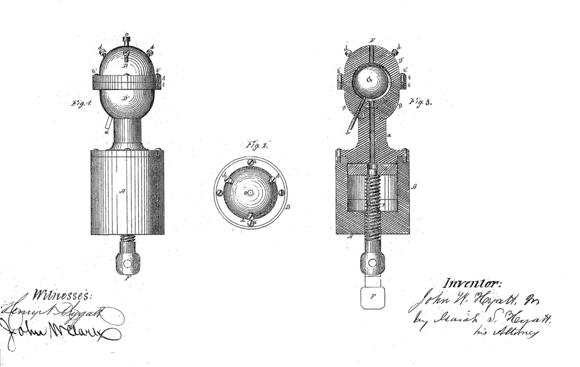

In the 1860s Michael Phelan offered $10,000 for a substitute for the ivory of billiard balls, and **[John Wesley Hyatt](kloom:e/john-wesley-hyatt)**, a printer turned inventor in Albany, New York, set out to win it. His first balls were coated with collodion, a solution of nitrated cotton, and they had faults: struck hard, they could go off like a percussion cap. Looking back in 1914, he remembered a saloon keeper in Colorado writing that he did not much mind, "but that instantly every man in the room pulled a gun." With his brother Isaiah he found a better material: nitrocellulose pulp mixed with camphor and pressed in a hot mold, which they named **[celluloid](kloom:e/celluloid)**. To shape it they built some of the first machines for forcing a hot plastic into a closed mold. Every plastic part around you that was not cut, blown or printed descends from them: **[injection molding](kloom:e/injection-moulding)**.

## Hyatt's machines

Hyatt's patent of May 1871 already holds the parts. A plunger, driven up a strong cylinder by a screw, forces the dough through a nozzle into a mold around the ball to be coated, which steel pins an eighth of an inch thick or less hold in the center. A vent sits opposite the inlet, so that the mold fills before the material reaches it, and is plugged once a little has squeezed through. The brothers' patent of 19 November 1872 adds the rest. A hydraulic ram drives cakes of celluloid down a cylinder kept cold at the top, so that air can escape before the camphor melts, and steam-heated at the bottom, where the material turns plastic. It leaves through a nozzle, as a continuous rod or into a two-part mold held shut by a second hydraulic press, and the patent states the rule every machine since obeys: that press's piston must be large enough that the injection pressure cannot force the mold apart. Blanks for dental plates were their main early business.

## From plunger to screw

A plunger can only push. The plastic melts by heat conducted inward from the cylinder walls, and plastics conduct heat badly, so plunger machines stayed small, and makers filled the bore with a fixed "torpedo" to spread the melt thin. They suited a **[thermoplastic](kloom:e/thermoplastic)**, whose long chains soften when heated and set when cooled, again and again. A thermoset such as **[Bakelite](kloom:e/bakelite)**, which crosslinks once and for good, would set solid in a heated barrel and seize it.

The screw came in two steps. In the 1940s James Hendry, a Scottish-born mold designer, turned a plunger machine into a two-stage one: a turning screw melted and mixed the plastic and fed it into a separate cylinder, from which a plunger injected it. Wikipedia and a history published by the Society of Plastics Engineers date this to 1946 and say almost every machine since works this way. The Plastics Hall of Fame describes it as a stationary preplasticiser and gives the credit for today's machine to someone else. In March 1952 William Willert, of Egan Machinery in New Jersey, applied for a patent, granted on 14 February 1956, on a screw that is itself the ram. It turns to melt the plastic and carry it forward, and the melt gathering at its tip pushes it back. Then it stops turning and drives forward like a plunger. _Plastics Technology_ notes that some credit Hans Beck of BASF with the same idea in 1943. By Willert's death in 2000, about 98 percent of injection machines used his reciprocating screw.

## One cycle

| Step          | What happens                                                                 |
| ------------- | ---------------------------------------------------------------------------- |
| Clamp         | the two halves of the mold close and are held shut                           |
| Inject        | the screw rams forward, filling the cavity to about 95–98% at a set speed    |
| Pack and hold | the machine switches to holding a pressure, feeding in plastic as it shrinks |
| Cool          | the gate freezes; the screw turns and backs away, gathering the next shot    |
| Eject         | the mold opens and pins push the part out                                    |

DuPont's design guide gives injection pressures of 35 to 140 megapascals and melt temperatures from about 215 °C to 300 °C, and a cycle from two seconds to several minutes, often limited by how fast the mold can carry heat away. The clamp is sized as Hyatt said. Take an invented lid whose outline covers 60 square centimeters, filled at 40 megapascals: the plastic pushes the mold apart with 240 kilonewtons, by our arithmetic, so the clamp must hold more than 24 tonnes.

## Shrinkage and draft

A plastic shrinks as it cools in the mold, and the toolmaker cuts the cavity oversize to suit. DuPont defines shrinkage as _S_ = (_D_ − _d_)/_D_, where _D_ is the cavity and _d_ the part, and gives nominal values of 0.020 for acetal and 0.015 for nylon. An acetal gear meant to be 50.00 mm across needs a cavity of 50.00 ÷ 0.980 = 51.02 mm, by our arithmetic. Thick sections shrink more than thin ones, so walls are kept even, or the part sinks and warps.

The part also shrinks onto any core that forms its inside, and every face parallel to the mold's opening needs a slight taper, the draft, to release it. DuPont's table asks for ½° on acetal walls deeper than 25 mm and up to ¼° on shallow ones, adding a degree for every 0.025 mm of surface texture. On a wall 40 mm deep, half a degree narrows the part by 40 × tan ½° ≈ 0.35 mm, by our arithmetic.

In 1947 a carpenter in Denmark spent a fifth of a year's earnings on an injection molding machine from England. The next frame is what his company made with it: the Lego brick.
