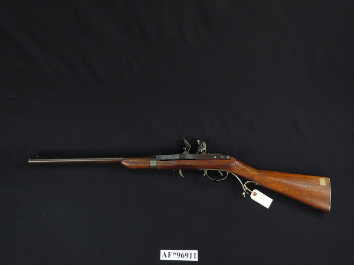
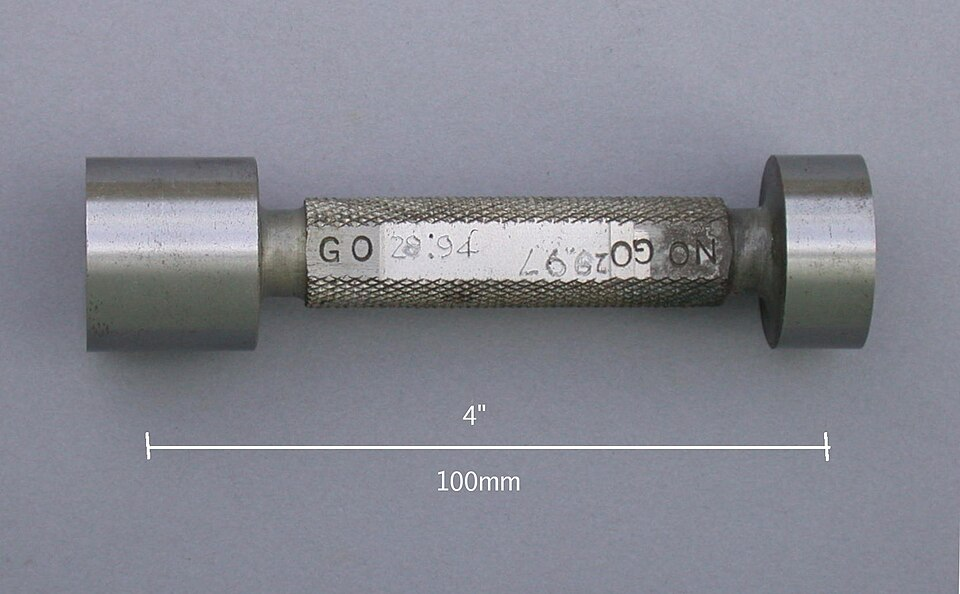

In August 1785 **[Thomas Jefferson](kloom:e/thomas-jefferson)**, the American minister in Paris, wrote home to John Jay about a gunsmith who was making musket locks "so exactly alike, that what belongs to any one, may be used for every other musket in the magazine." Jefferson had visited the workshop. He was shown the parts of fifty locks laid out in compartments, put several locks together himself from pieces taken at random, and found that "they fitted in the most perfect manner." The gunsmith was **[Honoré Blanc](kloom:e/honore-blanc)**, and the idea he was demonstrating is the one this frame is about: **[interchangeable parts](kloom:e/interchangeable-parts)**, made so nearly identical that any one will fit any assembly without being filed to it. It took another forty years, and an American armory, to make it work.

## A demonstration, and a legend

Blanc had the patronage of General Gribeauval, who had standardized France's artillery, and he made his parts by filing them against gauges and master pieces. Not everyone was convinced. Gaspard Cotty, a French artillery officer, wrote in 1806 that when Blanc's locks were taken apart and mixed in front of Gribeauval, "the defects of fit were soon recognised." The historian Ken Alder, as John Lienhard reports him, argues that the French state abandoned the method in 1806 because it freed manufacturers from its control of the skilled trades, not because it failed.

In America the credit went for a century to **[Eli Whitney](kloom:e/eli-whitney)**, the inventor of the cotton gin. In January 1798 Whitney, who had never made a gun, contracted to deliver ten thousand muskets (one account says twelve thousand). In 1801 he put on a demonstration for the government, assembling locks from mixed parts, and Jefferson wrote to James Monroe that year that Whitney had "invented molds and machines for making all the pieces of his locks so exactly equal" that a hundred could be mixed and reassembled. Roe's _English and American Tool Builders_ of 1916 took him at his word. The historian Merritt Roe Smith concluded that the demonstration was staged; in Lienhard's account the parts had been fitted by hand beforehand. Whitney delivered the muskets in 1809, nine years late, and they were not interchangeable.

## Hall at Harpers Ferry

The man who did it was **[John H. Hall](kloom:e/john-h-hall-gunsmith)**, a boat builder from Maine who had patented a breech-loading rifle in 1811. In 1819 the War Department gave him a contract for 1,000 rifles to be made at the **[Harpers Ferry Armory](kloom:e/harpers-ferry-armory)** in Virginia, with interchangeable parts the chief condition. He set up in an old sawmill on an island in the Shenandoah, drove his machines by water through belts, and built cutting machines with cast-iron frames that stopped themselves when the work was done. On 20 December 1822 he wrote to the Secretary of War that he had succeeded in "establishing methods for fabricating arms exactly alike, & with economy, by the hands of common workmen." The contract was finished in 1825, and an Ordnance Department committee sent to inspect called his system "entirely novel."

## How a part is made alike

Hall's machines cut close to size; a man then filed each part to the gauge, with the part clamped in a jig. The method rests on three things.

**One datum.** Every cut and every gauge is placed from the same reference faces, held in a fixture the same way each time. Here is why it matters, with invented numbers. A part has three holes, 20, 40 and 60 mm along it, each placed to within ±0.1 mm. Measured each from the one before, the errors can add: by our arithmetic the third hole may be 0.3 mm out. Measured each from the datum end, none is out by more than 0.1 mm.

**A model.** Gauges copy a master. When Simeon North was given two model rifles to work from and found them unlike, he asked to have one set aside and to gauge everything from the other.

**Two limits.** A gauge does not measure a part; it passes or fails it. A **[go/no-go gauge](kloom:e/go-no-go-gauge)** for a hole has two plugs. Wikipedia's example is a hole that may be anything from 12.60 to 12.90 mm across. The go plug, 12.60 mm, must enter: if it does not, the hole is too small. The no-go plug, 12.90 mm, must not enter: if it does, the hole is too big. The gauge in the photograph allows only 0.03 mm, a thirtieth of a millimeter, between its ends.

Hall's own test, as Roe recorded it of the first hundred rifles, finished in 1824, needed no instrument at all: the joint of the breech block was fitted so that one sheet of paper would slide loosely in it, but two would stick. One sheet goes; two do not.

## The American system

Hall's rifles and North's, made under contracts that from 1828 required their parts to interchange with the national armories' own, were followed by Springfield, Colt and the sewing-machine makers. In 1853 a British commission watched ten muskets made in ten successive years at Springfield taken apart and reassembled at random. Britain bought the machines for its Enfield factory, and the method became known as the **[American system of manufacturing](kloom:e/american-system-of-manufacturing)**.

Parts made alike can be put together as fast as they arrive. The next frame brought them to the workers on a moving line: Ford's assembly line.
