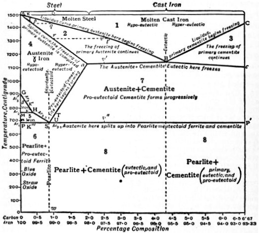

Every smith knew that the same steel could be soft or glass-hard depending on how it was heated and cooled, and for most of the nineteenth century nobody could say why. **[William Chandler Roberts-Austen](kloom:e/william-chandler-roberts-austen)**, chemist and assayer to the Royal Mint in London, set out to measure it. He had built an automatic recording pyrometer: a thermocouple of the kind Henri Le Chatelier had designed, wired to an instrument that wrote temperature against time. A cooling metal cools steadily until something happens inside it. Then it gives out heat, and the curve flattens for a while. Each flat is a change in the metal, and Roberts-Austen recorded them for iron with every amount of carbon. In 1897, in his fourth report to the Alloys Research Committee of the Institution of Mechanical Engineers, he drew the first complete diagram of the iron–carbon system: temperature up the side, carbon across the bottom. The soft, non-magnetic form of iron that exists only when hot is named **[austenite](kloom:e/austenite)** after him.

## A map with a rule

In 1900 the Dutch chemist **[Hendrik Willem Bakhuis Roozeboom](kloom:e/hendrik-willem-bakhuis-roozeboom)** redrew it by the **[phase rule](kloom:e/phase-rule)**, the law **[Josiah Willard Gibbs](kloom:e/josiah-willard-gibbs)** had derived for substances in equilibrium. Gibbs counted the ways a system can vary as _n_ + 2 − _r_, for _n_ substances in _r_ phases. Fix the pressure, as a furnace does, and one way goes: iron and carbon in three phases together have 2 + 1 − 3 = 0. Three phases can coexist at one temperature and one composition only. So on Roozeboom's diagram the lines where three phases meet are horizontal, and every boundary closes, each field holding one phase or one mixture.

The phases took their names in those years. Floris Osmond named **[martensite](kloom:e/martensite)**, the hard structure of quenched steel, after **[Adolf Martens](kloom:e/adolf-martens)**, a German pioneer of the metallurgical microscope. The names moved about before they settled: in definitions Henry Marion Howe and Albert Sauveur proposed in 1912, they noted that austenite had often been called martensite before 1900.

## Reading it for a steel

The diagram is a map of where a steel is at each temperature, if it is cooled slowly enough to reach equilibrium. Take a steel with 0.4 per cent carbon and follow it straight down. The temperatures are from today's values, and the second, by our arithmetic, takes the line from pure iron's change at 912 °C to the eutectoid as straight:

| Temperature   | What the steel is                                                                                   |
| ------------- | --------------------------------------------------------------------------------------------------- |
| near 1,500 °C | it freezes, a little below iron's 1,538 °C, into austenite, the carbon dissolved in iron            |
| about 815 °C  | crosses the first line: grains of nearly pure iron, ferrite, begin to grow at the austenite's edges |
| 815 to 727 °C | more ferrite forms, and the carbon it rejects enriches the austenite that is left                   |
| 727 °C        | the last austenite, now holding 0.76 per cent carbon, breaks up all at once into pearlite           |

How much pearlite? The lever rule answers: the steel's 0.4 per cent lies between ferrite's 0.02, the most carbon it holds, and pearlite's 0.76, so pearlite is (0.4 − 0.02) ÷ (0.76 − 0.02), about 51 per cent of it by our arithmetic, and the rest ferrite. Pearlite is the pearly constituent of the frame before this one, and 727 °C is where the compound Sorby guessed at breaks up. Pearlite itself is about one-eighth **[cementite](kloom:e/cementite)**, the iron carbide Fe₃C, in thin plates. Breaking up gives out so much heat that a cooling bar visibly brightens for a moment, a glow called recalescence.

Cool the same bar fast, by quenching, and the carbon has no time to leave the austenite. The iron changes its crystal anyway, with the carbon trapped, into martensite. Martensite is not on the diagram at all, because the diagram shows only what equilibrium allows. The quench is the step the Japanese sword's smith takes. Tempering works for the same reason: given heat, martensite heads back towards what the diagram allows.

The top of the diagram explains a different trade. Iron with about 4 per cent carbon is liquid near 1,150 °C; iron with almost none melts at 1,538 °C. So a furnace that burns the carbon out of molten iron has to grow hotter as it goes, as Bessemer's converter did.

## Where the lines are

The lines moved. Howe's diagram in the _Encyclopædia Britannica_ of 1911 put the eutectoid, the point where pearlite forms, at 0.90 per cent carbon and about 690 °C; Wikipedia's article on pearlite now gives 0.76 per cent and 727 °C, its article on steel 0.8 per cent. Howe's temperature is the one measured on cooling, which he called Ar₁; a change on cooling comes late, which may explain part of the difference. Even now the limit of carbon in austenite, which divides steel from cast iron, is 2.04 per cent in one Wikipedia article and 2.1 in another, and a 2023 history found textbooks giving 2.14 in Ukraine, 2.11 in Poland and 2.03 or 2.06 in Germany.

| Point                    | Howe, 1911       | Today                       |
| ------------------------ | ---------------- | --------------------------- |
| Eutectoid (pearlite)     | 0.90% · ~690 °C  | 0.76–0.8% · 727 °C          |
| Most carbon in austenite | about 2.2%       | 2.04–2.14% · 1,146–1,148 °C |
| Eutectic                 | 4.30% · 1,130 °C | 4.3% · 1,147 °C             |

The diagram is a map of steel. The next frame is about an alloy whose hardening the map could not explain at first: an aluminium that grew hard while it waited.
