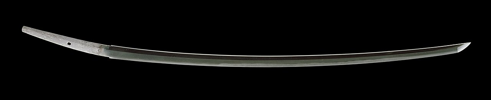
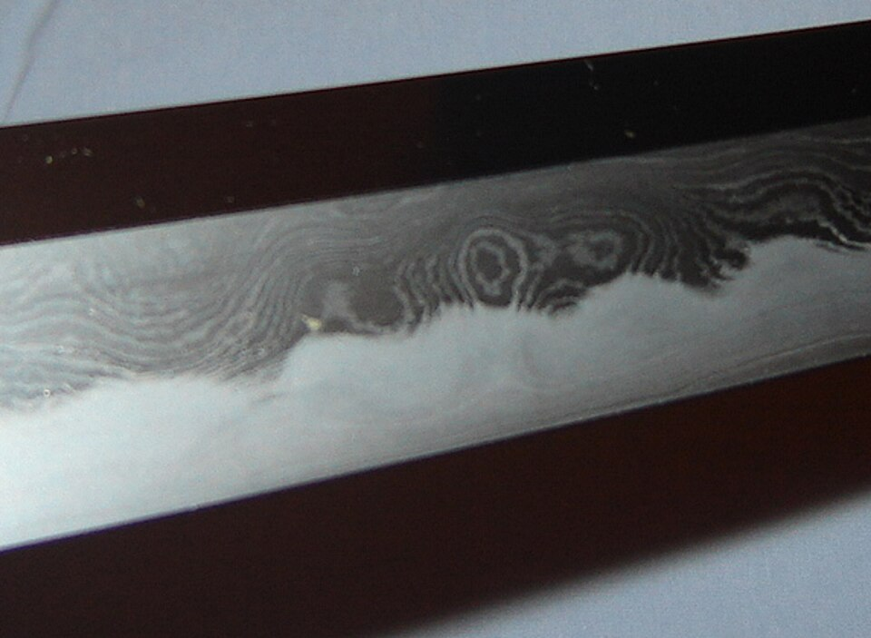

In the Tokyo National Museum lies a sword called **[Dōjigiri](kloom:e/dojigiri)**, "the slayer of Shuten-dōji", after a demon it is said to have killed. It was forged by a smith named Yasutsuna in the province of Hōki, at some time between the tenth and the twelfth century, in the **[Heian period](kloom:e/heian-period)**. It is 80 centimetres long, single-edged and curved: a straight line from its point to the base of the blade stands 2.7 centimetres off the back at the deepest part of the curve. That curve is the mark of the **[Japanese sword](kloom:e/japanese-sword)**. Earlier blades in Japan were straight, like the Chinese swords they were modelled on. By the first half of the tenth century smiths were making curved, ridged blades, forerunners of the **[tachi](kloom:e/tachi)**, a long sword slung edge down and used from horseback. Part of the curve is hammered in. The rest appears in a few seconds in a tank of water, in the step that also gives the blade a hard edge and a soft back.

## Steel from sand

Japanese smiths smelted no rock ore. Their steel, **[tamahagane](kloom:e/tamahagane)**, came from iron sand washed out of the mountains of western Japan and reduced with charcoal in a **[tatara](kloom:e/tatara-furnace)**, a low clay box furnace. The tatara works below the melting point of steel, at around 1,200–1,500 °C, and eats its own walls as it goes, their silica running off with the slag. The tatara revived in Shimane in 1977 to keep swordsmiths supplied burns for about 70 hours on 8 tonnes of iron sand and 13 of charcoal, and is then broken open to free a spongy block, the _kera_, of 2 to 2.5 tonnes. Its best parts hold 1.0–1.4 per cent carbon and almost no phosphorus or sulphur. Those figures, from the Kyoto engineer Tatsuo Inoue, describe the furnace as rebuilt. A Heian furnace was smaller: the great foot-worked bellows of the classic tatara date only from the late 1600s.

The smith breaks the steel into pieces, stacks them, welds them into a block and folds it ten to fifteen times. Each fold doubles the layers, to 1,024 after ten folds and, by our arithmetic, 32,768 after fifteen (Inoue rounds them to 1,000 and 30,000), and beats out slag and evens the carbon. A block of hard skin steel is then wrapped around a bar of soft core steel and drawn out into a blade. In two swords cut open by Kwangsik Kwak and colleagues at Kumamoto in 2024, one from the Muromachi period (1336–1573) and one made in 1945, the edge held 0.65–0.70 per cent carbon and the core only 0.07–0.08 per cent, close to pure iron. (Inoue's model of a sword assumed a core of 0.2 per cent, and an earlier analysis the Kumamoto team cites found 0.25.)

## Clay and water

The hardening, _yaki-ire_, is the step that makes the sword:

| Step   | What the smith does                                                                                                                                            |
| ------ | -------------------------------------------------------------------------------------------------------------------------------------------------------------- |
| Clay   | paints the blade with _yakiba-tsuchi_, clay mixed with charcoal and ground whetstone, thick over the back and flats, thin over the edge, shaped with a spatula |
| Heat   | heats it in charcoal, in a darkened smithy, to 800–850 °C, judged by its colour                                                                                |
| Quench | plunges it edge down into water (at 40 °C in Inoue's model)                                                                                                    |
| Result | a hard edge, softer steel above it, and between them a visible border, the _hamon_                                                                             |

At that heat the steel is austenite, a form of iron that dissolves carbon. Cooled slowly, the carbon has time to leave the iron and gather in thin plates of carbide, a soft structure called pearlite. Cooled fast enough, it is trapped, and the iron snaps into a strained and very hard structure, **[martensite](kloom:e/martensite)**. For a steel of about 0.8 per cent carbon, fast enough means from 750 to 450 °C in 0.7 seconds, 430 degrees a second.

The surprise is how the clay manages it. It looks like insulation. Inoue's group coated a silver rod with clay of different thicknesses, heated it to 800 °C and plunged it into water. Bare, or under clay 0.7–0.9 millimetres thick, the rod first wrapped itself in a film of steam, which insulates, and cooled slowly until the film broke. Under clay 0.1–0.3 millimetres thick no film formed: bubbles burst out at once over the whole surface, and between 800 and 400 °C, the range that decides the result, the thinly coated rod lost heat faster than the bare one. The thin coat on the edge is an accelerator. Inoue then simulated three ways of coating a blade:

| Clay                                | Martensite after the quench                 |
| ----------------------------------- | ------------------------------------------- |
| thick (0.8 mm) all over             | a thin strip at the edge only               |
| thin (0.1 mm) all over              | nearly the whole blade, which is brittle    |
| thick on the back, thin on the edge | a hard edge on a tough body, as real swords |

The simulation also shows the curve being made. At one second the edge, cooling first, shrinks, and the blade bows the wrong way. Then the edge turns to martensite, which takes up more room than the austenite it came from, and the blade swings back. At three to four seconds the back turns to pearlite and pulls it the wrong way again. Last, the back, the part still hot, cools and shrinks, and the blade is left curved with its edge on the outside of the bend. The stresses are severe: near the point they can reach the steel's breaking stress, and a blade may crack in the water.

The Kumamoto team measured the result. Within 4 millimetres of the edge, the 1945 sword read 519–803 on the Vickers hardness scale and the Muromachi sword 285–679, against 112–199 in the cores. A smith's legend credits one Amakuni with the hardened, curved blade in the eighth century; nobody can say who first did it.

Why trapped carbon makes iron so hard, and why martensite appears on no equilibrium diagram of iron and carbon, is the business of the trail that starts here, Materials science, which opens with Galileo's beams.
