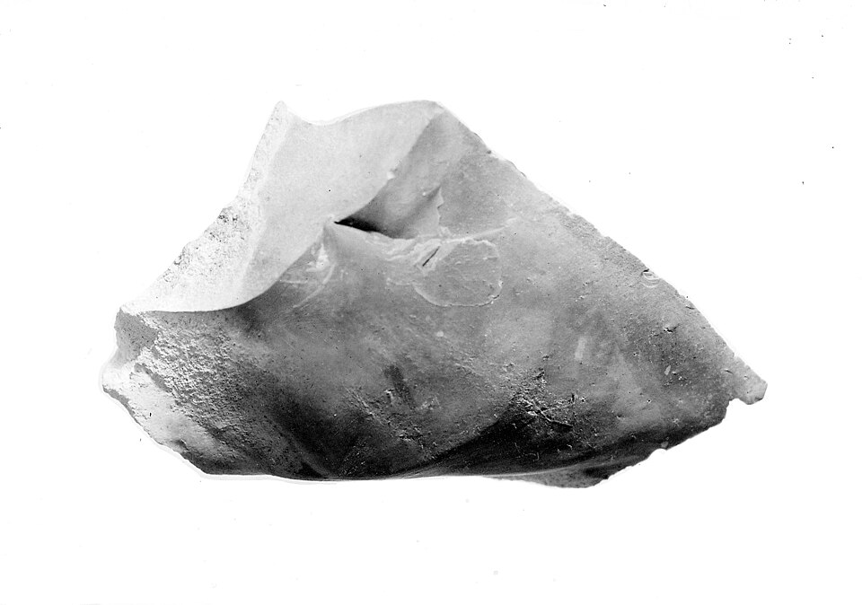
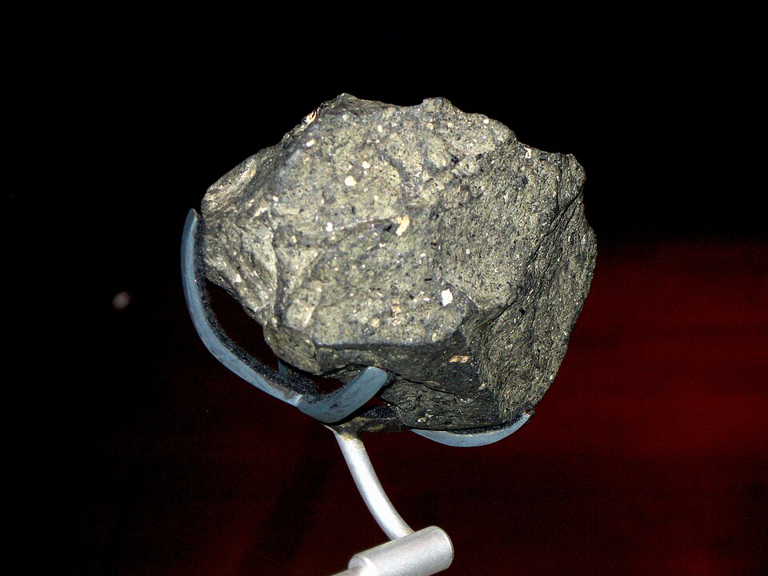

In July 2011 a team of archaeologists led by **[Sonia Harmand](kloom:e/sonia-harmand)** and Jason Lewis, of Stony Brook University, took a wrong turn on the way to a dig on the west side of **[Lake Turkana](kloom:e/lake-turkana)** in northern Kenya. Surveying where they had ended up, they found stone tools lying on the ground. A year later they dug there, at a site they called **[Lomekwi 3](kloom:e/lomekwi)**, and found more in the sediment, between two layers of volcanic ash. The ash and the record of the Earth's magnetic reversals dated them to 3.3 million years ago, older than our own genus by about half a million years. Whoever made them, and it may have been _Kenyanthropus_ or an australopithecine, they are the oldest known evidence of **[knapping](kloom:e/knapping)**: shaping stone by striking flakes off it. Every object in this subject begins here, with a hand learning where to hit.

## Where to hit

Flint, obsidian, chert and fine lavas have no grain, so they do not split along planes as wood or slate do. Struck hard enough, they break in a **[conchoidal fracture](kloom:e/conchoidal-fracture)**, a shell-shaped curve whose path is set only by the forces on it. A blow near the edge of a block sends a cone of fracture into the stone. Where the cone meets the outer surface, a flake comes away, and its inner face carries the record of the blow: a swelling just under the point of impact, the bulb of percussion, and ripples spreading from it. A flake whose edge thins away to nothing, the "feather" termination, can be only a few molecules thick at the edge.

The skill is in the platform: the surface you strike. Two measurements decide what comes off. The **exterior platform angle** is the angle between the striking surface and the face of the block the flake will come from: the edge, measured. The **platform depth** is how far in from the edge the blow lands. A controlled program of experiments led by **[Harold Dibble](kloom:e/harold-l-dibble)**, with machines striking standardized glass cores, found that these two settle a flake's size and shape: a wider angle or a deeper blow makes a bigger, heavier flake, and a wider angle a thinner, longer one. It also found something every beginner learns the hard way. Force is a threshold. Below the force a platform needs, nothing happens. Above it, hitting harder makes no difference to the flake.

| What the knapper sets        | What it changes                                    |
| ---------------------------- | -------------------------------------------------- |
| Exterior platform angle      | wider: a heavier, thinner and longer flake         |
| Platform depth               | a blow further in gives a heavier flake            |
| Force                        | none, once the threshold for that platform is met  |
| A blow too far from the edge | no flake: the threshold rises past what a hand has |

## How the first knappers worked

Lomekwi 3 has given up 149 artifacts: 83 cores, 35 flakes, seven pieces worn as anvils and seven used as hammers. They are big. The cores average 3.1 kilograms, the flakes run up to 20 centimeters long, and the heaviest anvil weighs 15 kilograms. Harmand's team tried to make them again from the same local basalts and phonolites, and concluded that the knappers mostly did not hold a hammer in one hand and a core in the other. They held the core in both hands and brought it down on a stationary block, or set it on an anvil and struck it from above. Those motions, the excavators noted, are closer to the way chimpanzees crack nuts than to later toolmaking.

The stones also record failure. Most flake scars end in hinge or step fractures, where the break turned and stopped short instead of running out to a feather. Some platforms carry repeated pocks from blows that landed too far from the edge to break anything. In Dibble's terms, those knappers were working with too much platform depth.

## The Oldowan

For decades the oldest tools known were the **[Oldowan](kloom:e/oldowan)**, named after **[Olduvai Gorge](kloom:e/olduvai-gorge)** in Tanzania, where in 1964 fossils were found beside them and named _Homo habilis_, "handy man". The idea was that our own lineage alone had learned to strike sharp flakes. Then the oldest Oldowan tools were pushed back to 2.6 million years at Gona in Ethiopia, and in 2023 a team led by Thomas Plummer reported tools at **[Nyayanga](kloom:e/nyayanga)**, in western Kenya, from between 3.03 and 2.58 million years ago. Their makers flaked as well as later Oldowan knappers did, and used the flakes to butcher at least two hippopotamuses. The only hominin teeth found with them belonged to [_Paranthropus_](kloom:e/paranthropus), not to _Homo_.

Who made the first tools is now an open question, and so is whether Lomekwi's way of working led to the Oldowan or was forgotten and found again. What is not in question is the lesson in the stones: a sharp edge comes from where and at what angle you strike, not from how hard. The next frame is the tool that took that lesson to its limit, the hand axe.
