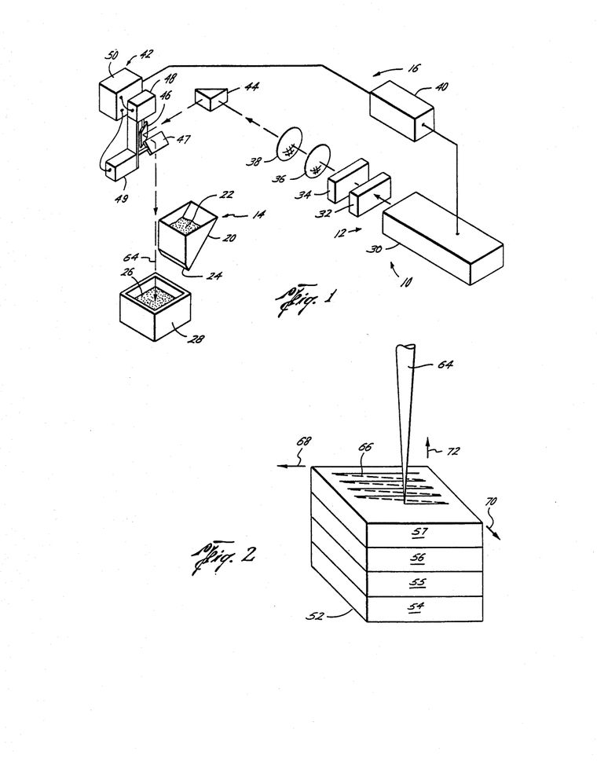
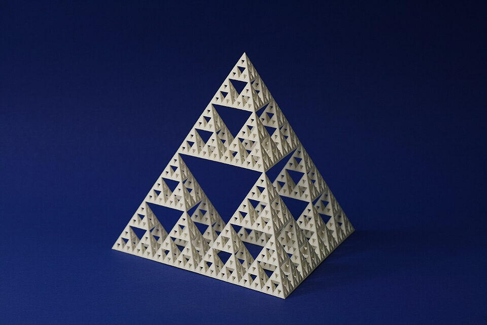

**[Carl Deckard](kloom:e/carl-r-deckard)** had spent his first year as an undergraduate working in a machine shop in Houston, where he saw at first hand why a machine was needed that made parts by adding material rather than cutting it away. Back at the **[University of Texas at Austin](kloom:e/university-of-texas-at-austin)** in 1984, he took an idea to Joe Beaman, a young assistant professor of mechanical engineering: spread a thin layer of powder, melt the parts of it that belong to an object with the heat of a laser, spread another layer and do it again. The powder that is not melted stays where it is. Deckard became Beaman's graduate student, and the university filed his patent on 17 October 1986. It was granted on 5 September 1989 as US 4,863,538, for "producing parts by selective sintering". The process came to be called **[selective laser sintering](kloom:e/selective-laser-sintering)**.

## A laser and a hopper

**[Sintering](kloom:e/sintering)** is making a solid mass from a powder by heat or pressure, without melting it to a liquid. Deckard's patent made it selective. (In today's nylon machines the laser does melt the grains, but the name stuck.) Its first machine, drawn in the patent, had a neodymium–YAG laser of 100 watts at most, steered by two mirrors on galvanometers in a raster across a box, and a hopper that dropped powder into it. Because the laser was weak, the powder was a plastic, ABS, chosen for its low heat of fusion. The parts were meant as prototypes and as patterns for sand casting and lost-wax casting.

He was not the first to think of it. In December 1979 Ross Housholder had filed a patent on a "molding process" that built articles in layers; one of its versions spreads layers of plastic or sand particles and fuses each with a laser beam steered by two mirrors. It was never put into production. The company that sold Deckard's machines later acquired Housholder's patent too.

In 1987 the university licensed the process to an Austin company, Nova Animation, soon renamed DTM. It sold its first machines in 1989. BFGoodrich bought control of it in 1990, its Sinterstation 2000 went on the market in 1993, and in 2001 DTM was bought by **[3D Systems](kloom:e/3d-systems)**, the company that sold stereolithography. Deckard taught at Clemson University and later went back to Austin to design engines. He died in 2019, aged 58.

## The powder-bed cycle

A modern machine runs one cycle over and over. A 2021 review by Federico Lupone and colleagues at the Politecnico di Torino sets it out. Most parts are nylon, very often **[nylon 12](kloom:e/nylon-12)**, a polyamide whose powder melts at about 182 °C.

| Step    | What happens                                                                      |
| ------- | --------------------------------------------------------------------------------- |
| Preheat | the whole bed is held just below the melting point, by infrared lamps and heaters |
| Spread  | a roller or blade lays a fresh layer of powder, usually 100–150 µm thick          |
| Scan    | a laser, often carbon dioxide, melts the slice; the molten grains flow together   |
| Lower   | the build platform drops by one layer, and a feed piston beside it rises          |
| Repeat  | until the last layer, then the whole block cools before the parts are dug out     |

The preheat matters most. The laser has to add only the last few degrees and the heat of melting, and the melted slice sits in warm powder above the temperature at which nylon crystallises, so it does not set before the next layer joins it. A good powder has a wide gap between the temperature where it melts and the one where it crystallises again; too narrow a gap, and the review warns of distorted parts.

How much energy the laser leaves in the powder is set by four numbers. Starr and colleagues defined a _volume energy density_: the laser's power _P_ divided by the hatch spacing _h_ between scan lines, the layer thickness _z_ and the scan speed _v_. Here it is with invented numbers:

| Setting                           | Invented value                         |
| --------------------------------- | -------------------------------------- |
| Laser power _P_                   | 30 W                                   |
| Scan speed _v_                    | 2,500 mm/s                             |
| Hatch spacing _h_                 | 0.25 mm                                |
| Layer thickness _z_               | 0.1 mm                                 |
| Energy density                    | 30 ÷ (0.25 × 0.1 × 2,500) = 0.48 J/mm³ |
| Area melted each second           | 0.25 × 2,500 = 625 mm²                 |
| One layer of a 10 cm × 10 cm part | 10,000 ÷ 625 = 16 seconds              |

Double the speed and the energy halves, unless the power doubles with it. The melt must reach deeper than one layer, to fuse it to the layer below, but not as deep as two. Too little energy and the grains only touch, leaving pores, which a 2022 study of nylon 12 parts calls largely responsible for poor strength. Too much and the layers below melt again, with high thermal stresses and even a degraded polymer.

## No supports

A part in a powder bed is held on every side by powder that was never melted, so nothing needs propping up. An overhang that a nozzle or a vat would need supports for rests on the layer of powder below it, and parts can be stacked in the bed in three dimensions to fill it. The one rule is that a hollow part must have a hole to let the loose powder out.

The geometer George W. Hart's Sierpinski tetrahedron, sintered in nylon, is the kind of object a powder bed makes easy: every small pyramid in it was held in powder while the layers above were laid. The next frame takes the opposite road, with no laser, no vat and no powder: a thread of plastic, and a hot nozzle.
