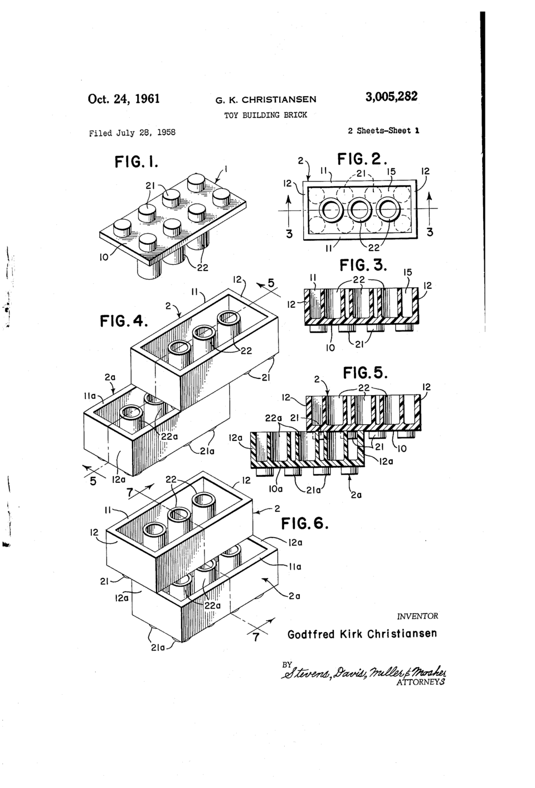
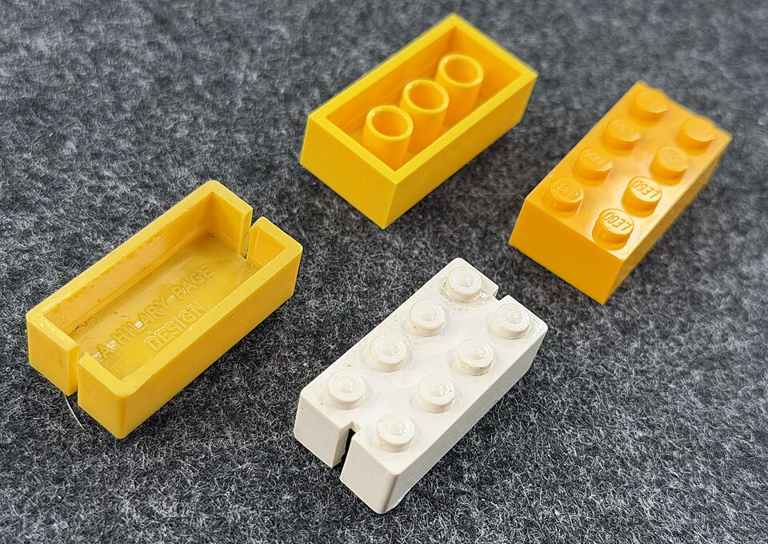

At 1:58 in the afternoon of 28 January 1958, by the company's own account, a patent application for a new toy brick was handed in at the patent office in Copenhagen. Its inventor was **[Godtfred Kirk Christiansen](kloom:e/godtfred-kirk-christiansen)**, who ran the family toy firm in Billund, Denmark, and the brick was the one still sold as **[Lego](kloom:e/lego)**. Its American patent, filed that July and granted in 1961, describes what was new in a single geometric rule. Under the brick, between each square of four studs, stands a hollow tube whose outline touches all four studs of the brick below. Everything about the brick's grip follows from that rule, and from moulding it to within a few thousandths of a millimetre.

## A brick that would not stay put

Godtfred's father, **[Ole Kirk Christiansen](kloom:e/ole-kirk-christiansen)**, was a carpenter who began making wooden toys in 1932. In 1947, according to the company, he bought an injection moulding machine from England for 30,000 kroner, a fifth of the firm's annual earnings; Wikipedia's biography of Godtfred puts the purchase in 1946. From the machine's British supplier the Christiansens also received a sample of the Self-Locking Building Bricks made by **[Kiddicraft](kloom:e/kiddicraft)**, the firm of the English toymaker **[Hilary Page](kloom:e/hilary-page)**, who had patented them in 1940. In 1949 the Christiansens began selling their own version, the Automatic Binding Brick, moulded in **[cellulose acetate](kloom:e/cellulose-acetate)**. When the case was heard in Hong Kong in 1986, Godtfred said under oath that they had copied the English bricks "very carefully". In 1981 the Lego Group had paid about £45,000 for the rights to Page's designs: to Page's estate, by Wikipedia's article on Lego, or to Kiddicraft's later owners, by its article on Kiddicraft.

A Page brick is a hollow box with studs on top and nothing beneath. Pressed onto another, it is held only where the studs touch the inside of its walls. By Godtfred's 1958 meeting, the company had heard enough complaints that the bricks did not hold together. The tubes gave every stud a second surface to press against, and let a brick sit on another in any position, offset by one stud or turned across.

## The clutch, worked

Lego's own patent of 2019 gives the size of a brick with two rows of four studs: about 32 by 16 millimetres, 9.6 millimetres high without its studs, each stud about 4.8 millimetres across, and no dimension more than 1% off if the bricks are to fit together. The grid is 8 millimetres. From those and the 1961 rule the rest can be worked out:

| Dimension                     | Value        | How                                          |
| ----------------------------- | ------------ | -------------------------------------------- |
| Stud pitch                    | 8.0 mm       | the grid                                     |
| Stud diameter                 | 4.8 mm       | Lego, 2019                                   |
| Diagonal between stud centres | 11.31 mm     | 8 × √2                                       |
| Tube outer diameter           | 6.51 mm      | 11.31 − 4.8, touching all four studs         |
| Wall thickness                | about 1.5 mm | 4 − 0.1 − 2.4, a stud just touching the wall |

The last two rows are our arithmetic, not Lego's figures. The 0.1 millimetre is the clearance the Brighton Toy and Model Museum describes, each brick being trimmed by a tenth of a millimetre a side so that neighbours do not touch.

Exactly those sizes would give studs that touch but do not grip. The museum's curators put a micrometer to bricks from the 1960s to today and found the studs almost always 4.88 or 4.89 millimetres across, not 4.8. They concluded that the studs are deliberately oversize. If the tube is as drawn, each stud then reaches about 0.04 millimetres into the circle the tube occupies, by our arithmetic, and the plastic has to give that much at every contact. The walls bow out a little into the gap left between bricks, as the museum describes, and the tube must yield as well. That springy pressure is what the company calls clutch.

## Moulding to the micrometre

Forty micrometres of interference leaves little room. The Lego Group's 2011 presentation of itself said its moulds were accurate to within five micrometres, that the tolerance on a stud was two hundredths of a millimetre, and that only 18 elements in a million failed its standard. Wikipedia's article on Lego gives ten micrometres for the machines and twenty for the moulds. A figure of two micrometres is also widely repeated, but none of the sources read for this frame gives it.

The brick's material changed in 1963 to **[acrylonitrile butadiene styrene](kloom:e/acrylonitrile-butadiene-styrene)**, ABS, a tough thermoplastic, and the company says bricks from 1958 still fit those made today. By the same 2011 account, the plastic is heated to between 230 and 310 °C, injected under 25 to 150 tonnes, and cools for five to ten seconds before the brick is pushed out; Wikipedia gives 232 °C and about fifteen seconds. In 2010 Lego moulded more than 36 billion elements, about 1,140 every second, most of them by the moulding cycle of the frame before this one.

A brick is taken out of its mould by the machine itself. The next frame is the first machine built to take parts out of moulds and put them anywhere it was taught to: Unimate.
