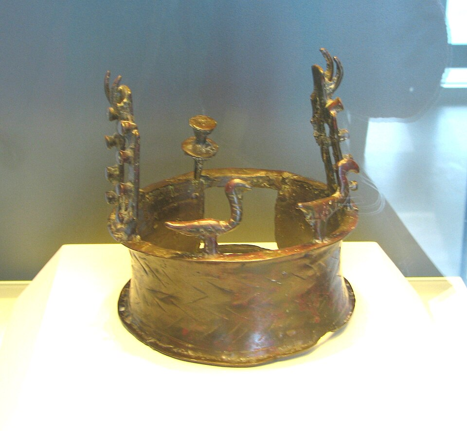
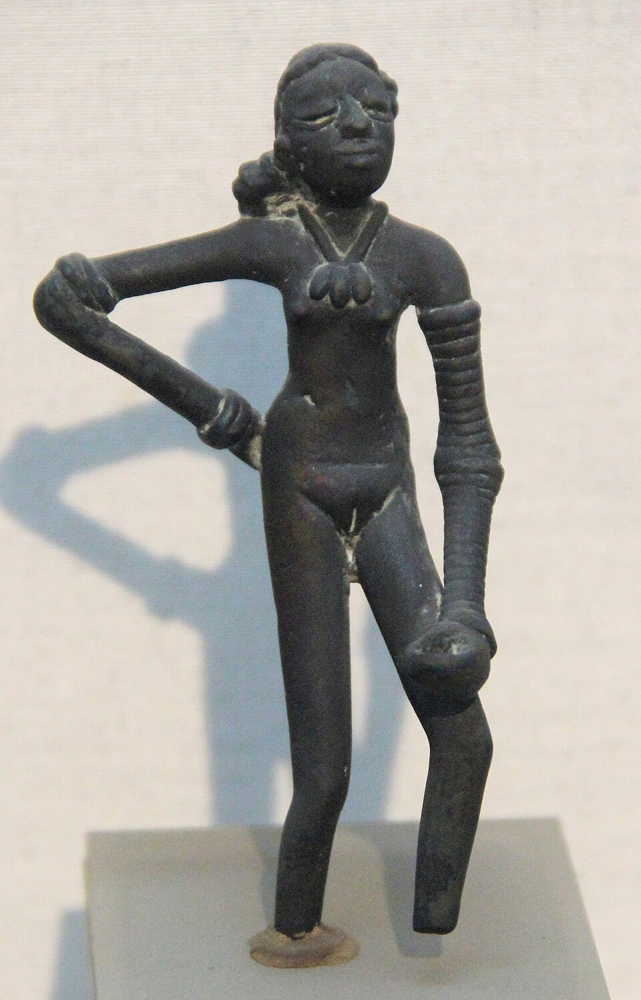

At **[Mehrgarh](kloom:e/mehrgarh)**, in Baluchistan, archaeologists found a **[copper](kloom:e/copper)** amulet in the shape of a wheel, 20 millimetres across: six thin spokes meeting at the centre and pressed onto a ring. It was corroded right through, and it lay in a layer dated between 4500 and 3600 BC. In 2016 Mathieu Thoury and colleagues imaged a slice of it at the synchrotron SOLEIL, near Paris, and found the ghost of its metal preserved in the corrosion: the branching crystals of a casting, continuous across ring and spokes, so it had been cast in one piece. No mould in two halves could have released that shape. The spokes had been modelled in something soft that joined when pressed, a wax, and the metal had been poured into the space the wax left. That makes the amulet, by their account, the oldest known object made by **[lost-wax casting](kloom:e/lost-wax-casting)**. (Wikipedia's article on the method gives that title to gold from the cemetery at Varna in Bulgaria, of 4550–4450 BC, and a 2023 study agrees; the two are near in date.)

## Six steps

The method has hardly changed since. In 2020 Thomas Rose, Peter Fabian and Yuval Goren rebuilt the moulds of the **[Nahal Mishmar hoard](kloom:e/nahal-mishmar-hoard)**, 429 copper objects hidden in a cave near the Dead Sea before 3500 BC, by the radiocarbon date of the mat they were wrapped in, from the clays the Chalcolithic founders used:

| Step         | What is done                                                             | Their numbers                         |
| ------------ | ------------------------------------------------------------------------ | ------------------------------------- |
| 1. Core      | clay and sand shaped round a stick and dried, for a hollow casting       | about 47 mm across, dried for weeks   |
| 2. Wax       | the core dipped in molten wax and resin, details added in beeswax        | wax at 80–85 °C, built up to 3–5 mm   |
| 3. Sprue     | wax rods for the metal's way in and the air's way out                    | 13–21 mm across                       |
| 4. Investing | a slip of fine clay to take every detail, then coarser layers            | 0.2 mm, then a mould 10–19 mm thick   |
| 5. Burnout   | the mould heated until the wax runs or burns out, and fired hard and dry | up to 1,038 °C at the mould's surface |
| 6. Pour      | molten metal poured into the hot mould, which is broken off when cold    | the sprue cut off, the surface worked |

By Thoury's reconstruction, the Mehrgarh mould was heated upside down so the wax ran out of the cup; Rose's team, afraid the running wax would catch fire, burned it off with the mould upright. Their own pours mostly failed: they could not melt much copper in a crucible over charcoal blown by leather bag bellows, and once a piece of charcoal fell from the crucible and blocked the pouring cup before the metal reached the mould.

## Hotter than melting

Metal that is only just molten freezes the moment it touches the cooler mould, and a thin spoke or rim never fills. So a founder heats the metal well above its melting point, which is called superheat, and keeps the mould hot. "The temperature above the freezing point is probably the most important factor of all in connection with fluidity," says an American founder's manual of 1917, writing of cast iron, which adds that oxide in the metal "makes the metal sluggish and causes it to set quickly". In earlier experiments on the Levantine alloys, which the 2023 study says can be fully molten as low as 600 °C, the metal was cast at 800 to 900 °C into moulds fired to 600 to 700 °C: by our arithmetic, 200 to 300 degrees of superheat.

The Mehrgarh amulet shows the trouble with doing it the hard way. Its metal is very pure copper, with traces of gold, silver and mercury that suggest native copper, and pure copper must be heated past 1,085 °C before it melts at all. It also took up about 0.3 per cent of oxygen from the air as it melted, which froze between the crystals as the eutectic the imaging revealed. Pure copper, Thoury's team concluded, made casting harder, not easier. Baluchistan's founders soon added 10 to 30 per cent of lead, which made the metal run, and the Levant's used copper rich in arsenic and antimony.

Some two thousand years later, in the Indus city of **[Mohenjo-daro](kloom:e/mohenjo-daro)**, someone cast the **[Dancing Girl](kloom:e/dancing-girl-prehistoric-sculpture)**, 10.5 centimetres of bronze, found by Ernest Mackay in 1926.

## Cellini's pour

What happens when the superheat is lost was told by **[Benvenuto Cellini](kloom:e/benvenuto-cellini)**, in his own colourful account, of the casting of his bronze **[Perseus with the Head of Medusa](kloom:e/perseus-with-the-head-of-medusa)** in Florence. He burned the wax out with a slow fire for two days and nights, buried the mould in a pit and loaded his furnace with copper and bronze. Then rain and wind cooled the furnace, his workshop caught fire, and while he lay in bed with fever his men let the metal "curdle". Cellini fed the fire with dry oak, threw in half a pig of pewter, about sixty pounds, then some two hundred of his own pewter dishes, and the mould filled. He blamed the fierce fire for burning away the alloy. Pewter is mostly tin, and tin brings bronze's melting point, about 950 °C, below copper's: he had won back the superheat from both ends, hotter metal that melted lower.

The same steps, now called investment casting and often from printed models, still make precise parts for aircraft and medicine. The next frame is a metal that was made for thousands of years without ever being melted: iron, in the bloomery.
