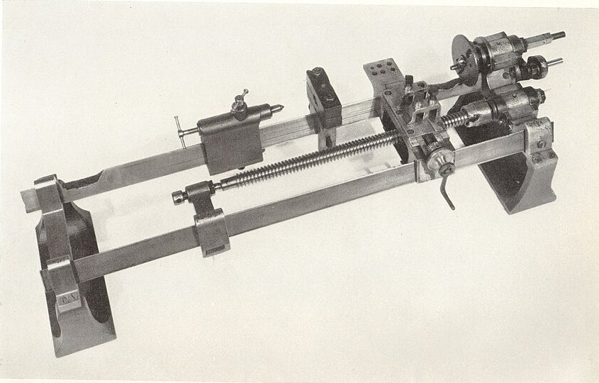

At twelve, **[Henry Maudslay](kloom:e/henry-maudslay)** was filling cartridges at the Royal Arsenal in Woolwich, where his father worked. By eighteen he was a blacksmith good enough to be hired by **[Joseph Bramah](kloom:e/joseph-bramah)**, the London locksmith, and within a year he ran Bramah's shop. In 1797, refused a rise to thirty shillings a week, he left and set up for himself. Around 1800 he built the machine this frame is about: a small lathe, all of metal, whose cutting tool was carried along the work by a screw. It could cut a screw thread that was as good as the screw that drove it, and it could do so again and again.

## Every bolt its own nut

Before Maudslay, as the biographer Samuel Smiles put it in 1863, screws were cut by hand, the small ones filed and the large ones chipped and filed. No two workshops agreed on how many threads an inch should carry, so bolts and nuts were made in pairs and marked as belonging to each other. A screw is a ramp wound round a cylinder. To make an accurate one you need something that moves a tool along by exactly the same distance for every turn of the work, and that something is itself a screw. The problem was where to get the first one.

Maudslay's answer, described by the lathe maker Charles Holtzapffel in 1846, was to grow one. He turned a cylinder of alder, tin or brass and pressed against it a crescent-shaped knife set at a slant. As the cylinder turned, the slanted edge dragged it along, cutting a helix as it went, and a chaser following behind deepened the groove. The slant decides the pitch: for a thread of ¼ inch on a cylinder an inch across, the knife must lean at about 4½° from square, by our arithmetic (the tangent of the angle is the pitch divided by the circumference). He made hundreds of such screws, Holtzapffel says, and kept the ones whose threads matched a fixed measure and glided most evenly.

## How the lathe copies a screw

The best of them became a **[lead screw](kloom:e/leadscrew)**. In the lathe of about 1800, now in the [Science Museum](kloom:e/science-museum-london), it lies between the two bars of the bed, an inch thick with four square threads to the inch. A nut on the slide rest rides it, and gears tie it to the spindle that turns the work.

| Step | What happens                                                                                  |
| ---- | --------------------------------------------------------------------------------------------- |
| 1    | The lead screw and the spindle are geared together, so both turn in a fixed ratio             |
| 2    | Each turn of the lead screw carries the slide rest, and the tool, forward by one pitch        |
| 3    | With equal gears the tool advances one pitch for each turn of the work: the copy matches      |
| 4    | Other gears give other pitches from the one lead screw (the trail's _Cutting a screw thread_) |
| 5    | A graduated hand wheel on the slide rest sets how deep each cut goes                          |

The machine copies whatever it is given, errors included. So the work went into the master. Holtzapffel tells of a brass screw about seven feet long that came out less than a sixteenth of an inch too long. Correcting that with gears would have needed wheels of about 1,000 and 999 teeth. Instead Maudslay set a straight bar at a slight slope beside the bed and linked it to the tool through a lever of ten to one, so that the tool was eased back by a tenth of the bar's slope, evenly along the whole length.

In 1810 Maudslay and his friend John Barton took two screws they believed perfect to **[Edward Troughton](kloom:e/edward-troughton)**, the instrument maker, who compared their threads under two microscopes. They were full of errors, coarse in places and irregular in angle: "drunk". Barton's cure was to run a screw through two dies set apart on one bar, so that where it was too coarse one die trimmed it and where too fine the other did, averaging the errors away. Maudslay's finest screw, Smiles records, was five feet long with fifty threads to the inch, and its nut, a foot long, gripped 600 threads at once, an average over every one of them.

## Planes and the Lord Chancellor

Maudslay did not invent the slide rest or the lead screw. Both appear in earlier French books, and the Science Museum's catalog calls him not original in combining them; his pupil **[James Nasmyth](kloom:e/james-nasmyth)**, who joined him in 1829 at ten shillings a week, credited him with the slide rest all the same. What Maudslay did was make the combination rigid, all of metal and part of everyday work. He kept true flat plates on his benches, made three at a time, and a bench measuring machine with a fine screw, which he called the "Lord Chancellor" because its verdict was final. Nasmyth says it read to a thousandth of an inch; the Science Museum's catalog says Maudslay made it accurate to a ten-thousandth.

By 1810 the firm had moved to Lambeth, joined by Joshua Field. It trained **[Joseph Clement](kloom:e/joseph-clement)**, Richard Roberts, Nasmyth and **[Joseph Whitworth](kloom:e/joseph-whitworth)**, and through them spread the idea that a machine could hand on its accuracy. Maudslay died in February 1831. The Lathe work trail turns, gears and threads at his lathe; the main spine goes on to Whitworth's flat plates.
